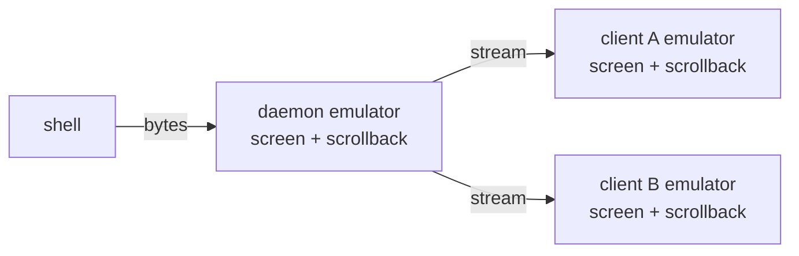

A scrollback line in tuios used to cost the same whatever was on it. A pane
207 columns wide with the default 10,000 lines of history held 232MB once the
ring filled. An empty line, a line with one letter and a line of solid text
all cost the same. That was one copy. There were at least two.

This post is about bytes held, not time spent. It follows the numbers from
the first measurement to the last, including the step that made something
slower and the fix that made something bigger.

## Why twice

tuios runs as a daemon that owns the shells and one or more clients that
attach to it. The daemon feeds every byte a shell prints into a VT emulator
and keeps that emulator for the life of the pane. The client keeps a second
emulator per pane and is expected to arrive at the same picture. The
[rehydration contract](https://github.com/Gaurav-Gosain/tuios/blob/main/docs/REHYDRATION.md)
spells that out, and the [architecture page](/docs/architecture#client-and-daemon)
has the overall shape.

So every byte of scrollback is paid once in the daemon and again in every
attached client. Any saving per line is also multiplied by that count.

## Measure both sides first

The memory tests that existed watched the daemon only. The first commit of
this work added one that watches both. `TestPerfMemoryClientAndDaemon` starts
a daemon with `--pprof`, attaches a client at 207x55, opens eight tiled panes,
floods each one past its ring, and logs the resident size and the heap after
a collection for both processes at each step.

Eight flooded panes held 527MB in the daemon and 533MB in the client. Eight
tiled panes are each narrower than 207 columns, which is why that is less
than eight times 232MB.

The reason is the size of one cell. The emulator's screen and its scrollback
were both built from `uv.Cell`, the cell type of the ultraviolet library. A
`uv.Cell` is 112 bytes: a string header for the content, three colour
interfaces for foreground, background and underline, a link made of two
strings, and an int width. The ring kept every line as a full-width slice of
them. 207 columns times 112 bytes is 23,184 bytes a line, and 10,000 lines is
232MB. What the line said did not enter the sum.

## Step one: 24 bytes a cell

The first fix kept the idea of a cell and made it small. A packed cell is
24 bytes: a rune or an index into a table of interned grapheme clusters, three
colours packed into 32 bits each, an interned link index, and one byte each for
the attributes, the underline style and the width. A line is stored only up to
its last cell that is not a plain blank, and decoded back to its full width
when something reads it.

Two details kept it from costing more than it saved. A render of a scrolled
pane asks for the same line once per column, so reads go through a small cache
of decoded lines. A push into a full ring reuses the storage of the line it
evicts, so a flood allocates nothing once the ring is full.

The same eight flooded panes:

<BenchBars
  groups={["daemon", "client"]}
  series={[
    { label: "uv.Cell lines", values: [527, 533], tone: "baseline" },
    { label: "24-byte cells", values: [67, 71], tone: "subject" }
  ]}
  unit="MB"
  groupLabel="process"
  caption="Eight panes tiled in a 207x55 client, each flooded past its 10,000-line ring, from TestPerfMemoryClientAndDaemon. The daemon and the client each hold their own copy."
/>

A thousand short lines at 207 columns went from 22MiB to 118KiB, because the
blank tail of a line is no longer stored.

It was not free. A whole-screen scroll of a short line got 17% faster, but a
whole-screen scroll of a full-width line got 8% slower. That is the price of
packing every cell on the way into the ring. I
kept it, and put the cost in the commit message next to the saving: a
full-width line cost 3.6 times less to hold, and a short one far less than
that.

## The same morning: three things that were not scrollback

Measuring both processes turned up more than the ring.

**Output queues.** The client queued daemon output through a channel of
16,384 slots, and a slot holds a batch of up to 256KiB. That queue could hold
4GiB before it dropped anything, and the channel alone was 900KiB per pane.
The daemon gave each subscriber a channel of the same length with 16KiB reads
in it. My first fix cut both to 4,096 slots, which saved 690KiB per pane in
the client and 480KiB per pane per client in the daemon.

That was the wrong bound, and I replaced it a few hours later. A count of
slots bounds nothing, because what a stalled reader can pin depends on how big
each chunk is: 4,096 batches is still a gigabyte per pane in the client. Both
queues are now bounded in bytes. The daemon holds at most 8MiB per stream,
marks the stream as gapped past that, and rebuilds it from the ring once the
reader catches up. The client holds 16MiB per pane and makes the sender wait
past that, because a client cannot recover a chunk it dropped.

**The ghostty backend.** tuios can also be built on libghostty-vt. That
library keeps two scrollback limits and prunes at whichever it hits first. Its
default byte limit is 10,000 bytes, and tuios only set the line limit. So a
pane asked for 10,000 lines kept about 870 at 80 columns and about 400 at 207.
The fix gives it a byte budget of 4KiB per requested line, and it now keeps
9,852 lines at 207 columns.

That fix made the ghostty backend use more memory, not less: about 1.8KB a
line at 207 columns in libghostty's pages, 18MB for a full pane on each side.
That is what [`scrollback_lines`](/docs/configuration#scrolling) asks for. The
backend had been using less than the setting promised.

**The decoded line cache.** It was emptied only when the pane next wrote. A
capture of the whole history decoded every line into it, so after one capture
of three quiet panes the daemon held 29MB of decoded 112-byte cells for as long
as the panes stayed quiet. It is now capped at 256 rows.

## Step two: stop storing cells

Twenty-four bytes is still 24 bytes for the letter `a`, which is one byte of
UTF-8. At 207 columns a 175-character line of a build log cost 4,864 bytes on
the heap. A filled ring was 48MB per pane, once in the daemon and once in every
client. The cell was still the unit of storage, and most cells of a log are plain
letters in the same style as the letter before them.

So a line became the bytes of its text. The stored form is the line's width as
a uvarint, then a stream in which a character written as its UTF-8 bytes is
one narrow cell in the current style. Anything a plain byte cannot say is a token:

| byte | token | what follows |
|---|---|---|
| `0xFF` | style change | fg, bg and underline colour as uvarints, then attributes and underline style |
| `0xFE` | link change | 0 for no link, otherwise 1 plus an index into the link table |
| `0xFD` | cell of width other than one | the width as a byte, then the cell's content |
| `0xFC` | grapheme of more than one rune | an index into the grapheme table |
| `0xFB` | empty content | nothing; this is what a wide character's spacer holds |

The trick is the range. The bytes `0xF8` to `0xFF` never start a UTF-8
sequence, so a reader can tell a token from the start of a character without
a length prefix. A style is written once where it changes rather than once per
cell, and a single rune of any script goes in as its own UTF-8 bytes.

The same 175-character line now costs 216 bytes, ring header included, and the
filled ring holds 4.2MB. The ring's slice of line headers also grows as lines
arrive instead of being allocated at full capacity, which was 320KB per pane
before the pane had printed anything.

Here is the line, in the three encodings. The byte strips are computed the way
`internal/vt/scrollback.go` computes them, and I checked each preset against
the Go encoder byte for byte.

<ScrollbackBytes />

A few things the widget shows that I did not expect to write about:

- The 216 bytes are not the encoded length. The build log line encodes to 177
  bytes: 175 of text and two for the width. The buffer is made with room for
  16 more, and Go's allocator rounds 191 up to its 192-byte size class. The
  ring's slice header adds 24. The packed line's 4,864 is the same effect: 175
  cells of 24 bytes is 4,200, and the next size class is 4,864.
- A truecolour value packed as a uvarint often contains bytes in the token
  range. That is fine, because the decoder only reads a token where a cell
  would start. Payload bytes are never mistaken for one.
- Colour on a wide character costs more than it should. A wide cell is
  followed by a spacer cell with no style, so a run of red CJK writes a style
  token back to plain for every spacer and another to return to red. Pick
  "red CJK" to see it. It is still less than half the packed form, so I have
  left it.

The decoder stops at the first token it cannot read whole, so a truncated
record leaves the rest of the line blank instead of reading past the end. A
random round-trip test pushes lines made of every kind of cell through a ring
that wraps and reads each one back.

One cost came later. The decoded line cache from step one is a map, and it is
reached from capture paths that hold only a read lock. Five days after this
landed, two captures on one busy pane wrote the map at once and the runtime
killed the daemon, twice in three minutes. The cache now has its own mutex.

## Step three: an empty pane

With the ring small, what was left was the cost of a pane that had printed
nothing.

The first piece was the parser's data buffer. The emulator gave its sequence
parser a 4MiB buffer, allocated in full when the pane was made, so a sixel
image or a large OSC 52 write would not be cut short. That was 4MiB per pane
on both sides of the socket, before any output. Eight empty panes were 47.5MiB
of heap in the daemon, 32MiB of it this buffer. The parser now starts at 4KiB
and doubles on demand up to the same 4MiB cap. Eight empty panes went to
14.9MiB of heap.

The second piece was the screen. An empty 207x55 pane held 1.7MB, and 1.3MB of
that was the grid: `uv.Buffer` allocates every row of 112-byte cells when it
is made, for a shell prompt that uses two rows.

The screen now has a grid of its own. A row is nil until something is written
on it, and a nil row reads as blanks. A write that would leave the row blank
does not allocate it. A row that has been written stays allocated, so a flood
never allocates a row it already has. An empty pane held 28KB when this
landed. The test that pins it logs 33,576 bytes on main today, still far under
the 1.3MB one grid of cells costs.

Replacing the storage under the whole screen is the kind of change that looks
right and is subtly wrong. The cell semantics are ultraviolet's own: a write
goes through `uv.Line.Set`, and line shifts follow `uv.Buffer` step for step.
To check that, `TestGridMatchesUVBufferUnderRandomOperations` builds the new
grid and a `uv.Buffer` of the same random size, drives both with the same
random operations (set a cell, fill, clear, insert and delete lines, resize),
and compares every cell after every operation, plus the string and rendered
forms. It runs 40 seeds of 300 operations each. The expected value comes from
the library the grid replaces, not from the grid.

## The graphics tail

A week later came a report of tuios-web sitting on 300MB. I measured it under
chafa animating a gif for two minutes: 47MB at rest, 5.3GB at the end, and
10.4GB of live heap after a forced collection. None of the three causes was
scrollback, and none was bounded.

- **A cache nothing could read.** The bitmap cache is keyed by host image id.
  An image sent under kitty's auto-assign id, `i=0`, gets a fresh host id every
  time, on purpose, so two of them can coexist. chafa sends every frame that
  way. Every lookup missed, and the copy kept for the next comparison was never
  read: 2.8GB of bitmaps kept for the life of the process. An image that cannot
  be patched now keeps nothing.
- **A queue with no ceiling.** Frames waiting for the host grew without limit
  when the guest produced them faster than the render loop drained them: 7.3GB
  of whole bitmaps. Past a byte limit a new bitmap is now dropped, and the user
  sees the previous frame held a moment longer.
- **Buffers that kept their peak.** Two reuse buffers were emptied with `[:0]`,
  which keeps the capacity. One outsized write left 107MB of scratch resident
  with nothing on screen. Past a size limit they are now released.

The same two minutes of the same gif: 5,323MB to 189MB resident, and 10.4GB to
44MB of live heap. More on the web client is on the [web page](/docs/web).

## Where it ended up

| | before | after |
|---|---|---|
| 8 flooded panes, daemon | 527MB | 67MB (24-byte cells) |
| 8 flooded panes, client | 533MB | 71MB (24-byte cells) |
| full 10,000-line ring, 207 columns | 232MB (uv.Cell) | 4.2MB (text) |
| one 175-character line | 4,864 B (24-byte cells) | 216 B (text) |
| empty 207x55 pane | 1.7MB | 28KB |
| 8 empty panes, heap | 47.5MiB | 14.9MiB |
| tuios-web under chafa, live heap | 10.4GB | 44MB |

The list of changes is in the [memory section of the unreleased notes](/releases/since-v0-7-0#memory).

## What I keep from this

The number that mattered was a size in the type, not anything in a profile.
112 bytes a cell, times a width, times a depth, times the number of processes
holding a copy. Each factor looked reasonable alone. The product was 232MB a
pane per process, and none of it depended on what the pane had printed.

The two steps also show why I measure after every one. Packing took the flooded
daemon from 527MB to 67MB and made a full-width scroll 8% slower, and I only know both
because I measured both. The ghostty fix made memory go up, and that was the
correct result. The slot bound on the output queues looked like a fix and was
not one. A figure for each step is what let me tell those apart.
