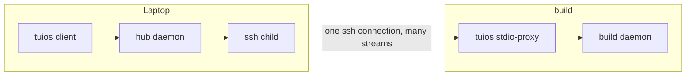
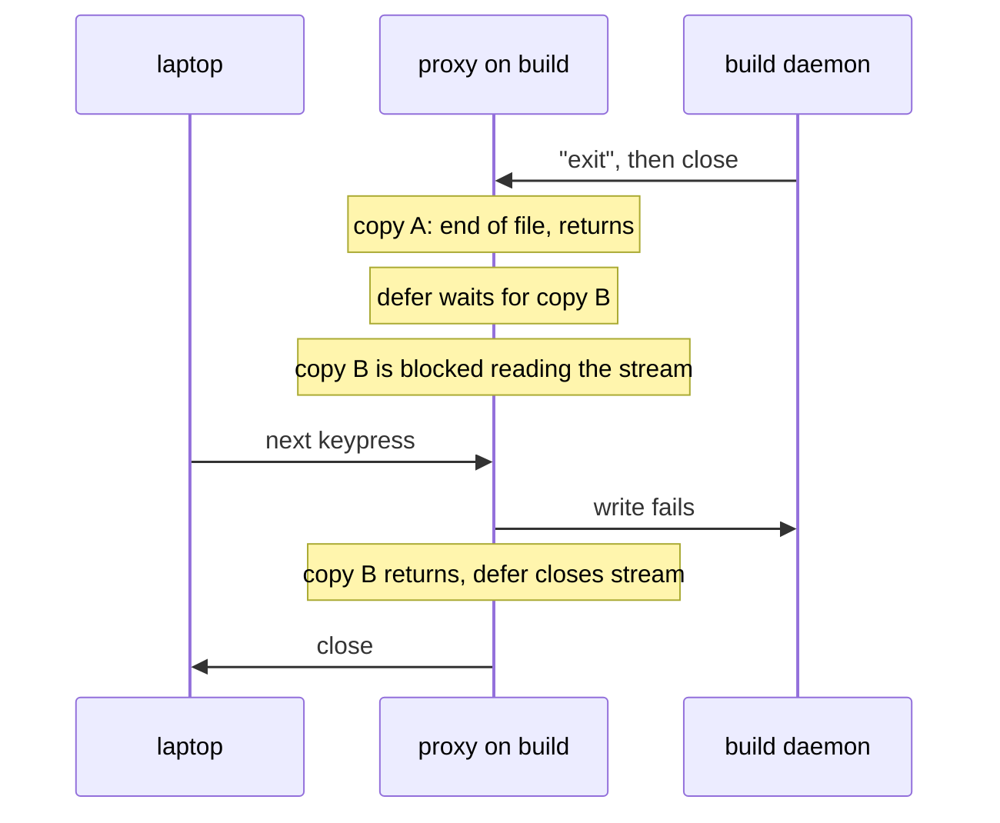

I work on more than one machine: the laptop I sit at, and hosts that run the
long jobs. Until this work, each machine had its own tuios, and reaching one
meant typing `ssh` and running the far tuios nested inside the local one. The
nested client used the far machine's theme and config, and I had to press the
prefix key twice to reach it. An agent on the laptop could not see what an
agent on another machine was doing at all.

So tuios daemons now talk to each other. The laptop daemon holds one link to
each machine you name, and on 18 September a window in a laptop session could
run its process on another machine for the first time. This post is about how
that got built, in stages, and the bug each stage had. None of the bugs were
exotic. Most of them could not show up in the tests I had, and that is the
part worth writing down.

## One pipe per machine

The shape has not changed since the first commit. The local daemon is a hub.
For each host in the `[hosts]` table it runs one child process:

```
ssh -o BatchMode=yes <host> tuios stdio-proxy
```

`stdio-proxy` is a hidden subcommand that connects its stdin and stdout to the
daemon socket on that machine. The hub and the proxy speak a small framing over
the pipe: a 9 byte header (type, stream id, length) and a payload capped at
1 MiB. The three frame types are open, data and close. That is enough to carry
several logical streams on one ssh connection.

`BatchMode=yes` is there because a daemon has no terminal. If ssh asks it to
accept a host key or type a password, nobody will ever answer, and the link
hangs forever. With batch mode it fails, and the failure is reported. The
proxy also never starts a daemon on the far machine, because starting one
restores that machine's sessions, and that is a change to someone else's
state.



The remote daemons are passive. They never dial back, and there is no mesh.
The first invariant in the design notes was that a remote daemon never gets a
channel into the hub. That invariant produced the first bug.

## Stage 1: listings only

The [first commit](https://github.com/Gaurav-Gosain/tuios/commit/2926fa27), on
27 August, added 4,506 lines and could not change anything on another machine.
The hub asked each host for listings, and `tuios hosts`,
`tuios ls --all-hosts`, `tuios list-agents --all-hosts` and the rail showed
them. The daemon had no verb that could start, stop, resize, type into or
attach to anything across a link. I did that on purpose. A read-only link is
something I could ship before I trusted the rest of it.

It also cost nothing when unused. The client polls host state inside a
`tea.Cmd`, a daemon with no hosts answers the first poll and is never asked
again, and `BenchmarkIdleTick` stayed at 0 renders per tick, 296 B/op and 5
allocs/op.

Then I tested the invariant. Deleting the code that refuses a stream opened by
the peer should fail a test. It did not. The test stayed green with the
refusal gone.

There were two defects, one in the test and one in the framing. The test
asserted that the peer's read on its stream ended with some error. Tearing
down the link at the end of the test also ends the read with an error, so the
test could not tell a refusal from teardown.

The framing defect was the real one. Both ends allocated stream ids from 1.
The hub dials, so it opens the control stream first, and that is id 1. The
peer's first stream was also id 1. With the refusal deleted, the next check
down, the one that rejects a duplicate id, found id 1 in use and sent the same
close. The peer saw a closed stream either way.

The [fix](https://github.com/Gaurav-Gosain/tuios/commit/5542193f) was the one
ssh and HTTP/2 already use. The side that dials takes odd ids, the side that
answers takes even ones, and an inbound open can only ever name an id the hub
does not own. The refusal is now the only code that can answer it. The test
now asserts three things teardown cannot fake: nothing comes back on the
stream, the stream ends within a two second budget, and afterwards the link is
still up and still answers a real verb.

Try it below. Pick "stream ids", step through with the old allocation, then
flip to the fix.

<LinkLanes />

The same commit tightened two more assertions that had the same any error will
do shape. A peer with an incompatible protocol must be refused as
incompatible, not as any failure. A dead host in a fan-out listing must fail
with an error that names it.

## Stage 2: a real connection, and a drop every eleven seconds

Listings are not what I wanted. I wanted to open a session on the build box.
The first version of that, on 9 September, did what I had been doing by hand.
Enter on a remote session in the rail
[ran ssh in a local pane](https://github.com/Gaurav-Gosain/tuios/commit/d3e44eab),
and the tuios on the far machine drew itself inside it. It worked. It was also
the nested client with the wrong theme and the double prefix key, now with a
nicer button.

The same afternoon it was replaced. The
[new verb](https://github.com/Gaurav-Gosain/tuios/commit/3e0195b2)
`open-host-connection` has the hub open a second stream on the link. The proxy
answers it with a fresh connection to the far daemon's socket, and the hub
relays bytes between the client and that stream without reading them. The
client then speaks the ordinary attach protocol with the far daemon. The
session is drawn by the laptop client, with the laptop's theme, config and
prefix key. Nothing is nested. `--ssh` stays as the fallback for a host whose
tuios is too old.

Then I used it against a cloud host, and it kept taking the session away from
me. The [fix](https://github.com/Gaurav-Gosain/tuios/commit/e18cf535) found
three separate faults, and the first one needed no network at all.

The daemon answers a verb through `writeVerbResponse`, which arms a ten second
write deadline on the client's socket. After the reply, the connection is
handed to the relay. The relay cleared the read deadline and left the write
deadline armed. A deadline on a `net.Conn` is a point in time, not a budget
per write. So about eleven seconds into every attached session, the far pane
printed something, the write to the client failed with `i/o timeout`, and the
client was told it had lost the link. It did the same eleven seconds after the
next attach. The widget above has this one as "11 second drop". The relay now
clears both deadlines.

The second fault was a policy. A control call that missed its deadline tore
down the whole link. The rail polls a host listing every five seconds, and the
link also carries the attached session. So one slow listing across an ocean
cost me the pane I was typing into. A failed call now replaces the control
stream and keeps the link. The link is torn down only if the pipe has carried
nothing for longer than ssh's keepalive window, or if three calls in a row
have failed.

The third fault was a panic. Two calls on one control stream read the same
`bufio.Reader`, and nothing paired a request with its reply. Two clients
polling the rail at once was enough. The daemon panicked inside
`bufio.ReadSlice` and took every session on it down. Calls on a control stream
are now serialised.

The same commit made drops survivable:

| What | Value |
| --- | --- |
| ssh keepalive | `ServerAliveInterval=15`, `ServerAliveCountMax=3`, `TCPKeepAlive=yes`, after the host's own options so yours win |
| a relayed reader that falls behind | dropped after 30 s (a listing gets 10 s) |
| client redial after a drop | backoff from 1 s to 15 s, for 3 minutes |
| on reconnect | panes are reused, each asks only for the rows it does not hold, and the scroll position is kept |

Without the keepalives a NAT drops an idle link silently, and ssh finds out on
your next keystroke. A failure that retrying cannot fix, such as an unknown
host or a session that is gone, stops at once with the reason.

## Finding tuios over ssh

A host added with no `--command` failed with `command not found` whenever
tuios lived in `~/.local/bin`. That is where the project's own install script
puts it. ssh runs the remote command through a non-interactive shell, and that
shell's `PATH` does not include what a login profile adds.

The [link now sends one sh script](https://github.com/Gaurav-Gosain/tuios/commit/49978afd)
as the remote command. It looks for tuios on the `PATH`, then at the install
paths the installers and the updater already know, then asks the login shell.
The path it finds is announced before the link starts, so the hub remembers it
and redials with it directly. `tuios hosts test` prints where it looked when
it finds nothing. The e2e suite's stand-in for ssh now runs the command
through `sh -c` on the joined words, which is what sshd does, so the probe
runs in tests the way it runs over a real link.

The same day, adding a host stopped needing a file edit and a daemon restart.
[`tuios hosts add`, `remove` and `test`](https://github.com/Gaurav-Gosain/tuios/commit/c003cd17)
edit only the one `[hosts.NAME]` table, and the daemon follows the config file
and reconciles its links. A test runs a hundred add and remove rounds and
counts goroutines before and after, so repeated edits cannot leak them.

## Stage 3: a window whose process is somewhere else

Attaching a whole session on another machine was useful. What I wanted more
was a session on the laptop with a pane on the build box beside a local one:

```bash
tuios new-window deploy --host build
```

The [window](https://github.com/Gaurav-Gosain/tuios/commit/ecce136d) belongs
to the laptop session. It is drawn, laid out and closed there. Only the
process runs on `build`.

The seam for this already existed. Earlier that day, the handle a `PTY` holds
had been narrowed to an interface called `paneIO`: `Read`, `Write`, `Close`
and `Resize`. Nothing else in the session code touched the handle. So a remote
pane is a `paneIO` whose `Read`, `Write` and `Close` are a connection to the
far daemon, and whose `Resize` is a verb on the link's control stream. Above
that line nothing changed. The same emulator parses the bytes, the same
scrollback keeps them, and the same subscribers receive them.

The far machine supplies a process and a pty, and nothing else. It keeps no
emulator and no scrollback for the pane, and does not know which session it
belongs to. I considered borrowing a window from a session on the far machine
instead. That would have put the pane into that session's size negotiation,
where the size is the smallest of the attached clients, so a layout on my
laptop would have shrunk the panes of whoever was working on the build box.

The difference is one field on the saved window state that records where the
process is. It is `omitempty`, so older clients and older state files read a
session the way they always did. The frame labels such a pane `build:deploy`,
and that is not optional. Two panes side by side look the same, and the same
typed line is a different act depending on which machine answers it.

This stage had three bugs, and the tests caught only one of them.

### The shell that did not exist

The first time I deployed it, on a laptop running zsh, the Linux host refused
the pane with "no such file or directory". The pane request carried the
laptop's shell, and the host tried to exec `/bin/zsh`.

`TERM` and `COLORTERM` should travel with the request, because they describe
the emulator the program talks to, and that emulator is on the laptop. The
shell should not, because it is a path on the machine that runs the process.
The [fix](https://github.com/Gaurav-Gosain/tuios/commit/51d49194) lets the far
machine pick its own shell.

Every test until then ran both ends on the same machine. The path existed on
both ends, so the bug could not appear. The commit was verified against two
real hosts over ssh: a laptop session with one local pane and one pane on each
host, each printing its own hostname and `uname`.

### The pane that never saw end of file

A hosted pane has no process on the laptop to wait on. The far machine notices
the process exit by the pty master going quiet. A master reports end of file
only once every slave descriptor is closed, and xpty leaves one open in the
parent after it starts the command. So the read waited for a byte from a
process that was already gone.

On Linux it waited forever and took the daemon's connection handler with it.
This one CI did catch: the test that a pane whose far process exits closes its
window failed, and so did an unrelated screenshot example that shared the
same daemon. The [fix](https://github.com/Gaurav-Gosain/tuios/commit/1ec07d91)
closes the parent's copy of the slave end, and also waits on the command. No
other code on that machine waits on it, so each hosted pane would otherwise
have left a zombie for as long as the daemon ran.

### ctrl+D, and the next keypress

Then the report that gave this post its title. ctrl+D in a pane on another
machine printed `exit` and left the window open. It closed on the next
keypress.

The proxy on the far machine runs two copies for each stream: one from the
daemon to the stream, one from the stream to the daemon. When the shell
exits, the far daemon closes its connection, and the first copy reads end of
file and returns. The stream close was in a `defer`, and the defer ran after
waiting for the second copy. The second copy was blocked reading the stream
for bytes from the laptop. Nothing told the laptop anything.

The window closed on the next keypress because the key crossed the link. The
second copy wrote it to the dead connection, the write failed, the copy
returned, the wait ended, and the defer finally closed the stream.



The [fix](https://github.com/Gaurav-Gosain/tuios/commit/c66c1311) closes the
stream as soon as the first copy returns. Nothing is lost there: that copy
ran to end of file, so everything the daemon sent is already on the stream.
Close is idempotent, so the defer is still correct. The test for it has a far
side that writes `exit` and hangs up, and asserts that the laptop's read ends
without the laptop writing anything. Moving the close back into the defer makes
it time out. The "ctrl+D" case in the widget walks through both versions.

This was not only about panes. Attaching a whole session over a link has the
same shape, so a far session ending would also have gone unreported until the
next keystroke.

## Where the question of which machine goes

Once a pane could run anywhere, a new window had to know where. The first
version got this wrong. It made every new window ask which machine whenever a
second one was reachable, which put a question in front of the common case.
The [commit that replaced it](https://github.com/Gaurav-Gosain/tuios/commit/b0832279)
says so in its first line. An ordinary
session is the machine it is on, and a new pane in it is a pane there.

So there is now a global session, and only it asks. The rail offers it once a
second machine is reachable. Inside it, every way to make a window asks which
machine. Everywhere else a pane is made without a word. A
[later fix](https://github.com/Gaurav-Gosain/tuios/commit/1405af0f) found that
the split keys called `AddWindow` directly, so in a global session they were
two of the five ways to make a pane that did not ask.

That commit also added `tuios hosts tailnet`. It asks the `tailscaled` already
running, through its local API, for the machines on your tailnet, and
`tuios hosts add NAME --tailnet` takes the address from one of them. It adds
about 0.9 MB to the binary. Embedding tsnet, so tuios would be its own tailnet
node, would add 15 MB and need an auth key, so it is not used. A host added
this way is still reached over ssh like every other host.

## What agents get from this

This is the part I built it for. An agent in a laptop pane can now drive
another machine through the same verbs it uses locally, by putting the host in
the target:

```bash
tuios list-agents --host build
tuios capture-pane -w build:api:0
tuios send-text -s build:api -w 0 'make test'
tuios wait-for window-idle -w build:api:0
```

The answer names the host it came from, and `--json` adds a `host` field. An
unknown host fails with `unknown_host` and lists the configured names. A host
that is down fails with `host_unreachable`, and nothing is queued for later.

Mail crosses links too, and it is
[marked](https://github.com/Gaurav-Gosain/tuios/commit/5ccf6d84). A message
that arrives over a link is stored as origin link, the sender's names are kept
as bounded printable claims rather than resolved against local windows, and
links can leave at most 32 unread messages per session. Files cross through
the stash, capped at 8 MB. In the rail, a machine's header shows how many of
its sessions want a person, so I can see from the laptop that an agent on the
build box is waiting on me.

There is a limit I want to be clear about. An agent inside a hosted pane can be
detected, because the laptop daemon asks the host what the pane is running.
But it cannot report its own state or read its mail, because nothing on the
host can reach the laptop daemon. That follows from the first invariant: the
far side never gets a channel into the hub. A hosted pane also ends when its
link drops, and a resurrected session brings it back as a local shell, without
the host's name on it.

## What I keep from this

Most of these bugs were invisible from where I tested. The id collision hid
behind an assertion that any teardown satisfied. The shell hid because both
ends of every test were one machine. The eleven second drop and the late close
showed up only when I used the feature for real: a session that lasted past
ten seconds, and a ctrl+D that I then watched. The code fixes were small.
Finding them took a real second machine, and tests that fail for the reason
they name and for no other.

The model and the commands are in [Remote Hosts](/docs/remote-hosts) and
[Sessions](/docs/sessions#sessions-on-other-machines). The release notes list
everything under [Other machines](/releases/since-v0-7-0#other-machines), and
[Agent Messaging](/docs/agent-messaging#across-machines) covers mail and files
across links.
