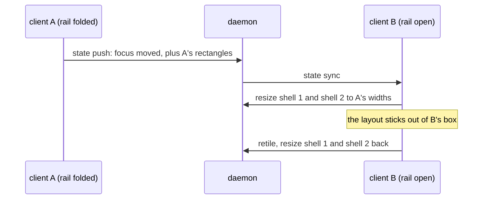

A tuios session lives in the daemon, and any number of clients can attach to
it: a terminal, an SSH login, a browser tab through tuios-web. They all look at
the same windows and the same shells. That is the point of [sharing a
session](/docs/sessions#sharing-a-session).

Each client also draws its own chrome around the panes. There is the session
rail on one side and the dock on the top or bottom, and whether you have them,
and where, is set in each client's own config. Two people on one session can
have different chrome, and so can one person with a terminal on one screen and
a browser tab on the other.

That turned out to be enough to make two clients fight. One pane switch on one
of them resized the two shared shells four times. This post is about why, what
the fix rests on, and the harness I built when fixing the cases one at a time
kept finding more of them.

## One size, the day before

The day before, I had fixed a related bug with the session's size. The session
runs at the smallest size across its clients, which is the usual answer for a
multiplexer: a shell cannot be wider than the smallest screen showing it. (tmux
has a `window-size` option for exactly this choice.) The local client used to
attach with a hardcoded 80x24 and only report its real size once Bubble Tea
sent the first window-size message. Because the session takes the minimum,
that placeholder was not a harmless guess. Attaching a terminal next to a
browser tab collapsed the whole session to 80x24 for a moment, and then
everything grew back.

The same fix found that every keystroke produced a state broadcast to every
peer, whether or not anything had changed. With two clients attached, 31
keystrokes produced 32 peer broadcasts, and all 32 carried a state identical to
the one before. Both ends now fingerprint the state and send nothing when it
has not moved.

So after that fix, the size was agreed. The panes still were not.

## Four resizes for a pane switch

A pane's shell runs in a PTY, and the kernel keeps one window size per PTY.
When tuios lays out the panes, each pane's rectangle becomes its shell's size,
and a change to it is a `TIOCSWINSZ` ioctl, after which the kernel sends
`SIGWINCH` to the program inside.

Each client worked out that layout for itself. It took the session's size,
subtracted its own rail and its own dock, and tiled what was left. Two clients
with different chrome therefore tiled two different boxes and got two different
sets of rectangles for the same panes. That alone would only mean two clients
drawing slightly different pictures. The problem was that every state push
carries the pusher's rectangles, and the peer adopts them.

The test that pinned it holds two full clients on one daemon. The only
difference between them is the rail: folded on one, open on the other. One
ordinary pane switch on the first client does this:



Two resizes out and two back, per push, for as long as anyone types. On the
unfixed tree the test found the two clients running the same two shells at
56x36 and 57x36 on one side and 46x36 on the other. At rest, one of them was
always drawing a pane at a size its shell was not running at.

This is not only wasted work. Every one of those resizes narrows a pane for a
moment, and under a reflowing emulator a narrowing resize is what damages
scrollback.

## The fact the fix rests on

I could have looked for a cleverer rule for when a peer should retile. The
real problem was simpler than that. **A PTY has one size.** Every client
attached to the session is looking at the same PTYs, so the box that their
rectangles are cut from cannot belong to one client. It has to be a session
quantity, and every client has to use the same one.

So the box is negotiated now. Each client reports the chrome it draws, as a
reserve on each edge. The daemon takes the largest reserve on each edge and
sends it back with the session size, because the two are halves of one answer:
the panes' box is the size less the reserve.

```go
// Max returns the reserve that satisfies both, which is the one a session
// agrees on: every client's own chrome fits inside it.
func (r LayoutReserve) Max(o LayoutReserve) LayoutReserve {
	return LayoutReserve{
		Left:   max(r.Left, o.Left),
		Right:  max(r.Right, o.Right),
		Top:    max(r.Top, o.Top),
		Bottom: max(r.Bottom, o.Bottom),
	}
}
```

It has to be the maximum, not an average or a minimum. A client cannot draw a
28-column rail in fewer than 28 columns, and it must not take those columns
from the panes. The only reserve every client can honour at once is the
biggest one. A client with less chrome than the agreed reserve draws a blank
band in the difference and leaves the panes where they are. A client absorbs
its own chrome. It never moves the panes to make room.

Try both models here. The rail and dock sizes are the real defaults, and the
session size is the smallest client's in both modes:

<PaneBoxNegotiation />

The negotiated box has a cost, and the widget shows it. Put the rail on the
left in one client and on the right in the other, and the agreed reserve takes
both edges, so everyone's panes lose a rail's width on each side. I think that
is the right trade. A few blank columns on one screen are visible and harmless.
When two clients disagree about a shell's size, one of them is showing the
person in front of it a pane the shell is not running in.

## The obvious fix is a loop

There is a tempting shape of fix here: when a peer disagrees with a pushed
layout, let it push its own so the other client can catch up. I tried that
shape in the test, as a negative control, and it never stops. Client A pushes,
B reads rectangles that do not fit its box and pushes its own, A reads those
and pushes again. Run that way, the test hit its cap of sixty rounds with the
two clients still trading rectangles.

So the commit makes the echo impossible instead of unlikely. No push leaves a
client while it is applying a peer's sync. The one thing inside a sync that is
real news, a window the daemon asked this client to place, is remembered and
sent once afterwards. That is an answer rather than an echo, and the peer that
applies it has nothing left to say back.

## A resize that changed nothing still did damage

While I was watching the resizes, I found one more thing. A resize to the size
a terminal already had reset the scroll region (DECSTBM), on both emulator
backends. A real resize should reset it. A same-size resize is not a real
resize, but tuios sent them all the time: every client announces every pane's
size for itself, so a second client attaching, or any client re-announcing
after a retile that moved nothing, sent a pane the size it already had. A
full-screen program in that pane lost its scroll region because of a message
that changed nothing.

In the daemon it also added a resize mark to the output ring, broadcast a width
to every subscriber and sent `SIGWINCH` to the guest, which then repainted its
prompt. An unchanged size now returns early in the daemon's `PTY.Resize` and in
both emulators, and a conformance case pins that the margins survive.

## The arithmetic inside the box

The same day there was a second report, from a local terminal and a tuios-web
tab on one session. By then the box was agreed. How it was divided was not.
Shared borders and the pane gap were process globals that nothing synced, so
two clients whose config files disagreed computed different rectangles for the
same panes, or the same rectangles with different guest grids. With shared
borders off, a pane's border takes two rows and two columns out of its guest
grid.

Measured on two clients whose configs disagreed about shared borders, one focus
switch cost one PTY resize and left the clients running the same PTYs at
60x38 and 59x38 on one side and 58x36 and 57x36 on the other. After the fix:
zero resizes, one answer everywhere.

That commit wrote down the rule the rest of this post keeps running into.
Every input to pane geometry must be identical across a session's attached
clients, because a PTY has exactly one size. Anything that moves a rectangle is
session state. Anything purely visual (theme, colours, glyphs, border style,
title position, dimming) stays per-client, so each person can still rice their
own client.

## From instances to the class

That was four multi-client geometry fixes in two days: the size, the reserve,
the arithmetic, and a race where a broadcast that arrived before the client had
registered its handlers was dropped. Each one I found by hand, reproduced by
hand, and pinned with a test written for its own shape. They were all the same
fault: some piece of layout authority still lived in a client, so two clients
held two opinions about one rectangle. Fixing instances clearly was not going
to find the next one. I needed a test for the class.

The convergence harness attaches three headless clients to one session. Each
picks its own terminal size and its own chrome: rail on either side, dock at
either edge, its own shared-borders setting and pane gap. Those are installed
as that client's globals before anything runs on its behalf, so the fleet
behaves like three processes with three config files. Three and not two,
because with two clients "the peer" is always the right answer, and a bug that
sends a broadcast to the wrong client still reaches the only other one.

A seeded random sequence of ordinary actions is then played into them one at a
time: resize a terminal, open a pane, close one, move focus, change the layout,
switch workspace, change the geometry settings, fold the rail, detach and come
back. After every single action the fleet has to converge, and converged is
defined in two halves, because there are two authorities:

| Compared | Must be exactly equal |
| --- | --- |
| Client against client | every pane's rectangle and guest grid on the workspace shown, its z order, minimized and floating flags, the focused pane, the current workspace, the tiling flag, the layout mode, the master ratio, the geometry settings, the negotiated box |
| Client against daemon | the pane set and the fields the daemon owns, the focused pane, and the size the daemon runs each shell at, which has to be the guest grid every client draws it in |

Two stronger or weaker predicates looked tempting and were wrong. Byte-equal
frames are too strong: clients attach at their own sizes, so a larger client
legitimately draws a blank band, and theme, glyphs and input mode are
per-client by design. "The clients went quiet" is too weak. Every divergence
this harness found was a quiet one, where nothing was left to say and two
different answers were held.

It never samples on a timer. After each action it delivers queued broadcasts
until the fleet satisfies the predicate and the queue is empty. A separate cap
on deliveries catches the other failure, two clients trading rectangles
forever, which no deadline can tell apart from slow. On failure it prints the
seed, the whole action journal, and every client's view next to the daemon's.

I checked what it catches by reverting fixes rather than assuming. With the
arithmetic moved back to the config globals, all five default sequences fail.
With the reserve negotiation reverted, three of five fail, naming the pane that
two clients put at different x. It does not catch the other two of the four,
and the file says so: one needs a stale layout to arrive with no size change
beside it, which no action produces, and the attach race was measured at 2 in
200 under load, and forty sequences with it reverted stay green. Five sequences
of eighteen actions take about five seconds, so it runs in the normal suite.

## What it found

It found two divergences before it was even committed, and they landed in the
same merge.

**A layout was judged stale on its far edges only.** A client checks whether a
pushed layout fits its own box before adopting it. The check caught rectangles
that stuck out of the box and rectangles that stopped short of the right or
bottom edge. It did not look at the left and top. That shape is real: a client
attaches, is handed the session's reserve as it stands, lays the panes out
against it and pushes. If the reserve then shrinks because this same client
asks for less chrome than the one already there, the rectangles it pushed start
too far in and still reach the far edges exactly. A peer that had already
retiled against the smaller reserve adopted them and drew every shared shell
narrower than it was running. The check looks at all four edges now. You can
see the old behaviour in the widget: in the old mode, switch pane on B and
client A keeps B's inset layout without complaint.

**A workspace switch from a sync did not retile.** The rectangles in the sync
were right. But the panes it brought on screen had last been laid out on this
client under whatever shared-borders setting was in force then, so each kept
the wrong border allowance: two rows and two columns of every guest on the
workspace, on this client alone. A workspace change now joins the same retile
as a geometry change.

## Then zoom, and everything else that moves a rectangle

The harness had two switches for divergences it could reproduce and the tree
could not yet pass. One of them was zoom.

Zoom was a flag on the client's own window object, and the session state had no
field for it. The rectangle it produced went out on the wire as ordinary
tiling. A peer saw one pane covering the whole box, with nothing to say why,
read it as a layout computed for someone else's screen, tiled it away and
resized the shared shell. The client that zoomed was left drawing a guest grid
the daemon was not running. The deciding fact is the same one: zooming resizes
the PTY, and a PTY has one size. A flag kept locally while its rectangle is
broadcast cannot work. Now the flag travels and the rectangle does not. Each
peer computes the zoom box against its own bounds, the way it computes a tiled
layout, and zoom went back into the harness's default actions.

Once I was looking for it, the same shape showed up across the rest of the
[layout modes](/docs/layout-modes) over the next ten days. Here is the whole
series, including the fixes from before the harness:

| State | Where it lived | What went wrong | Commit |
| --- | --- | --- | --- |
| The rail and dock reserve | each client | four resizes per pane switch | `8de5a589` |
| Shared borders, pane gap | process globals | same rectangles, two guest grids | `846b7d28` |
| Zoom | a flag on one client | peer tiled the zoom away | `38cefd4b` |
| Master-stack ratio per workspace | each client | A tunes workspace 3 to 0.70, B has never been there, comes up at 0.50 and pushes 0.50 | `a3b57f95` |
| Scrolling strip offset | each client | peer kept its viewport, focused pane at x=-65 on a 100-wide screen | `d7299aeb` |
| "Arranged by hand" flag | each client | A arranges 40/120 on workspace 3, B's first visit retiles to 80/80 and pushes it | `a3d591fb` |
| Window set during an open or close | a snapshot taken before the change | a surviving pane held at 29x17 on one client and 29x34 on another | `225d3aa1` |
| The BSP tree | the client that built it | peer drew a box around every borderless pane and built its own spiral | `da6cbfe2` |

Two of these are worth a closer look.

The stale push was not about layout at all. A client does not open a window
itself. It sends the daemon an intent and waits for the answer. But the input
handler pushed the client's state after every input, including that one, and
the snapshot was built before the change the client had just asked for. It
reached the daemon after the daemon's own change, and the daemon kept the
pushing client's rectangles, which described a window set that no longer
existed. Nothing downstream could tell, because the panes of the older, smaller
set still filled the box exactly. The fix is that a client with an intent in
flight has nothing to say about the window set, so it says nothing. Over forty
sequences with that action enabled, the harness went from 16 failures to 3, and
those 3 were a different bug: a client rejoining with a zoomed pane.

The scrolling strip had a gob detail I will remember. The offset was a `*int`,
and gob flattens a pointer to the value it points to and omits a zero value. So
an offset of 0 went over the wire as nothing and decoded as "this peer has not
said". The strip's home position, the most common place for it to be, was the
one offset that never travelled. It is a pointer to a struct now, which gob does
not elide.

## Three clients that were built three different ways

The last fix in this series was not about geometry either, but it came from the
same habit of asking whether two clients were really the same.

The local client, the SSH server and tuios-web each built a client in their
own entry point: the Bubble Tea options, the daemon callbacks, the attach
sequence, the config watcher. Anything added to one copy was missing from the
others until someone noticed. The worst gap was the mouse motion filter, which
only the local client installed. Over SSH or the web, every pointer move over
chrome composed a full frame that the renderer then found unchanged:

<BenchBars
  groups={["one pointer move over chrome"]}
  series={[
    { label: "SSH, no motion filter", values: [582], tone: "baseline" },
    { label: "SSH, with the filter", values: [47], tone: "subject" }
  ]}
  unit="µs"
  groupLabel="event"
  caption="Server CPU per pointer event over a real SSH session, before and after the SSH server got the same motion filter as the local client."
/>

That was measured per pointer event over a real SSH session. The same commit
found that `tuios attach` had no config hot reload, the after-attach hook never
fired for SSH or web clients, a daemon started by `tuios ssh` read only the hooks
from the `[daemon]` section, and `pkg/tuios` carried a third, stale copy of the
filter. Every client is now built through one set of functions, and a test
reads the syntax tree to check that every entry point uses them. Twenty-two
mutations of the guarded lines were each caught by the test that names them.

## What belongs to whom

After all of this, the split is easy to state, and I wish I had written it down
first:

| Belongs to the session | Belongs to the client |
| --- | --- |
| the session size (smallest client) and the chrome reserve (largest per edge) | its own terminal size, and the blank band it draws |
| shared borders and the pane gap | theme, colours, glyphs, border style |
| every pane's rectangle, and the BSP tree | where its own rail and dock sit |
| zoom, master ratios, the strip offset, the "arranged by hand" flag | input mode and copy-mode position |
| which pane is focused, which workspace is shown | appearance and behaviour settings |

The test for which column a piece of state belongs in is one question: does it
change the size of a shell? If it does, a PTY has one size, and the state
belongs to the session. The [release notes](/releases/since-v0-7-0#one-layout-for-every-client)
list what this means for users.

## It is not finished

The harness still has one switch that is off by default. With it on, the
"change the layout" action cycles through all three tiling modes, and three of
the five default sequences fail. I ran it again while writing this and got the
same three failures. Each is a piece of layout authority that still lives in a
client: the scrolling strip's column topology, where a new pane goes in the
strip, and one border allowance under master-stack.

The default run is not perfectly clean either. The first time I ran it for
this post, one of the five sequences failed. Replaying that seed six times
failed once:

<TerminalCapture
  title="TUIOS_CONVERGE_SEED=4354685564937353519, one run in six"
  lines={[
    { text: "client C opened a pane: clients A and C disagree: pane 9f40c044:", tone: "normal" },
    { text: "  A  @24,2 50x30 guest 50x30 zoom=true", tone: "normal" },
    { text: "  C  @24,2 50x30 guest 48x28 zoom=true", tone: "echo" },
    { text: "  daemon runs 9f40c044 at 48x28", tone: "echo" },
    { text: "", tone: "dim" },
    { text: "  14. client C zoomed 58479da4", tone: "dim" },
    { text: "  15. client C opened a pane", tone: "dim" },
    { text: "session 98x34 reserve {Left:24 Right:24 Top:2 Bottom:2}", tone: "dim" }
  ]}
  rows={8}
  note="Trimmed from the harness's own report. The same rectangle carries two guest grids, a border allowance apart, and client A draws a size the daemon is not running. The seed fixes the actions but not the order real sockets deliver in, so a divergence that needs a particular interleaving replays as a probability."
/>

That one is not fixed yet. But this is the kind of report I wanted from the
start: it names the pane, the two clients, the two answers, and the steps that
led there, instead of a person noticing a pane that looks slightly wrong. For
a class of bug that only shows up with more than one client attached, that
report is most of the work.
