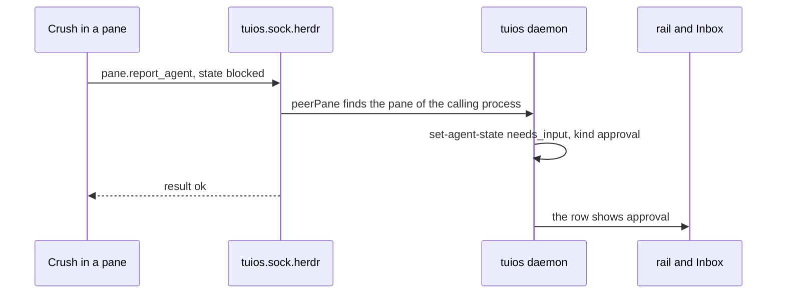

Charm ships [Crush](https://github.com/charmbracelet/crush) with a client for
[herdr](https://github.com/herdrdev/herdr), another terminal multiplexer for
coding agents. When Crush starts a turn, waits on a permission prompt or
finishes, it tells herdr over a unix socket. [Collie](https://github.com/AltanS/collie),
a phone client for agents, has an adapter that drives herdr through the same
socket: it lists panes, reads them, types into them and follows their events.

Neither tool knows tuios exists. I could have written a tuios client for each
one and asked their maintainers to merge it. Instead, on 30 September, two pull
requests made every tuios pane answer herdr's protocol:
[#287](https://github.com/Gaurav-Gosain/tuios/pull/287) for the agent reports,
and [#301](https://github.com/Gaurav-Gosain/tuios/pull/301) for the rest of
herdr's socket API. Both shipped in v0.8.3. A Crush or a Collie pointed at a
tuios pane now works with no setup.

## What herdr gives a pane

herdr puts five variables in each pane's environment: `HERDR_ENV=1`,
`HERDR_SOCKET_PATH`, `HERDR_PANE_ID`, `HERDR_WORKSPACE_ID` and
`HERDR_BIN_PATH`. A program that wants to talk to herdr connects to the socket,
writes one JSON line with an `id`, a `method` and `params`, reads one line back
and closes the connection. One request per connection.

An agent reports itself with `pane.report_agent`. The state is one of
`working`, `blocked`, `idle` or `unknown`. Each report carries a `seq`, and
herdr drops a report whose seq is not above the last one from the same source.
Crush seeds its seq from the clock.

That is the whole contract an agent needs. Everything Collie does goes through
the same socket with other methods.

## Where it started

The first Crush support landed on 27 September in
[f68dcf13](https://github.com/Gaurav-Gosain/tuios/commit/f68dcf13), for v0.8.0.
tuios opened a socket of its own and set the variables only in a pane that
started Crush directly. That was cautious, and it was wrong for the usual case.
People start Crush from a shell prompt, and that pane had no variables, so
Crush reported nothing. A Crush that crashed also left its pane on `working`
for the life of the pane, because nothing ever said otherwise.

## Every pane, by default

#287 made `[agents] herdr_protocol` default to `always`. herdr gives every pane
its environment, so tuios does too. This is the function the daemon calls when
it spawns a pane, in `internal/session/manager.go`:

```go
if sock == "" || windowID == "" || mode == config.HerdrProtocolOff {
	return nil
}
if mode != config.HerdrProtocolAlways && !guestenv.SpeaksHerdrProtocol(command) {
	return nil
}
env := []string{"HERDR_ENV=1", "HERDR_SOCKET_PATH=" + sock, "HERDR_PANE_ID=" + herdrPaneID(sessionID, windowID)}
if sessionID != "" {
	env = append(env, "HERDR_WORKSPACE_ID="+herdrWorkspaceID(sessionID))
}
if p := m.herdrBin.Load(); p != nil && *p != "" {
	env = append(env, "HERDR_BIN_PATH="+*p)
}
return env
```

The default has a cost, and the release notes say so. herdr reads
`HERDR_ENV=1` as "you are inside herdr" and refuses to start nested. With the
new default, a real herdr started in a tuios pane stops with its nesting
message. `herdr_protocol = "agents"` goes back to the old scope, and herdr's
own `experimental.allow_nested` also works.

`HERDR_BIN_PATH` names the tuios binary itself. herdr's guide tells agent
authors to report with `"$HERDR_BIN_PATH" pane report-agent`, so tuios has
hidden commands that take herdr's arguments: `pane report-agent`,
`report-agent-session`, `release-agent`, `report-metadata` and
`notification show`.

The socket is never herdr's. It sits beside the daemon's socket, at
`<daemon socket>.herdr`, with mode 0700. A pane never inherits an outer
herdr's `HERDR_ENV` or pane ids either. They go on the same strip list as
`TMUX`, so an agent in a tuios pane cannot report to a herdr that tuios itself
runs in.

## From herdr's states to tuios's

Every report goes through `verbSetAgentState`, the same path `tuios
set-agent-state` takes. The source ranking, the Inbox, the alerts and the rail
all see a Crush report the way they see any other.



The mapping is short:

| herdr | tuios |
| --- | --- |
| `working` | `working` |
| `blocked` | `needs_input` |
| `idle` | `done` if the pane was `working` or `needs_input`, else `idle` |
| `unknown` | no change |

`idle` needed the most thought. herdr has one word for "at rest". tuios tells a
finished turn apart from a pane that never started one, because a finished
turn is something you may want to read. So an `idle` that follows a turn
becomes `done`, and an `idle` from anywhere else, Crush's first report
included, stays `idle`.

`blocked` needed a kind. The Inbox groups a waiting agent by what it waits
for, an approval or a question. A Crush pull request,
[charmbracelet/crush#3541](https://github.com/charmbracelet/crush/pull/3541),
sends a message with every block. A permission request starts with
`Permission`. A question sends the question.

```go
func herdrBlockedKind(harness, msg string) string {
	if harness != "crush" {
		return ""
	}
	if msg == "" || strings.HasPrefix(msg, "Permission") {
		return harnessKindApproval
	}
	return harnessKindQuestion
}
```

An empty message is an approval because Crush releases before #3541 report
`blocked` only for a permission request, and send no message.

## A report speaks only for its own pane

A herdr report names a pane. tuios does not trust the name. The daemon finds
the process on the other end of the connection the way it finds every caller:
the kernel's peer pid, then its ancestors, then its terminal, and last its
`TUIOS_PANE_ID`. A report for any other pane is refused. A process outside
every pane cannot report at all.

The crashed Crush needed the reporting process too. #287 records the process
that reported, and for a short hook the first program above it that is not a
shell. When the last report is more than 2 seconds old and none of those
processes is alive, the claim lapses and the pane clears. herdr has the same
rule. In the PR, a real Crush was killed with `kill -9` while its permission
dialog was open, and its pane cleared in about 1.5 seconds.

## The rest of the socket

Reports were enough for Crush. Collie needs the rest: `session.snapshot`,
`pane.read`, `pane.send_text`, `tab.create`, `events.subscribe` and more. #301
answers herdr's socket API as of herdr 0.9.3, protocol 22.

The first problem is that herdr and tuios cut the world differently. #301 maps
them like this:

| herdr | tuios | id |
| --- | --- | --- |
| workspace | session | `w` and 12 hex digits of the session id |
| tab | workspace | `<ws>:t<workspace number>` |
| pane | window | `<ws>:p` and 12 hex digits of the window id |

The PR lists 40 methods that answer, beside the report methods. 57 more of herdr's methods answer
`unsupported` in herdr's own error shape: `pane.zoom`, `pane.resize`, the
`layout.*` and `plugin.*` families and others. A method herdr does not have
answers `invalid_request`, as herdr does. `ping` answers with herdr's version
plus `+tuios` and `server: "tuios"`, so a client can tell which one it reached.

The second problem is authority. A socket that can type into panes is a socket
that can type `rm -rf` into a pane. tuios already had rules for that on its
own verb socket: grants per pane, and no typing into a waiting prompt without
the `respond` grant. #301 did not write a second set. Each herdr method runs
the tuios verb that does the same work, through `admitVerb`, the path the verb
socket uses. Reads need `read`, typing needs `write`, and structural changes
need `admin`.

Review of #301 found three problems in that path.
`worktree.open` ran `git worktree list` before it checked the grant, so a pane
with no grants could learn whether a branch existed. `events.subscribe` looked
up pane ids before it checked the caller. Waits outlived a closed client. All
three were fixed before the merge.

Two more came from Collie's real traffic. herdr 0.9.3 writes `send_text` raw,
so a multi-line reply from Collie ran in the shell line by line. tuios sends it
as a paste ([51897a7c](https://github.com/Gaurav-Gosain/tuios/commit/51897a7c)).
`agent.prompt` had the same problem and now types through the same path as
`ask-agent`.

## How I checked it

The unit tests cover each method and the grants. `TestHerdrConformanceCollie`
replays a fixture taken from Collie's `bridge/mux/herdr/client.ts` at v1.14.2:
25 requests over 18 methods, with the result fields Collie reads from each.

By hand, Collie 1.14.2 with `COLLIE_MUX=herdr` ran against an isolated tuios
daemon: the snapshot showed the agent as blocked, and reading, replying, keys,
rename, focus, a new tab, a new space, the worktree calls and the event stream
all worked. herdr's own 0.9.1 CLI worked against the socket too, with
`pane list`, `pane read`, `pane send-text` and `api snapshot`.

For #287, the end-to-end test `TestRealCrushInParallelPanes` builds a real
Crush from #3541 and runs three of them against a local stand-in model, with
no API key and no network. They go idle, working, waiting for approval and
done. One quits and releases. One is killed with `kill -9` and clears.

One bug came later. Under load, a connection over the per-process cap got a
broken pipe instead of `rate_limited`. That is in [the post about the flaky
tests](/blog/three-flaky-tests-and-what-they-were-hiding), because a flaky
test is where it showed up.

## What it does not do

- `notification.show` raises no toast in the client. tuios has no path for a
  toast from the daemon to a client yet. The notification becomes an event and
  a match against the harness's notify rules.
- `resume_argv` is accepted and ignored. tuios resumes an agent from the
  harness and the session id a hook recorded.
- Scratch terminals are not herdr panes.
- A real herdr does not start in a tuios pane under the default setting.

The details, and the full table of methods, are on the [herdr
compatibility](/docs/herdr-compatibility) page.
