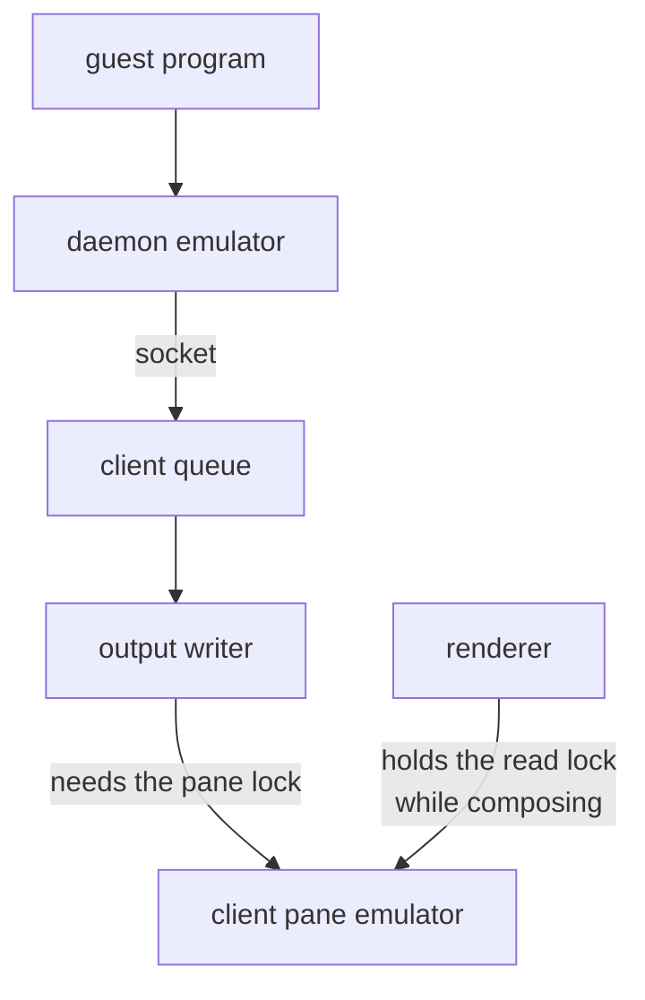

Flood a pane hard enough (a 192 MiB DOOM fire into a 158 by 41 grid), kill
the source, and the pane goes on painting. Not for a frame or two. For over
a second after the process is dead, the fire keeps burning.

The first two theories are the comfortable ones: a timer left armed, or
scrollback being redrawn. It is neither. It is a backlog. The daemon's
emulator paces the guest, but nothing paces the client, and the client is
the slower side because it also draws. So the queue between daemon and
client grows for the length of the flood and is worked through afterwards,
frame by frame, on screen.



## The same number twice

What made this worth a post is where the backlog comes from. Measured on
the flood above: the client's output writer waited 1117 ms in total for the
pane's read lock, and the pane went on painting for 1215 ms after the
source process exited.

Those are the same number twice. Composing a frame holds the pane's read
lock for the length of a compose, and every millisecond the renderer holds
it is a millisecond the writer is not draining the queue. The backlog a
client builds is very nearly the time its own renderer took from it. And
every frame drawn out of that backlog is overwritten by bytes already
queued behind it, so the client is falling behind in order to draw what it
is falling behind on. The renderer is not a witness to the backlog. It is a
cause of it.

<SpentFrames />

## Pacing by the debt, not only by the cost

The render coalescer already paced a pane by what its frames cost the
client. It now also paces by what the pane is behind, tracked in bytes
queued for the emulator rather than in channel slots, which vary in size by
two orders of magnitude and say nothing about how much work is queued.

```go
if w.queuedBytes.Load() >= catchUpBacklog {
    return catchUpCoalesceInterval
}
```

The threshold is 4 MiB, roughly a tenth of a second of the client's own
parsing, so an ordinary burst (a paste, a large directory listing) stays
under it. A pane past it drops to a frame every 250 ms until it catches
up: slow enough that the renderer stops taking the read lock out from
under the pane's own writer, fast enough to stay visibly alive.

Nothing is discarded. The emulator still sees every byte in order, so the
scrollback is exactly what it would have been. The alternative, throwing
the queue away and resyncing from a daemon snapshot, would have put a
silent hole in it, because the snapshot carries
a bounded scrollback window and the queue does not.

## The numbers

Same flood, three runs each, measuring how long the pane paints after the
source process dies:

<BenchBars
  groups={["run 1", "run 2", "run 3"]}
  series={[
    { label: "before", values: [1.086, 1.171, 1.064], tone: "baseline" },
    { label: "after", values: [0.518, 0.498, 0.474], tone: "subject" }
  ]}
  unit="s"
  groupLabel=""
  caption="Painting after the source process died: 192 MiB fire, 158x41 fullscreen pane. Frames painted in that tail went from 731, 743 and 709 to 424, 409 and 395."
/>

The drain is faster as well as quieter: a 256 KiB batch went from 6.2 ms to
3.95 ms, with the writer's lock wait halved. What remains of the tail is
the client emulator's own parse rate, which is the honest floor. The bytes
exist and something has to parse them.

The pacing is described with the other render settings on the
[architecture page](/docs/architecture#performance). Profiling a DOOM-fire
flood at nearly the same size showed that a fifth of each frame went to
[a wrap that changed nothing](/blog/a-fifth-of-every-frame-went-to-changing-nothing),
which is compose time a backlog like this one pays for. And the shape is the
one from [a resize drag that trailed the mouse](/blog/measuring-before-optimising):
a queue that grows while you work, and drains after you stop.

## What I keep from this

The instinct with a backlog is to look at the producer: something wrote too
much, too fast. Here the producer was innocent and dead, and the consumer
was manufacturing its own lateness, spending drain time on frames whose
only property was being already obsolete. The fix was not to work faster.
It was to notice that once a pane is behind, the frames it is being asked
for are already spent, and the cheapest thing a renderer can do with spent
work is not do it.
