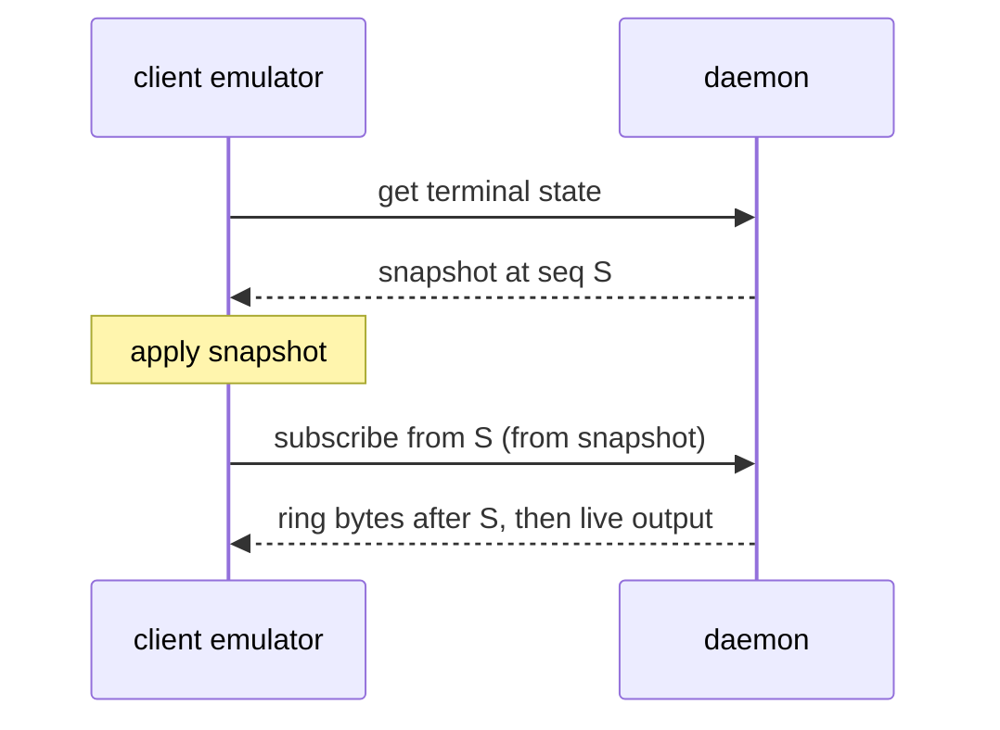

On 4 April I added session resurrection to tuios. The commit message said it
all: periodic persistence to `$XDG_STATE_HOME/tuios/sessions/`, an atomic save,
a load, a list, a save every 30 seconds, and "can recreate windows in same CWD
and layout after crash". The same evening a commit titled "wire all unwired
features into UI" started the 30 second saver in every session.

It wired the writer. It did not wire the reader. `LoadResurrectionState` had
exactly one caller, the function that listed saved sessions, and nothing ever
called that. From April to 18 July every tuios daemon wrote a JSON file per
session every 30 seconds, and when the daemon restarted, every session was gone.

The tests were green the whole time. `TestSaveAndLoadResurrection` saved a
state, loaded it back and compared the two. That is a real test of a real
round trip, and it says nothing about whether anybody ever takes the trip.

This post is about the two halves of a session coming back. The first half is
the daemon restarting: getting a session's shape off disk and into a live
daemon. The second is a client reattaching: getting a pane's screen out of the
daemon and onto your terminal without painting anything twice or losing rows.
Both had bugs that only showed up once something actually read what had been
written.

## Wiring up the read side

The restore landed on 18 July in two commits. The first hardened the file so
it was safe to read on a cold start:

- Every state file carries a schema version. A file from a newer tuios, or one
  that does not parse, is moved to an archive directory rather than loaded or
  deleted. One bad file can never crash the daemon or stop it starting.
- Each window records its working directory. The daemon reads it from the live
  shell process when it saves. The client never supplies it.
- `RestorePTY` starts a fresh shell in the saved directory, sets
  `TUIOS_RESTORED=1` in its environment and writes a dimmed one-line banner
  into the pane.
- `tuios kill-session` deletes the saved state, so a session you killed on
  purpose never comes back.

The second did the restore. On start, before it accepts a single client, the
daemon recreates every saved session: windows, workspaces, titles, the layout
and the BSP trees, with a new shell in each window. The old PTY ids died with
the old daemon, so every window is remapped to its new PTY. `tuios resurrect`
lists what is saved or brings one session back by name, and
`tuios daemon --no-restore` leaves restoring to you.

Here is what that looks like today, on macOS, against a scratch state
directory. I created a session, opened a second window, and sent the daemon a
`SIGKILL` three seconds later:

<TerminalCapture
  title="tuios ls, after kill -9"
  lines={[
    { text: "╭──────┬─────────┬────────┬─────────┬─────────────╮", tone: "dim" },
    { text: "│ NAME │ WINDOWS │ STATUS │ CREATED │ LAST ACTIVE │" },
    { text: "├──────┼─────────┼────────┼─────────┼─────────────┤", tone: "dim" },
    { text: "│ work │ 2       │ saved  │ -       │ just now    │" },
    { text: "╰──────┴─────────┴────────┴─────────┴─────────────╯", tone: "dim" },
    { text: "" },
    { text: "saved: on disk only, with no daemon running to hold it.", tone: "dim" },
  ]}
  note="Both windows were on disk within the three seconds. With no daemon running, tuios ls reads the state directory and says the session is saved. It also exits 3, so a script can tell a stopped daemon from an empty one."
/>

Starting a daemon again brings it back, marked as restored until the first
attach, with a new shell in the directory the old one was in:

<TerminalCapture
  title="after a new daemon starts"
  lines={[
    { text: "$ tuios ls", tone: "dim" },
    { text: "╭──────┬─────────┬──────────┬──────────┬─────────────╮", tone: "dim" },
    { text: "│ NAME │ WINDOWS │ STATUS   │ CREATED  │ LAST ACTIVE │" },
    { text: "├──────┼─────────┼──────────┼──────────┼─────────────┤", tone: "dim" },
    { text: "│ work │ 2       │ restored │ just now │ just now    │" },
    { text: "╰──────┴─────────┴──────────┴──────────┴─────────────╯", tone: "dim" },
    { text: "restored: the layout came back from saved state, and the shells are new.", tone: "dim" },
    { text: "" },
    { text: "$ tuios capture-pane -s work", tone: "dim" },
    { text: "-- tuios: session restored, fresh shell in /private/tmp/claude-501/trd/h/src/a", tone: "echo" },
    { text: "pi --", tone: "echo" },
    { text: "$ echo $TUIOS_RESTORED; pwd" },
    { text: "1" },
    { text: "/private/tmp/claude-501/trd/h/src/api" },
  ]}
  note="The daemon was started from /, and the shells came back in src/api, where the old ones had been. The banner is written into the pane's emulator only. The shell never sees it."
/>

That is the version that works. Getting there took another two months, because
the moment the file was read, everything wrong with how it was written started
to matter.

## What reading it exposed

On 12 August four fixes landed within ten minutes of each other. Each one is a
case where the saved state described something that did not exist, or failed
to describe something that did.

### The session you just made was the one you lost

The saver was a ticker started when the session was created. Its first write
was 30 seconds later. So a session created 25 seconds before a `SIGKILL` was
not stale after the restart. It had never been written at all, and it was the
session you had just made.

The fix sets a flag on every change to a session's structure, and the saver
polls that flag every 2 seconds. A poll that finds nothing changed does
nothing. The 30 second write stayed exactly as it was, because it is what keeps
each window's working directory current: typing `cd` changes no structure, so
no flag is set. A structural change now reaches disk within about two seconds,
and an idle session writes no more often than it did before.

Two tests pin both halves of that bargain. One fails if a changed session is
not on disk within three polls. The other fails if the faster poll turns into
faster writes for a session where nothing changed.

<ReattachReplay initialTab="kill" />

Drag the kill before 30 seconds and the old ticker has nothing on disk. Drag it
to 40 and the old ticker brings back one window and loses the one opened at 35
seconds. The new saver has both by 36 seconds, and by the end it has written
three times to the old ticker's two.

### A window that was really a hole

If a restored window's shell would not start, the window stayed in the session
holding the PTY id of the previous daemon's process. Nothing answers to that
id. The pane could not print, could not be typed into and could not be revived,
and nothing anywhere draws a pane as dead. It looked like a window and it was a
hole in the layout.

The fix drops the window, which is what the daemon already does whenever a PTY
goes away, and repairs focus in case the dropped window had it.

### Sessions with nothing in them

A session whose windows had all been closed still left a state file, and the
next daemon start restored it as a live session with no windows. It listed, it
showed in the rail, you could attach to it, and there was nothing in it. The
restore now refuses a session with no windows, for the automatic path and for
`tuios resurrect <name>` alike, and the automatic path deletes the file so it
stops being offered forever.

### Files nothing cleaned up

A save writes `<name>.json.tmp` and renames it. A daemon killed between those
two steps left the temp file forever. The archive, which exists so a file that
would not load can still be inspected, had no bound at all. The daemon now
sweeps the directory on start, the one moment none of its own saves can be in
flight: temp files go unconditionally, and archived files go after 14 days.
The sweep is best effort. A directory that cannot be swept must never stop the
daemon from starting.

Two days later there was one more: with `--no-restore`, `tuios attach work`
called a session that was sitting right there on disk unknown, and offered to
create it. It now says the daemon has not restored it, how many windows it
saved, and to run `tuios resurrect work`.

### The working directory on macOS

The daemon read each shell's working directory with
`os.Readlink("/proc/<pid>/cwd")`. macOS has no `/proc`. The read failed
quietly, the field stayed empty, and every restored macOS pane opened in
whatever directory the daemon happened to be started from. No error, no
warning, on a platform I use every day.

The same assumption had been written three times in three packages, and it was
found three times:

| Date | What was reading `/proc` | What it broke on macOS |
|---|---|---|
| 19 Aug | agent detection | no pane was ever detected as running an agent |
| 13 Sep | the terminal's `ShellCWD` | the OSC 7 spoof guard on sidebar file actions failed open |
| 18 Sep | the session's `ProcessCwd` | restored windows lost their directory |

The resurrection fix came in almost by accident, inside a commit that made new
windows open in the focused pane's directory. That feature needed the same
read, found it empty on macOS, and fixed it for both. On 22 September the two
copies of the per-platform reader were merged into one
`ptyspawn.ProcessCwd`, and the resurrection cwd test now runs on macOS too.
The darwin path goes through `proc_pidinfo` without cgo, so the release build
stays `CGO_ENABLED=0`.

## The second half: a pane has two sources

A restarted daemon has respawned shells with nothing on screen. A daemon that
kept running has live panes, and a client that reattaches to one has to end up
drawing the same screen the daemon holds. That is harder than it sounds, and
[REHYDRATION.md](https://github.com/Gaurav-Gosain/tuios/blob/main/docs/REHYDRATION.md)
is the document I wrote to keep it straight.

The daemon runs a terminal emulator for every pane, and a client runs a second
one. There are two ways to fill the client's:

- **The snapshot.** The daemon serializes its emulator: the grid, the cursor,
  the pen, the modes, the scroll region, the character sets, up to 1000 rows of
  scrollback. It is a picture of now, and it carries the stream position it was
  taken at.
- **The stream.** Every PTY keeps a 64 KB ring of the bytes it produced and a
  counter of every byte it ever produced. Subscribing from a position replays
  the ring from there and then streams live. It is history: applying the same
  bytes twice paints them twice.

They are not interchangeable and they are not additive. The rule is that a
client lays down the snapshot, then subscribes from exactly the position the
snapshot ends at, so nothing overlaps:

Two bugs broke that rule this summer, in two different ways.

### Painting the old picture over the new one

The client used to subscribe to the PTY first and fetch the snapshot second.
Live output was already streaming into the pane while cells that were by
definition older were painted over it. And the restore wrote into the emulator
with no lock held, while the output goroutine wrote the same cell buffer under
the I/O lock and the renderer read it under the same lock.

I found it by building with `-race` and driving the build through the e2e
suite. This was the most frequent signature in that run: 112 of 182 race
reports, 96 through the window sync path and 16 through the tape playback
re-fetch. The fix on 26 July does the restore under the I/O lock, and does it
before subscribing, in one function that both call sites now share. The cost
of restoring first is whatever the pane prints during a single round trip. The
new test drives a restore against live output directly, and against the old
unlocked code it reports 46 races.

### top, one blank line apart

On 16 August a user on Linux reported
[issue #123](https://github.com/Gaurav-Gosain/tuios/issues/123): run `top`,
detach, attach, and `top` comes back with an empty line between its rows. Quit
`top` and run it again, and it still looks like that.

The fix came from a contributor, SebaWag, in PR #139, and it landed on 1
September. The shape was this. When a pane produces output faster than the
daemon's emulator consumes it, the ring can roll past the position the
client's snapshot was taken at. The bytes between the snapshot and the ring's
start are gone. The old code handled that case by prefixing the replay with a
screen clear, `ESC[H ESC[2J ESC[3J`, and then sending the ring from its first
byte.

That was the right call for a client that still held a stale screen from
before it left. It was the wrong call for a client that had just laid down an
authoritative snapshot, for two reasons:

- The clear threw away the snapshot. A full-screen program like `top` does not
  rewrite every row on every tick. Every row that only the snapshot held came
  back blank.
- The ring's first byte is almost never the first byte of a chunk. It is the
  middle of whatever the program wrote, sometimes the middle of an escape sequence,
  replayed against cursor and mode state the client never saw.

The fix has two daemon-side parts. A client that restored a snapshot says so
when it subscribes, and a rolled catch-up replays on top of the snapshot
instead of clearing it. And the PTY records where each chunk began, so a rolled
catch-up starts at the first whole chunk inside the ring rather than at its raw
first byte.

<ReattachReplay />

Drag the slider until the ring rolls past the snapshot, then switch between
the two paths. Before, the header rows `top` did not rewrite come back blank
between the ones it did. After, the snapshot supplies them and the screen
matches the daemon.

I have to be honest about where this ended. I could not reproduce the user's
steps. Real `top`, detach, wait, attach, at the same size and at a smaller
size, came back clean every time. To reach the bug in a test, the pane had to
repaint far faster than `top` does. The fix is real and its tests cover the
quiet, redrawing, rolled and quit-the-alternate-screen reattach paths, but it
does not fully explain the report. I reopened the issue on purpose, and at the
time of writing it is still open, waiting on the reporter.

### History that only gets longer

One more rule was written into the contract in September. A pane whose emulator
survived a workspace switch should be handed only the rows that scrolled off
while it was away, and should never have its history replaced by the daemon's
bounded window. The ghostty backend broke that: its restore started from a hard
reset, which drops the library's history, so the tail the daemon sent became
the whole history and deep scrollback vanished on every workspace switch
(issue #146). It now starts from a hard reset only when the emulator holds no
history, and a wire test with eleven streams covers the second restore on both backends.

## What does not come back, on purpose

Resurrection brings back the shape of a session, not what was running in it.
The [sessions docs](/docs/sessions#session-resurrection) spell it out:

- **Running programs.** Every window gets a fresh shell. A `vim`, a build or an
  ssh connection is not restarted.
- **Screen contents and scrollback.** They live only in the daemon's memory and
  are never written to disk.
- **The last couple of seconds.** A window created just before a `SIGKILL` may
  be missing, and a `cd` made less than 30 seconds before it may not be
  recorded.

A restored shell is marked so neither you nor your tools mistake it for the
old one. The banner is for you. `TUIOS_RESTORED=1` is for your shell profile
and your scripts, which can check it and behave differently in a restored
shell. The
session shows a `restored` tag in `tuios ls`, the rail and the switcher until
you first attach.

## What I took from it

The resurrection file was the cleanest kind of dead code: it ran, it did its
job correctly, it was tested, and its output went nowhere. A round-trip test
proves the two halves agree. It does not prove anyone uses either half, and
nothing about a green test run would ever have said so.

Everything after that came from reading the state for real. The blind ticker,
the dead PTY, the empty sessions and the macOS directories were all present
from the day the file was first written. None of them could hurt anyone while
nobody read the file, so none of them were found until someone did.
