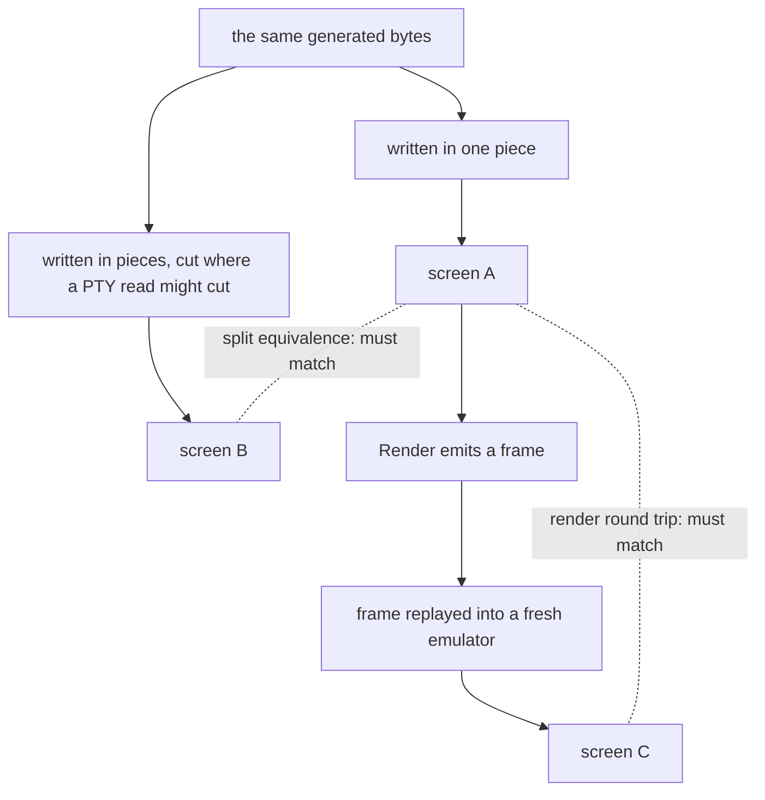

Every tuios pane is driven by an [in-process terminal
emulator](/docs/architecture), `internal/vt`.
It has fuzz targets, and they are not naive ones: raw random bytes almost
never form an escape sequence, so a byte-flinging fuzzer spends its whole
budget in the parser's ground state and never reaches the code that moves the
cursor or scrolls a region. The targets draw from a generator that builds
real sequences carrying hostile parameters, and they check invariants after
every step rather than only watching for a panic.

A campaign of 590,000 executions found nothing. In the same stretch, a
conformance round done by hand found eleven bugs. The fuzzer found none of
them. Not a reduced form of one, not a hint. None.

## Not a coverage problem

The first suspect was reach, so I measured it. The generated-input targets
cover 55.3% of `internal/vt`. The unit suite covers 75.4%. That gap looks
like the answer, and it is not. The structured generator beats raw random
bytes by only 3.4 points, and it demonstrably produces the traffic: DECSED,
DECSTBM and the rest, thousands of times each across a campaign.

The sequences were reaching the code. The code was running. Whatever the
code did next, nobody looked.

## What passing meant

The targets check four structural invariants: the screen has a non-negative
size, the scroll region is inside it, the cursor is inside it, and no cell
claims more columns than the row has left. Each one is a class of bug that
has actually shipped here. A scroll region past the end of the screen was
once a daemon-wide panic.

But all four are statements about the shape of the data structure, and an
emulator that silently does the wrong thing produces a perfectly well-formed
wrong answer. Move the cursor to the wrong row, drop an attribute, lose a
column: the grid stays exactly as tidy as before. 590,000 executions were
asking "is the screen well formed" of screens that were quietly wrong, and
getting the true answer yes.

The fix is not more invariants of the same kind. Writing down what the
screen should hold after DECSED with a hostile parameter means implementing
DECSED a second time in the test, and the second implementation is no more
trustworthy than the first.

## Two questions that need no answer key

There are properties that need nobody to write down the right answer,
because they relate the emulator to itself:

- a frame the emulator emits must redraw the screen the emulator holds
- the same bytes must draw the same screen however the read boundaries fall

The first matters because `Render` is what the app sends to the host
terminal, and nothing else checks it is faithful: the grid tests read cells,
and the frame goes out unread. The second matters because a PTY hands the
parser whatever the kernel had ready, so the same program output arrives in
different pieces on every run. If the screen depends on the pieces, a pane
renders differently depending on machine load.

Neither property knows what any sequence means. Both only ask the emulator
to be consistent with itself, so any violation is a bug by construction.



I wrote both. Both fail, and both failures are real.

<InvariantBlind />

## The E that was on screen and not in the frame

The render round trip fails on an input of two sequences. DECALN fills the
screen with E, and then one zero-width character with nothing to attach to
is enough:

```
\x1b#8      DECALN, fill every cell with E
\u0301      a combining acute, with no base to combine with
```

Such a character (a combining mark at the start of a row, a bidi control)
was stored as a cell of its own, taken from whatever was there. The row then
held one more cell than it had columns. `Render` emitted the row without it,
everything after shifted one column left, and the last column fell off the
end. The frame was missing an E the emulator still believed was on screen: a
character visible in the pane's own grid that never reaches the host.

The [ghostty differential
suite](/blog/my-differential-tests-passed-and-the-screen-was-pink) reached the
same defect from the other side.
The library discards a baseless mark rather than storing it, and that
divergence was already pinned in its own test. Two oracles, one asking "do
you agree with ghostty" and one asking "do you agree with yourself", pointed
at the same decision: what to do with a mark that has no base.

## Seed 28

Split equivalence fails at seed 28 of the generator, reduced to eight steps
ending in a wide base and its combining mark arriving at the right margin
with autowrap off. Hand reduction did not get it smaller, so the test
records the seed rather than claiming a repro it does not have.

This is the shape of bug that gets reported as a pane that sometimes
corrupts. Nothing about the guest's output changed between the good run and
the bad one. Only how much of it the kernel had ready on each read.

## Two ways the harness could have lied

Both are worth recording, because both would have produced confident
nonsense in the other direction: failures that were the harness's own
fault.

`Render` separates rows with a bare LF, the way a host with ONLCR expects.
Replay a frame into a fresh emulator without adding the carriage return and
every row starts one column further right than the last, the screen scrolls
out from under itself, and every input "fails" the round trip. The replay
has to feed back `\r\n` for the property to test the emulator rather than
the replay.

And a [shrinker](/blog/fuzzing-a-terminal-test-harness) whose oracle is "still fails" reduces a script holding two
bugs to whichever one survives the cuts, then prints that reduction under a
report about the other. The shrinker here requires a candidate to fail the
same way, by comparing a signature of the failure with the varying detail
stripped, so the reduction stays attached to the failure being reported.

## Pinning a bug you have not fixed

Both root causes went in as tests asserting the current broken behaviour, so
either one changing fires a test. The full metamorphic sweep sat behind an
environment variable, because with the bugs open a default-on sweep is a
permanently red test people learn to ignore.

Then the fix. A zero-width character now combines with the cell before the
cursor. It is dropped when there is nothing there, or when the code point
cannot extend that cell's cluster. The decision is made one rune at a time
and is final for each rune. That is what ghostty and xterm do, and the
per-rune finality is what makes the outcome independent of write boundaries.
That closes the split side too. A cluster left open across a write now
records the margins it was drawn under. A widened cluster that no longer
fits wraps whole, exactly as it would have if it had arrived unsplit. A
refused cluster is never left open to be extended later.

Both properties now hold across the first 10,000 generated seeds. The sweep
and both fuzz targets lost their opt-in gates and run on every build.

## What I keep from this

Structural invariants are cheap, worth having, and silent on the only
question that matters. They catch the emulator being broken. They cannot
catch it being wrong, because a wrong screen is still a well-formed one.
590,000 executions of a question the system cannot fail measure the
question, not the system.

The properties that worked cost nothing the invariants did not. No
expectations, no second implementation, no oracle to maintain. They ask the
emulator to agree with itself, in the two places where disagreement is
exactly what a user sees: the frame that goes to the host, and the read
boundaries the kernel chooses. When a fuzzer finds nothing for that long,
the interesting question is not where the bugs are. It is what the fuzzer
is actually able to notice.
