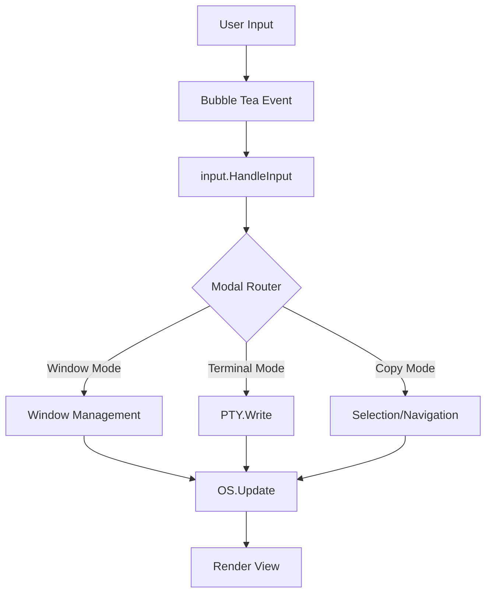
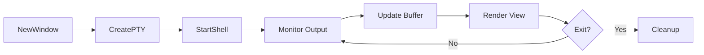

TUIOS is built on the Bubble Tea v2 framework following the Model-View-Update (MVU) pattern.

## Tech Stack

- **[Bubble Tea v2](https://charm.land/bubbletea)** - Event-driven TUI framework (`charm.land/bubbletea/v2`)
- **[Lipgloss v2](https://charm.land/lipgloss)** - Terminal styling with caching (`charm.land/lipgloss/v2`)
- **[Wish v2](https://charm.land/wish)** - SSH server framework (`charm.land/wish/v2`)
- **[xpty](https://github.com/charmbracelet/x/xpty)** - Cross-platform PTY interface
- **[Cobra](https://github.com/spf13/cobra)** - CLI framework
- **Vendored VT emulator** - Custom ANSI/VT100 terminal emulator

> **Note:** As of December 2025, the Charm stack packages have migrated from `github.com/charmbracelet/*` to `charm.land/*` module paths.

## Core Components

### Window Manager (app/os.go)

The central `OS` struct manages:
- Window lifecycle (create, focus, close)
- 9 workspaces with independent layouts
- Tiling mode with master-stack algorithm
- Mouse interaction state (dragging, resizing)
- Keybind registry for customization

### Terminal Emulation (vt/)

Custom ANSI/VT100 emulator:
- Full CSI, OSC, ESC sequence support
- 10,000 line scrollback buffer
- Bidirectional Unicode support
- SGR (color/style) attribute handling
- Alternative screen buffer (for vim, less, etc.)

### Rendering Engine (app/render.go)

Layer-based composition:
1. **Window layers** - Terminal content with borders
2. **Overlay layers** - Help, logs, cache stats
3. **Dockbar** - Window list and workspace indicator
4. **Mouse cursor** - Selection and interaction feedback

**Optimizations:**
- Viewport culling (skip off-screen windows)
- Style caching with LRU eviction
- Adaptive refresh rates (60Hz focused, 30Hz background)
- Frame skipping when no changes detected

### Input System (input/)

Modal routing:
- **Window Management Mode** - Navigate, create, tile
- **Terminal Mode** - Input forwarded to PTY
- **Copy Mode** - Vim-style scrollback navigation
- **Prefix Mode** - Tmux-style leader key commands

100+ configurable keybindings across modes.

### Configuration (config/)

TOML-based configuration:
- Keybinding customization per section
- Appearance options (borders, dockbar, scrollback)
- Platform-specific defaults (macOS Option key)
- Validation and auto-migration

## Performance Optimizations

### Style Caching

**Two-tier caching strategy:**
1. **Full render cache** - Complete styled output (hash-based lookup)
2. **Optimized render cache** - Partial updates for minor changes

**Benefits:**
- 40-60% allocation reduction
- LRU eviction (configurable size)
- Automatic invalidation on content changes

See cache stats with `Ctrl+B D c`.

### Viewport Culling

Only render visible windows:
- Off-screen windows skipped
- Minimized windows excluded
- Significant CPU savings with many windows

### Adaptive Refresh

- **60 FPS** - Focused window in terminal mode
- **30 FPS** - Background windows
- **Frame skipping** - When no changes detected

### Memory Pooling

Reusable buffers for:
- String builders
- Style objects
- Screen buffers

## SSH Server Architecture

Built on Wish v2 (SSH framework):

**Per-connection isolation:**
- Each SSH session gets its own OS instance
- Independent workspace and window state
- No shared memory between sessions

**Security:**
- Auto-generated host keys
- Public key authentication support
- No password auth by default

**Usage:**
```bash
tuios ssh --host 0.0.0.0 --port 2222
ssh -p 2222 user@hostname
```

## Tape Scripting System

Domain-specific language for automation:

**Pipeline:**
1. **Lexer** (tape/lexer.go) - Tokenization
2. **Parser** (tape/parser.go) - AST generation
3. **Executor** (tape/executor.go) - Command execution
4. **Player** (tape/player.go) - Playback engine with timing

**Commands:**
- Mode switching (WindowManagementMode, TerminalMode)
- Window operations (NewWindow, CloseWindow, RenameWindow)
- Workspace management (SwitchWorkspace, MoveToWorkspace)
- Keyboard input (Type, Enter, Ctrl+X combinations)
- Timing (Sleep, WaitUntilRegex)

## Theme System

**300+ built-in themes** using [bubbletint](https://github.com/lrstanley/bubbletint):

- ANSI 16-color palette mapping
- SGR sequence translation
- Runtime theme switching
- Terminal color profile detection

**Usage:**
```bash
tuios --theme dracula
tuios --list-themes
tuios --preview-theme nord
```

## Development Patterns

### Bubble Tea MVU

**Model** - `app.OS` struct holds all state

**View** - `render.go` generates terminal output

**Update** - `update.go` handles messages:
- `tea.KeyMsg` - Keyboard input
- `tea.MouseMsg` - Mouse events
- `tea.WindowSizeMsg` - Terminal resize
- Custom messages (window exit, PTY output)

### Message Flow



**Flow Explanation:**

1. **User Input** - Keyboard or mouse event occurs
2. **Bubble Tea** - Event system captures input
3. **`input.HandleInput()`** - Central router receives event
4. **Modal Router** - Determines mode and routes to handler
5. **`OS.Update()`** - Handler modifies application state
6. **Render** - Screen updates based on new state

### Window Lifecycle



**Lifecycle Stages:**

- **Creation** - PTY spawned, shell launched
- **Monitor** - Background goroutine reads output
- **Update** - Terminal emulator processes ANSI sequences
- **Render** - Screen displays content
- **Cleanup** - On exit, PTY closed, resources freed

## Testing

```bash
# Run all tests
go test ./...

# Run with race detection
go test -race ./...

# Specific package
go test ./internal/config/...
go test ./internal/tape/...
```

**Test coverage:**
- Configuration validation
- Tape parsing and execution
- VT emulator sequences
- Style cache behavior

## Building from Source

```bash
git clone https://github.com/gaurav-gosain/tuios.git
cd tuios
go build -o tuios ./cmd/tuios
./tuios
```

**Requirements:**
- Go 1.24+
- C compiler (for PTY support)
- Nerd Font (for icons)

## Cross-Platform Support

**PTY implementation:**
- Unix: `terminal/pty_unix.go` (uses `creack/pty`)
- Windows: `terminal/pty_windows.go` (uses ConPTY)

**Window sizing:**
- Unix: `terminal/window_unix.go` (TIOCGWINSZ ioctl)
- Windows: `terminal/window_windows.go` (Windows Console API)

**System info:**
- macOS: `system/sysinfo_darwin.go` (sysctl)
- Linux: `system/sysinfo_linux.go` (/proc, cgroups)

## Contributing

See [CONTRIBUTING.md](https://github.com/Gaurav-Gosain/tuios/blob/main/docs/CONTRIBUTING.md) in the main repository.

## Related Documentation

<Cards>
  <Card
    title="Configuration"
    href="/docs/configuration"
    description="Customize TUIOS settings"
  />
  <Card
    title="Tape Scripting"
    href="/docs/tape-scripting"
    description="Automate with tape files"
  />
  <Card
    title="CLI Reference"
    href="/docs/cli-reference"
    description="Command-line options"
  />
</Cards>
