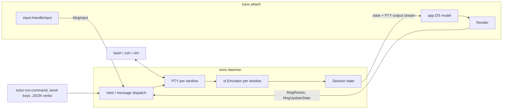
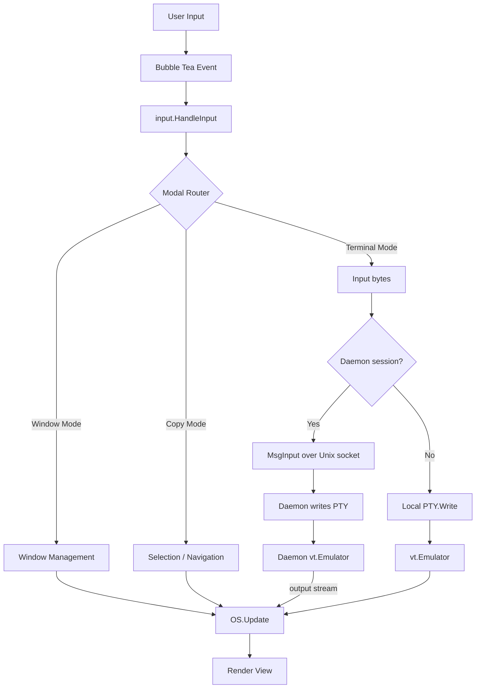
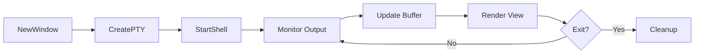

import { Callout } from 'fumadocs-ui/components/callout';
import { Card, Cards } from 'fumadocs-ui/components/card';

TUIOS is built on the Bubble Tea v2 framework following the Model-View-Update (MVU) pattern. All application code lives under `internal/`, with two binaries in `cmd/`.

## Tech Stack

- **[Bubble Tea v2](https://charm.land/bubbletea)** - Event-driven TUI framework (`charm.land/bubbletea/v2`)
- **[Lipgloss v2](https://charm.land/lipgloss)** - Terminal styling (`charm.land/lipgloss/v2`)
- **[Ultraviolet](https://github.com/charmbracelet/ultraviolet)** - Cell and screen primitives used by the compositor
- **[Wish v2](https://charm.land/wish)** - SSH server framework (`charm.land/wish/v2`)
- **[x/xpty](https://github.com/charmbracelet/x)** - Cross-platform PTY interface (`github.com/charmbracelet/x/xpty`, which pulls in `x/conpty` and `creack/pty` indirectly)
- **[Cobra](https://github.com/spf13/cobra)** - CLI framework, wrapped by **[fang](https://github.com/charmbracelet/fang)** for styled help, errors, and version output
- **[bubbletint](https://github.com/lrstanley/bubbletint)** - Theme palettes
- **[sip](https://github.com/Gaurav-Gosain/sip)** - Browser terminal transport used by `tuios-web`
- **Vendored VT emulator** - Custom ANSI/VT100 terminal emulator (`internal/vt`)

> **Note:** As of December 2025, the Charm stack packages have migrated from `github.com/charmbracelet/*` to `charm.land/*` module paths.

## Package Map

| Package | Responsibility |
|---------|----------------|
| `internal/app` | The `OS` model: window lifecycle, workspaces, rendering, overlays, graphics passthrough, tape manager |
| `internal/session` | Daemon and client. Sessions, PTY ownership, wire protocol, state merge, resurrection, JSON verbs |
| `internal/server` | SSH server (`ssh.go`) and the SSH-side session picker (`session_picker.go`) |
| `internal/vt` | The terminal emulator: CSI/OSC/ESC/DCS parsing, screen, scrollback, Kitty keyboard and graphics, Sixel |
| `internal/terminal` | PTY spawn and I/O per window, window geometry, environment, cwd capture, cleanup |
| `internal/input` | Modal input routing, keybinding resolution, mouse handling, copy mode |
| `internal/layout` | BSP tree (`bsp.go`), tiling schemes (`tiling.go`), scroll geometry (`scrolling.go`) |
| `internal/overlay` | Reusable overlay primitives: panels, the command palette, and hit regions |
| `internal/scrollback` | Scrollback browser, output extraction, OSC 133 zone parsing, vim-style motions |
| `internal/theme` | Theme registry, custom theme loading, theme-aware UI styles |
| `internal/config` | TOML config, constants, keybinding registry, validation, migration, file watching |
| `internal/hooks` | User hooks fired on session and window lifecycle events |
| `internal/guestenv` | Environment variables injected into guest shells |
| `internal/pool` | Reusable buffer and builder pools |
| `internal/ui` | Animation easing and timing helpers |
| `internal/testutil` | A fake shell used to make PTY tests deterministic |
| `cmd/tuios` | The main binary and every CLI subcommand |
| `cmd/tuios-web` | Serves TUIOS over HTTP through sip. See [Web Terminal](/docs/web) |
| `e2e` | Control-plane tests, plus `e2e/tui`, a separate module that drives a real TUIOS in a PTY |

## Client and Daemon

`internal/session` is the largest subsystem in the repo. TUIOS runs as a daemon that owns sessions, and one or more thin clients that attach over a Unix socket.


```mermaid
graph LR
    subgraph Client["tuios attach"]
        IN[input.HandleInput]
        MODEL[app.OS model]
        VIEW[Render]
    end

    subgraph Daemon["tuios daemon"]
        DISP[Verb / message dispatch]
        STATE[Session state]
        VT[vt.Emulator per window]
        PTY[PTY per window]
    end

    IN -->|MsgInput| DISP
    DISP --> PTY
    PTY --> VT
    VT --> STATE
    STATE -->|state + PTY output stream| MODEL
    MODEL --> VIEW
    VIEW -->|MsgResize, MsgUpdateState| DISP

    SHELL[bash / zsh / vim] <--> PTY
    CLI[tuios run-command, send-keys, JSON verbs] --> DISP
```

The pieces that matter when reading the code:

- **`daemon.go`, `daemon_handlers.go`** - accept loop and per-message handling. `manager.go` owns the session table.
- **`protocol.go`, `codec.go`** - length-prefixed framing over the socket. Payloads are gob by default, with a JSON codec available for external clients.
- **`daemon_stream.go`** - the PTY output stream clients subscribe to, so a client renders without owning a PTY.
- **`state_merge.go`** - reconciles client-side and daemon-side window state, which is what makes multiple clients on one session converge.
- **`tuiclient.go`, `client.go`** - the attach-side model and the connection wrapper.
- **`verb_protocol.go`, `verb_handlers.go`, `verb_subscribe.go`** - the JSON verb layer that `tuios run-command` and external tooling speak.
- **`resurrection.go`** - periodic and shutdown persistence of session structure to disk.

Because the daemon owns the PTYs and the emulator, detaching a client does not stop anything. See [Sessions & Daemon Mode](/docs/sessions) for the user-facing behaviour and for the limits of resurrection, and the [Control Protocol](/docs/control-protocol) for the verb schema.

<Callout type="info">
There is also an in-process path. `tuios` with no subcommand, and the SSH server, build an `app.OS` directly without a daemon. The same model code runs in both cases; only where the PTYs live differs.
</Callout>

## Core Components

### Window Manager (`internal/app/os.go`)

The central `OS` struct manages:

- Window lifecycle (create, focus, close)
- 9 workspaces with independent layouts
- Tiling mode, backed by the BSP tree in `internal/layout`
- Mouse interaction state (dragging, resizing)
- Keybind registry for customization

Layout work is split across `os_layout.go`, `tiling.go`, `tiling_bsp.go`, `tiling_resize.go`, and `tiling_swap.go`.

### Terminal Emulation (`internal/vt`)

Custom ANSI/VT100 emulator:

- Full CSI, OSC, ESC, DCS sequence support
- Scrollback buffer, 10,000 lines by default (`appearance.scrollback_lines`)
- Bidirectional Unicode support
- SGR (color/style) attribute handling
- Alternative screen buffer (for vim, less, etc.)
- Cursor shape rendering (block, bar, underline) with blink support
- DECSCUSR sequence support for vi-mode cursor changes
- Kitty keyboard protocol (CSI u) with push/pop/query/set. Fish 4.x compatible; Shift+printable bypasses the protocol and sends text directly.
- Mode 2026 (synchronized output) and mode 2027 (unicode core)
- OSC 4 (palette colors), OSC 10-12 (default colors), OSC 52 (clipboard with bubbletea bridge)
- Mode 2031 (light/dark color scheme detection)
- OSC 133 (shell integration / semantic zones), consumed by `internal/scrollback`
- Cell size reporting (CSI 14t, 16t, 18t)
- Thread-safe HasMouseMode/HasAllMotionMode/KittyKeyboardFlags via atomics

### Graphics Protocols (Experimental)

<Callout title="Experimental Feature" type="warn">
Graphics support is experimental. Bugs are expected and functionality may change in future releases.
</Callout>

TUIOS supports terminal graphics protocols for inline image display:

**Kitty Graphics Protocol** (`internal/app/kitty_*.go`, `internal/vt/kitty_*.go`):

- Passthrough forwarding from guest terminals to host
- Image transmission (PNG, RGB, RGBA formats) with raw passthrough (no re-encoding)
- Flicker-free video via image ID reuse (frames replace in-place). `mpv --vo=kitty` works (both shm and base64), youterm works.
- Placement tracking with viewport clipping
- Multi-window support with ID mapping
- Shared memory support (`t=s` for mpv `--vo-kitty-use-shm`)
- File path forwarding (`t=f`) to avoid read+encode overhead
- Mode 2026 synchronized output wrapping
- Animation protocol (a=f, a=a, a=c) **not supported** due to ID remapping constraints

**Sixel Graphics** (`internal/app/sixel_*.go`, `internal/vt/sixel_*.go`):

- Sixel image passthrough with raw data forwarding
- DCS sequence parsing and dimension calculation
- Window boundary awareness (hides images that don't fit)
- Experimental: pixel-level clipping not yet implemented (requires stream-level sixel cropping)

**Supported terminals**: Kitty, WezTerm, Ghostty, iTerm2, Foot, Contour, and other Kitty-protocol-compatible terminals.

**Environment variables:**

- `TUIOS_KITTY_GRAPHICS=1/0` - Force enable/disable Kitty graphics
- `TUIOS_SIXEL_GRAPHICS=1/0` - Force enable/disable Sixel graphics

### Rendering Engine (`internal/app/os_render.go` and `render_*.go`)

Layer-based composition:

1. **Window layers** - Terminal content with borders (`render_terminal.go`, `render_scrollbar.go`)
2. **Overlay layers** - Help, logs, settings, theme picker, command palette, scrollback browser, cache stats (`render_overlays.go` and siblings)
3. **Dockbar** - Window list and workspace indicator
4. **Mouse cursor** - Selection and interaction feedback

Overlays are z-ordered and mouse-draggable; hit testing lives in `overlay_hit.go` and `overlay_mouse.go`.

### Input System (`internal/input`)

Modal routing:

- **Window Management Mode** - Navigate, create, tile
- **Terminal Mode** - Input forwarded to PTY
- **Copy Mode** - Vim-style scrollback navigation (`copymode_*.go`)
- **Prefix Mode** - Tmux-style leader key commands (`prefix_routing.go`, `prefix_actions.go`)

Over 100 configurable keybindings across modes.

### Configuration (`internal/config`)

TOML-based configuration:

- Keybinding customization per section
- Appearance options (borders, dockbar, scrollback, max FPS)
- Platform-specific defaults (macOS Option key)
- Validation and auto-migration
- Live reload via `watcher.go` (fsnotify)

## Performance

<Callout type="warn">
The repo has benchmarks (`internal/app/compositor_bench_test.go`, `damage_bench_test.go`, `perf_bench_test.go`) but no published results, and none of the numbers below are measured. Treat them as design intent, not as figures you can cite.
</Callout>

### Style Caching

`internal/app/stylecache.go` caches lipgloss styles keyed by a hash of the cell's foreground, background, attributes, and cursor state, and stores the derived ANSI prefix and suffix alongside the style so the escape is not rebuilt on every flush.

It is a single-tier map, not an LRU. When the cache reaches its size limit it drops roughly half the entries at once and relies on Go's randomized map iteration order to approximate recency. Default size is 512 entries.

Hit, miss, and eviction counters are exported and visible with <kbd>Ctrl</kbd>+<kbd>B</kbd> <kbd>D</kbd> <kbd>c</kbd>.

### Viewport Culling

Only visible windows are rendered. Off-screen and minimized windows are skipped.

### Refresh Rates

Rendering is event-driven: PTY output wakes the model through a `PTYDataMsg`, so there is no fixed render loop for terminal content. A separate maintenance tick drives animations, the prefix which-key overlay, dock stats, and tape playback.

- `NormalFPS` defaults to 60 and is configurable through `appearance.max_fps`. Values are clamped to 10 at the low end and `MaxFPSCap` (240) at the high end. The settings UI offers 30, 60, 90, 120, 144, and `unlimited`, which pins it to the cap.
- The tick drops to `IdleFPS` (10) when there are no animations, no active prefix, no running tape, and nothing needing dock updates.

<Callout type="warn">
`IdleThresholdFrames` and `BackgroundWindowUpdateCycle` are declared in `internal/config/constants.go` but are not referenced anywhere else in the tree. Documentation describing a per-frame idle counter or a background-window skip cycle is describing constants that nothing reads.
</Callout>

### Memory Pooling

`internal/pool` provides reusable string builders and buffers for the render path.

## SSH Server Architecture

Built on Wish v2, in `internal/server/ssh.go`:

**Per-connection isolation:**

- Each SSH session gets its own OS instance
- Independent workspace and window state
- No shared memory between sessions

**Security:**

- Auto-generated host keys
- Public key authentication support
- No password auth by default

**Usage:**

```bash
tuios ssh --host 0.0.0.0 --port 2222
ssh -p 2222 user@hostname
```

## Tape Scripting System

Domain-specific language for automation, in `internal/tape`:

**Pipeline:**

1. **Lexer** (`lexer.go`) - Tokenization. Keywords are matched case-insensitively.
2. **Parser** (`parser.go`) - AST generation
3. **Executor** (`executor.go`) - Command dispatch
4. **Player** (`player.go`) - Playback engine with timing
5. **Recorder** (`recorder.go`) - Captures live actions back into a tape file

The lexer recognises more verbs than the executor acts on, and the parser cannot construct arguments for several commands that the executor would accept. See [Tape Scripting](/docs/tape-scripting) for the list of commands that parse but do nothing.

## Theme System

**342 built-in themes** (count from `tuios --list-themes`) sourced from [bubbletint](https://github.com/lrstanley/bubbletint), plus user themes loaded by `internal/theme/custom.go`.

- ANSI 16-color palette mapping
- SGR sequence translation
- Runtime theme switching, including an in-app searchable picker
- Terminal color profile detection

**Usage:**

```bash
tuios --theme dracula
tuios --list-themes
tuios --preview-theme nord
```

## Development Patterns

### Bubble Tea MVU

**Model** - `app.OS` struct holds all state

**View** - `os_render.go` and the `render_*.go` files generate terminal output

**Update** - `update.go` handles messages:

- `tea.KeyMsg` - Keyboard input
- `tea.MouseMsg` - Mouse events
- `tea.WindowSizeMsg` - Terminal resize
- `PTYDataMsg` - PTY produced output
- Session messages (client joined/left, resize, forced refresh)

### Message Flow


```mermaid
graph TD
    A[User Input] --> B[Bubble Tea Event]
    B --> C[input.HandleInput]
    C --> D{Modal Router}
    D -->|Window Mode| E[Window Management]
    D -->|Terminal Mode| F[Input bytes]
    D -->|Copy Mode| G[Selection / Navigation]
    E --> H[OS.Update]
    G --> H
    F --> I{Daemon session?}
    I -->|Yes| J[MsgInput over Unix socket]
    I -->|No| K[Local PTY.Write]
    J --> L[Daemon writes PTY]
    K --> M[vt.Emulator]
    L --> N[Daemon vt.Emulator]
    N -->|output stream| H
    M --> H
    H --> O[Render View]
```

**Flow Explanation:**

1. **User Input** - Keyboard or mouse event occurs
2. **Bubble Tea** - Event system captures input
3. **`input.HandleInput()`** - Central router receives event
4. **Modal Router** - Determines mode and routes to handler
5. **PTY write** - Direct in-process, or sent to the daemon as `MsgInput` when attached to a session
6. **`OS.Update()`** - Emulator output and state changes reach the model
7. **Render** - Screen updates based on new state

### Window Lifecycle


```mermaid
flowchart LR
    A[NewWindow] --> B[CreatePTY]
    B --> C[StartShell]
    C --> D[Monitor Output]
    D --> E[Update Buffer]
    E --> F[Render View]
    F --> G{Exit?}
    G -->|Yes| H[Cleanup]
    G -->|No| D
```

**Lifecycle Stages:**

- **Creation** - PTY spawned, shell launched with the environment from `internal/guestenv`
- **Monitor** - Background goroutine reads output
- **Update** - Terminal emulator processes ANSI sequences
- **Render** - Screen displays content
- **Cleanup** - On exit, PTY closed, resources freed, hooks fired

## Testing

```bash
# Run all tests
go test ./...

# Run with race detection
go test -race ./...

# Specific package
go test ./internal/config/...
go test ./internal/tape/...

# The end-to-end TUI harness is a separate module
cd e2e/tui && go test ./...
```

**Test coverage:**

- Configuration validation and migration
- Tape lexing, parsing, execution, and fuzzing
- VT emulator sequences
- Style cache behavior
- Daemon protocol, state merge, resurrection, and verb handlers
- End-to-end TUI runs against a real PTY, using the fake shell in `internal/testutil`

## Building from Source

```bash
git clone https://github.com/gaurav-gosain/tuios.git
cd tuios
go build -o tuios ./cmd/tuios
./tuios
```

**Requirements:**

- Go 1.25.9 (per `go.mod`)
- Nerd Font (for icons; `--ascii-only` avoids it)

No C compiler is needed. There is no cgo in the tree, and the PTY layer is pure Go.

## Cross-Platform Support

**PTY implementation:**

- Unix: `internal/terminal/pty_unix.go`
- Windows: `internal/terminal/pty_windows.go` (ConPTY)
- The daemon has its own PTY split at `internal/session/pty_unix.go` and `pty_windows.go`

**Window sizing:**

- Unix: `internal/terminal/window_unix.go`
- Windows: `internal/terminal/window_windows.go`

**Terminal capability detection:**

- `internal/app/capabilities_linux.go`, `capabilities_darwin.go`, `capabilities_bsd.go`, `capabilities_windows.go`

**Daemon socket:**

- Unix: `internal/session/daemon_unix.go`, `manager_unix.go`
- Windows: `internal/session/daemon_windows.go`, `manager_windows.go`

## Contributing

See [Contributing](/docs/contributing).

## Related Documentation

<Cards>
  <Card
    title="Sessions & Daemon Mode"
    href="/docs/sessions"
    description="What the daemon guarantees, and what it does not"
  />
  <Card
    title="Control Protocol"
    href="/docs/control-protocol"
    description="The JSON verb protocol the daemon speaks"
  />
  <Card
    title="Configuration"
    href="/docs/configuration"
    description="Customize TUIOS settings"
  />
  <Card
    title="Tape Scripting"
    href="/docs/tape-scripting"
    description="Automate with tape files"
  />
</Cards>
