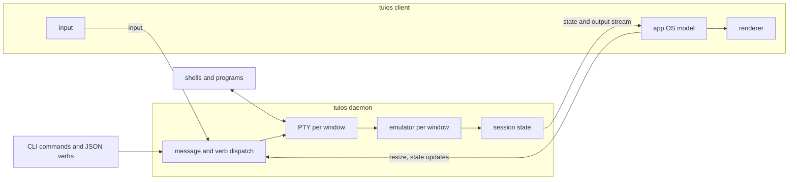
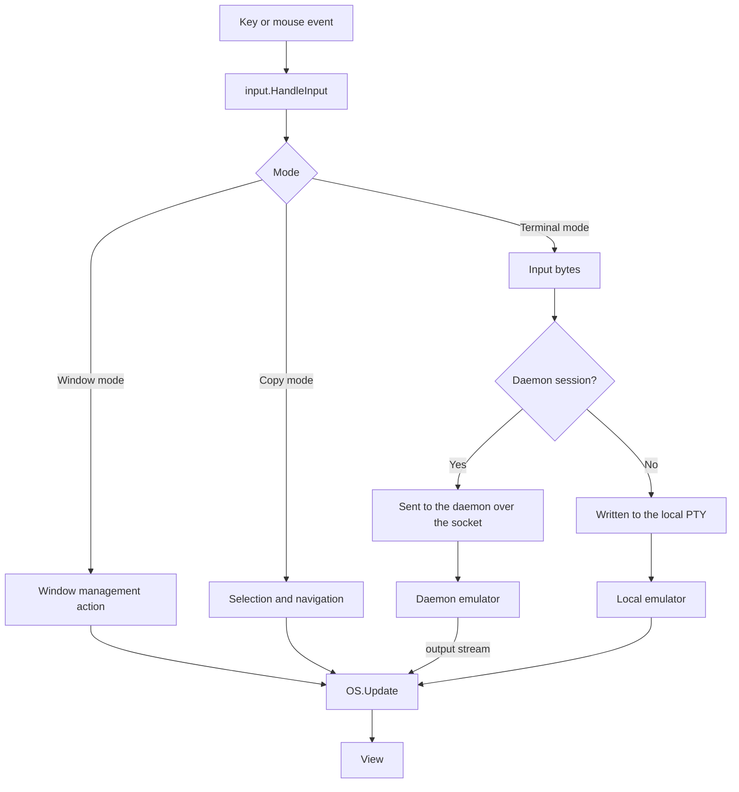

import { Callout } from 'fumadocs-ui/components/callout';
import { Card, Cards } from 'fumadocs-ui/components/card';

TUIOS is a Go program built on Bubble Tea v2 and its Model-View-Update pattern. The code lives under `internal/`, with the binaries in `cmd/` and the embeddable packages in `pkg/`. This page is a map for reading the code.

## Tech stack

- **[Bubble Tea v2](https://charm.land/bubbletea)** (`charm.land/bubbletea/v2`): the event loop and program model
- **[Lipgloss v2](https://charm.land/lipgloss)** (`charm.land/lipgloss/v2`): styling and layer composition
- **[Ultraviolet](https://github.com/charmbracelet/ultraviolet)**: cell and screen types used by the emulator and the compositor
- **[Wish v2](https://charm.land/wish)** (`charm.land/wish/v2`): the SSH server
- **[x/xpty](https://github.com/charmbracelet/x)**: cross-platform PTYs (ConPTY on Windows)
- **[Cobra](https://github.com/spf13/cobra)** with **[fang](https://github.com/charmbracelet/fang)**: the CLI, its help and its errors
- **[bubbletint](https://github.com/lrstanley/bubbletint)**: the built-in theme palettes
- **[sip](https://github.com/Gaurav-Gosain/sip)**: the browser transport behind `tuios-web`
- **[libghostty-vt](https://github.com/ghostty-org/ghostty)** (`go.mitchellh.com/libghostty`): an optional emulator backend, built with `-tags ghostty`

## Package map

| Package | What it does |
|---------|--------------|
| `cmd/tuios` | The main binary and every CLI subcommand |
| `cmd/tuios-web` | The browser server. See [Web Terminal](/docs/web). |
| `cmd/tuios-fuzz` | A property fuzzer that drives TUIOS and can draw the run |
| `internal/app` | The `OS` model: windows, workspaces, layout, rendering, overlays, graphics passthrough |
| `internal/session` | The daemon and its client: sessions, PTY ownership, the wire protocol, state merging, resurrection, the JSON verbs |
| `internal/input` | Modal input routing, keybinding dispatch, mouse handling, copy mode |
| `internal/vt` | The terminal emulator, behind the `vt.Terminal` interface |
| `internal/terminal` | One window: its PTY I/O, geometry, environment, working directory and cleanup |
| `internal/ptyspawn` | Starting every PTY-backed process, in one place |
| `internal/layout` | The BSP tree (`bsp.go`), master-stack tiling (`tiling.go`) and the scrolling layout (`scrolling.go`) |
| `internal/config` | The TOML config, defaults, the option registry, keybinding registry, validation and file watching |
| `internal/server` | The SSH server and its authentication |
| `internal/served` | The per-connection model shared by the SSH and web servers |
| `internal/cliflags` | The appearance flags every TUI-drawing binary registers |
| `internal/federation` | The ssh links between this daemon and daemons on other machines |
| `internal/overlay` | Panel and dialog primitives, and mouse hit regions |
| `internal/scrollback` | The scrollback browser and OSC 133 command zones |
| `internal/theme` | The theme registry, theme import, glyph sets and UI colours |
| `internal/hooks` | Shell hooks fired on window, session and agent events |
| `internal/harness`, `internal/transcript` | Detecting coding agents in panes and reading their state |
| `internal/sessiontree` | The sidebar's model of sessions, windows and agents |
| `internal/worktree`, `internal/gitstate` | Git worktree sessions, and the branch facts the sidebar shows |
| `internal/shot`, `internal/capture` | Rendering a window to PNG, SVG, ANSI, HTML or text for `tuios screenshot` |
| `internal/tape` | Tape scripts: lexer, parser, executor, player, recorder |
| `internal/guestenv` | The environment variables exported to shells in windows |
| `internal/release` | Finding and verifying releases for `tuios update` |
| `internal/pool`, `internal/perf`, `internal/ui`, `internal/sound` | Buffer pools, latency measurement, animation easing, sound cues |
| `internal/fuzz`, `internal/testutil` | Grammar-based fuzz input, and a fake shell for deterministic tests |
| `pkg/tuios` | Embed TUIOS in another Bubble Tea program. See [Library](/docs/library). |
| `pkg/applist`, `pkg/fuzzy` | `$PATH` scanning for the launcher, and the fuzzy matcher behind every search box |
| `e2e` | Control-plane tests, and `e2e/tui`, a separate module that drives a real TUIOS in a PTY |

## Client and daemon

By default TUIOS runs as a daemon that owns sessions, plus one or more clients that attach to it over a Unix socket.


```mermaid
graph LR
    subgraph Client["tuios client"]
        IN[input]
        MODEL[app.OS model]
        VIEW[renderer]
    end

    subgraph Daemon["tuios daemon"]
        DISP[message and verb dispatch]
        STATE[session state]
        VT[emulator per window]
        PTY[PTY per window]
    end

    IN -->|input| DISP
    DISP --> PTY
    PTY --> VT
    VT --> STATE
    STATE -->|state and output stream| MODEL
    MODEL --> VIEW
    MODEL -->|resize, state updates| DISP

    SHELL[shells and programs] <--> PTY
    CLI[CLI commands and JSON verbs] --> DISP
```

Where to look in `internal/session`:

- `daemon.go`, `daemon_handlers.go`: the accept loop and per-message handling. `manager.go` owns the session table.
- `protocol.go`, `codec.go`: length-prefixed frames with gob payloads, the binary protocol the client speaks.
- `verb_protocol.go`, `verb_handlers.go`, `verb_subscribe.go` and the other `verb_*.go` files: the [JSON control protocol](/docs/control-protocol). The daemon tells a JSON client from a binary one by its first byte.
- `daemon_stream.go`: the output stream clients subscribe to, so a client draws without owning a PTY.
- `state_merge.go`: reconciles client and daemon state, which is how several clients on one session converge.
- `tuiclient.go`, `client.go`: the attach side.
- `resurrection.go`: saving session structure to disk and restoring it.

Because the daemon owns the PTYs and the emulators, detaching a client stops nothing. [Sessions](/docs/sessions) covers the user-facing behaviour.

<Callout type="info">
There is also an in-process path. `tuios --standalone`, `tuios ssh --ephemeral` and `tuios-web --ephemeral` build an `app.OS` that owns its PTYs directly, with no daemon. The same model code runs either way; only where the PTYs live changes.
</Callout>

## Core components

### Window manager (`internal/app`)

The `OS` struct in `os.go` is the model. It holds the windows, the nine workspaces, the focus, the input mode, the tiling state, overlays and mouse interaction state. Layout code is in `os_layout.go`, `tiling.go`, `tiling_bsp.go`, `tiling_resize.go` and `tiling_swap.go`.

### Terminal emulation (`internal/vt`)

The emulator sits behind the `vt.Terminal` interface, and exactly one implementation is compiled into a binary:

- **Pure Go** (default). No cgo, so `go install` and cross-compilation just work.
- **libghostty-vt** (`-tags ghostty`). Ghostty's VT library through its Go bindings. It needs cgo, and `scripts/install.sh` builds the library with `zig`.

A differential test suite feeds the same bytes to both and compares screens, cursor, scrollback, modes and wire snapshots. `tuios --version` names the backend a binary was built with.

The emulator handles CSI, OSC, ESC and DCS sequences, the alternate screen, scrollback (10,000 lines by default, `appearance.scrollback_lines`), cursor shapes, the kitty keyboard protocol, synchronized output (mode 2026), unicode width (mode 2027), colour scheme reports (mode 2031), OSC 4, 10 to 12 and 52, OSC 133 shell integration zones, and cell size reports (CSI 14t, 16t, 18t).

### Rendering (`internal/app/os_render.go`, `render_*.go`)

The view is a stack of layers: window contents and borders, then overlays (help, palette, settings, pickers, the scrollback browser), then the dock and the sidebar. Overlays are z-ordered and can be dragged; hit testing is in `overlay_hit.go` and `overlay_mouse.go`.

### Input (`internal/input`)

Keys are routed by mode:

- **Window management mode**: arrange windows
- **Terminal mode**: keys go to the focused window's PTY
- **Copy mode**: vim-style navigation over scrollback (`copymode_*.go`)
- **Prefix mode**: the tmux-style leader key and its sub-menus (`prefix_routing.go`, `prefix_actions.go`)

Every binding goes through the keybinding registry in `internal/config`, so every key can be rebound.

### Configuration (`internal/config`)

The TOML config file, its defaults, an option registry that the settings page, `list-options` and `set-option` all read, platform defaults (the macOS Option key), validation, migration of old keys, and live reload when the file changes.

## Graphics

<Callout title="Experimental" type="warn">
Graphics support is experimental. Expect bugs, and expect behaviour to change.
</Callout>

TUIOS passes images from programs in its windows through to the host terminal. It supports the **Kitty graphics protocol** and **sixel**.

Kitty graphics (`internal/app/kitty_*.go`):

- Image data is forwarded without re-encoding.
- Image IDs are reused across frames, so video does not flicker. `mpv --vo=kitty` and [youterm](https://github.com/Gaurav-Gosain/youterm) work.
- Shared memory (`t=s`) and file path (`t=f`) transmission are forwarded when the host terminal supports them.
- Placements follow the window as it moves and scrolls, and are cropped to the part another window does not cover.
- Unicode placeholders are drawn when the host terminal is known to support them.
- Animation frames (`a=f`, `a=a`, `a=c`) are forwarded, and animated programs are sent as changed rectangles rather than whole images.
- Output is wrapped in synchronized output (mode 2026).

Sixel (`internal/app/sixel_passthrough.go`) is passed through as is. An image that does not fit inside its window is hidden, because pixel-level clipping is not implemented.

TUIOS asks the host terminal what it supports at startup instead of guessing, and waits up to 300 ms for the answer. It then gives programs the real answer: a program that asks whether it may send a file path is told no when the host cannot read files, and falls back to sending bytes. If no answer arrives in time (for example when TUIOS runs inside another multiplexer that swallows the query), graphics forwarding is turned off and programs are told so.

Host terminals known to work include Kitty, Ghostty, WezTerm, Foot, Contour and iTerm2 (partly). Support is detected, not looked up, so an unlisted terminal works if it answers the probe. The browser client supports a smaller set; see [Web Terminal](/docs/web#graphics-in-the-browser).

These environment variables override detection. Set each to `1` or `0`:

| Variable | Overrides |
|----------|-----------|
| `TUIOS_KITTY_GRAPHICS` | Kitty graphics support |
| `TUIOS_SIXEL_GRAPHICS` | Sixel support |
| `TUIOS_KITTY_PLACEHOLDERS` | Unicode placeholder support (also `appearance.kitty_placeholders`) |
| `TUIOS_KITTY_ANIMATION` | Whether the host carries animation frame edits |

## Performance

Rendering is event-driven. PTY output wakes the model through a `PTYDataMsg`; there is no fixed-rate loop for terminal content. A separate maintenance tick drives animations, the which-key panel, dock stats and tape playback, and it stops doing work when nothing needs it. An idle session costs close to no CPU.

- `appearance.max_fps` caps the frame rate. It defaults to 60 and is clamped to 10 to 120, the ceiling Bubble Tea itself enforces. The settings page offers 30, 60, 90, 120 and `unlimited`, which means 120.
- Each window paces its redraws by what a frame actually costs, at most one every 8 ms. A window more than 4 MiB behind on output drops to a catch-up rate, so a flooding window cannot starve input.
- Windows that are off screen or minimized are not rendered.
- `internal/app/stylecache.go` caches cell styles and their ANSI escapes, keyed by a hash of colours and attributes. It holds 512 entries and drops about half when full. <kbd>Ctrl</kbd>+<kbd>B</kbd> <kbd>D</kbd> <kbd>c</kbd> shows its hit rate.
- `internal/pool` reuses byte buffers and highlight grids on the render path.

The benchmarks are in `internal/app/*_bench_test.go`. The repository's `docs/perf.md` records measured baselines.

## SSH server

`tuios ssh` (`internal/server/ssh.go`) serves TUIOS over SSH with Wish.

- **Sessions.** By default each connection attaches to a daemon session, so sessions persist and several people can share one. With `--ephemeral`, each connection gets its own standalone session.
- **Authentication.** Public keys from `~/.config/tuios/authorized_keys`, or `~/.ssh/authorized_keys` if that is absent. With no keys configured, the server accepts every connection on `localhost` and refuses to start on any other address unless you pass `--no-auth`.
- **Host key.** Generated on first run, or given with `--key-path`.

```bash
tuios ssh --host 0.0.0.0 --port 2222
ssh -p 2222 work@server   # the user name picks the session
```

## Tape scripting

`internal/tape` turns a tape file into actions: `lexer.go` tokenizes it (keywords are case-insensitive), `parser.go` builds commands, `executor.go` dispatches them and `player.go` plays them with timing. `recorder.go` records live actions back into a tape. See [Tape Scripting](/docs/tape-scripting).

## Themes

342 themes are built in, from [bubbletint](https://github.com/lrstanley/bubbletint). `tuios import-theme` converts a kitty, ghostty, alacritty or wezterm colour scheme into a TUIOS theme, and the themes directory is re-read every time themes are listed, so an imported theme is usable without a restart.

A theme sets the 16 ANSI colours and the default foreground and cursor. The 256-colour indices above 15 and truecolor pass through unchanged, and the default background stays transparent so programs keep their own backgrounds.

## Development patterns

### Model-View-Update

- **Model**: `app.OS` holds all state.
- **View**: `os_render.go` and the `render_*.go` files produce the frame.
- **Update**: `update.go` handles messages: `tea.KeyPressMsg`, the mouse messages (`tea.MouseClickMsg`, `tea.MouseMotionMsg` and others), `tea.WindowSizeMsg`, `PTYDataMsg`, and messages from the daemon such as clients joining or leaving.

### Message flow


```mermaid
graph TD
    A[Key or mouse event] --> C[input.HandleInput]
    C --> D{Mode}
    D -->|Window mode| E[Window management action]
    D -->|Copy mode| G[Selection and navigation]
    D -->|Terminal mode| F[Input bytes]
    F --> I{Daemon session?}
    I -->|Yes| J[Sent to the daemon over the socket]
    I -->|No| K[Written to the local PTY]
    E --> H[OS.Update]
    G --> H
    J --> N[Daemon emulator]
    K --> M[Local emulator]
    N -->|output stream| H
    M --> H
    H --> O[View]
```

### Window lifecycle

1. **Create**: `internal/ptyspawn` starts the shell on a new PTY, with the environment from `internal/guestenv`.
2. **Read**: a goroutine reads the PTY and feeds the emulator.
3. **Render**: new output marks the window dirty and a frame is drawn.
4. **Close**: when the process exits or the window is closed, the PTY is closed, resources are freed and hooks fire.

## Testing

```bash
go test ./...                 # everything
go test -race ./...           # with the race detector
go test ./internal/vt/        # the emulator's conformance corpus and fuzz seeds
cd e2e/tui && go test ./...   # the end-to-end TUI suite, a separate module
```

The tests cover config validation and migration, tape parsing and execution, emulator conformance, the daemon protocol, state merging, resurrection and the verbs, and full TUI runs in a real PTY using the fake shell in `internal/testutil`. The repository's `AGENTS.md` describes the differential tests against tmux and the ghostty backend.

## Building from source

```bash
git clone https://github.com/Gaurav-Gosain/tuios.git
cd tuios
go build -o tuios ./cmd/tuios
./tuios
```

You need Go 1.26 or newer. The default build needs no C compiler. A [Nerd Font](https://www.nerdfonts.com) is needed for icons, or run with `--ascii-only`.

## Platform-specific code

| Concern | Files |
|---------|-------|
| Starting processes on a PTY | `internal/ptyspawn/spawn_unix.go`, `spawn_windows.go` |
| Reading a process's working directory | `internal/ptyspawn/cwd_linux.go`, `cwd_darwin.go`, `cwd_other.go` |
| Window sizing | `internal/terminal/window_unix.go`, `window_windows.go` |
| Host terminal probing | `internal/app/capabilities_linux.go`, `capabilities_darwin.go`, `capabilities_bsd.go`, `capabilities_windows.go` |
| Daemon socket | `internal/session/daemon_unix.go`, `manager_unix.go`, `daemon_windows.go`, `manager_windows.go` |

## Contributing

See [Contributing](/docs/contributing).

## Related

<Cards>
  <Card title="Sessions & Daemon Mode" href="/docs/sessions" description="What the daemon guarantees, and what it does not" />
  <Card title="Control Protocol" href="/docs/control-protocol" description="The JSON verbs the daemon speaks" />
  <Card title="Library" href="/docs/library" description="Embed TUIOS in your own program" />
  <Card title="Tape Scripting" href="/docs/tape-scripting" description="Automate with tape files" />
</Cards>
