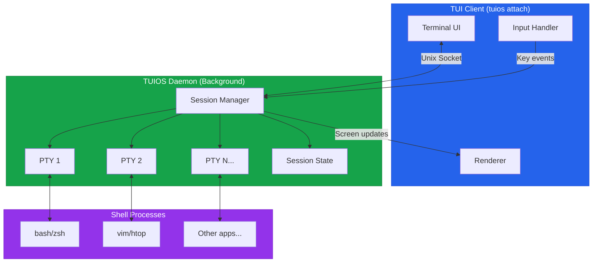
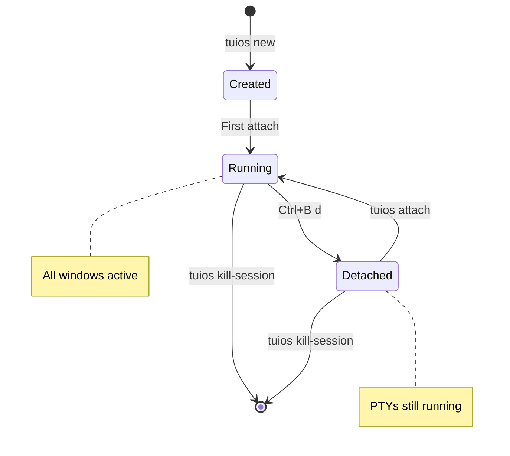

import { Callout } from 'fumadocs-ui/components/callout';
import { Card, Cards } from 'fumadocs-ui/components/card';

TUIOS supports persistent sessions through a daemon process, similar to tmux or screen. Sessions continue running in the background even when you disconnect, allowing you to reattach later with all windows and terminal content preserved.

<Callout type="info">
**Platform Support:** Daemon mode is available on **Linux**, **macOS**, and **Windows** (Windows 10 build 17063+ with Unix socket support).
</Callout>

## Quick Start

```bash
# Create a new session
tuios new mysession

# Work in TUIOS, then detach
# Press Ctrl+B d

# Later, list sessions
tuios ls

# Reattach to continue
tuios attach mysession
```

## Creating Sessions

Use `tuios new` to create a new persistent session:

```bash
# Auto-generated session name
tuios new

# Named session
tuios new work

# With options
tuios new dev --theme dracula --show-keys
```

### Session Naming

- Session names can contain letters, numbers, hyphens, and underscores
- If no name is provided, a unique name is auto-generated
- Session names must be unique

## Listing Sessions

View all sessions with `tuios ls`:

```bash
tuios ls
```

**Output:**
<pre className="monospace">
╭───────────────┬─────────┬──────────┬───────────────┬─────────────────╮
│ NAME          │ WINDOWS │ STATUS   │ CREATED       │ LAST ACTIVE     │
├───────────────┼─────────┼──────────┼───────────────┼─────────────────┤
│ work          │ 3       │ detached │ 2 hours ago   │ 5 mins ago      │
│ dev           │ 2       │ attached │ 1 day ago     │ just now        │
╰───────────────┴─────────┴──────────┴───────────────┴─────────────────╯
</pre>

## Attaching to Sessions

Reattach to a session with `tuios attach`:

```bash
# Attach to specific session
tuios attach work

# Attach to most recent session (if only one)
tuios attach

# Attach and create if session doesn't exist
tuios attach work -c
```

<Callout type="info">
When you attach, the session resumes exactly where you left off. All windows, their positions, and terminal content are preserved.
</Callout>

## Detaching from Sessions

Detach from a session without closing it:

| Method | Key |
|--------|-----|
| Prefix command | <kbd>Ctrl</kbd>+<kbd>B</kbd> <kbd>d</kbd> |
| From window mode | <kbd>d</kbd> (detach) |

After detaching, the session continues running in the background.

## Managing Sessions

### Kill a Session

Remove a specific session:

```bash
tuios kill-session work
```

<Callout type="warning">
This permanently closes all windows in the session. Any unsaved work will be lost.
</Callout>

### Stop the Daemon

Stop the TUIOS daemon and all sessions:

```bash
tuios kill-server
```

## How It Works



1. **Daemon Process**: When you create your first session, TUIOS starts a background daemon that manages all sessions
2. **Socket Communication**: TUI clients communicate with the daemon over a Unix socket
3. **PTY Persistence**: Terminal PTYs are owned by the daemon, not the client, so they survive disconnection
4. **State Sync**: Window positions, workspace layout, and terminal content sync continuously

### Session Lifecycle



### Daemon Location

The daemon socket is located at:
- **Linux**: `$XDG_RUNTIME_DIR/tuios/tuios.sock` or `/tmp/tuios-$UID/tuios.sock`
- **macOS**: `/tmp/tuios-$UID/tuios.sock`
- **Windows**: `%LOCALAPPDATA%\tuios\tuios.sock`

## Remote Control

One of the most powerful features of daemon sessions is the ability to control them from external scripts and tools. TUIOS provides CLI commands to send keystrokes, execute commands, and query state.

### Send Keystrokes

Send input to a running session:

```bash
# Enter terminal mode
tuios send-keys i

# Send key combo
tuios send-keys "ctrl+b q"

# Send to specific session
tuios send-keys -s mysession Escape

# Send literal text to terminal
tuios send-keys --literal "echo hello"
```

### Run Commands

Execute TUIOS commands remotely:

```bash
# Create a new window
tuios run-command NewWindow "my-terminal"

# Get JSON output with window ID
tuios run-command --json NewWindow "dev"

# Switch workspace
tuios run-command SwitchWorkspace 2

# Toggle tiling
tuios run-command ToggleTiling

# Target specific session
tuios run-command -s mysession NewWindow "dev"
```

### Query State

Inspect session state for scripting:

```bash
# List all windows
tuios list-windows --json

# Get focused window info
tuios get-window --json

# Get session state
tuios session-info --json
```

### Example: Development Layout Script

```bash
#!/bin/bash
# Create a development environment

# Create windows and capture IDs
EDITOR=$(tuios run-command --json NewWindow "editor" | jq -r '.data.window_id')
TERM=$(tuios run-command --json NewWindow "terminal" | jq -r '.data.window_id')
LOGS=$(tuios run-command --json NewWindow "logs" | jq -r '.data.window_id')

# Enable tiling
tuios run-command ToggleTiling

# Start applications
tuios send-keys "nvim ." Enter
tuios run-command FocusWindow "$TERM"
tuios run-command FocusWindow "$LOGS"
tuios send-keys "tail -f app.log" Enter
```

### Example: Window Selector with fzf

```bash
#!/bin/bash
WINDOW=$(tuios list-windows --json | \
    jq -r '.windows[] | "\(.display_name)\t\(.id)"' | \
    fzf --with-nth=1 | cut -f2)

[ -n "$WINDOW" ] && tuios run-command FocusWindow "$WINDOW"
```

<Callout type="info">
For the complete list of remote control commands, see the [CLI Reference](/docs/cli-reference#remote-control-commands).
</Callout>

## Best Practices

### Naming Conventions

Use descriptive session names:
```bash
tuios new project-frontend
tuios new project-backend
tuios new personal
```

### Workspace Organization

Combine sessions with workspaces:
- Use sessions for different projects or contexts
- Use workspaces within a session for related tasks

### Clean Up

Regularly remove unused sessions:
```bash
tuios ls              # Review sessions
tuios kill-session old-project
```

## Troubleshooting

### "Daemon not running"

If you see this error, the daemon may have crashed. Start fresh:

```bash
tuios kill-server     # Clean up any stale socket
tuios new mysession   # Start new daemon
```

### "Session not found"

The session may have been killed or the name is incorrect:

```bash
tuios ls              # Check available sessions
tuios attach <name>   # Use exact name
```

### Stale Sessions

If a session becomes unresponsive:

```bash
tuios kill-session stuck-session
tuios new fresh-session
```

## Related

<Cards>
  <Card
    title="CLI Reference"
    href="/docs/cli-reference"
    description="Complete command reference"
  />
  <Card
    title="Keybindings"
    href="/docs/keybindings"
    description="Keyboard shortcuts"
  />
  <Card
    title="Configuration"
    href="/docs/configuration"
    description="Customize TUIOS"
  />
</Cards>
