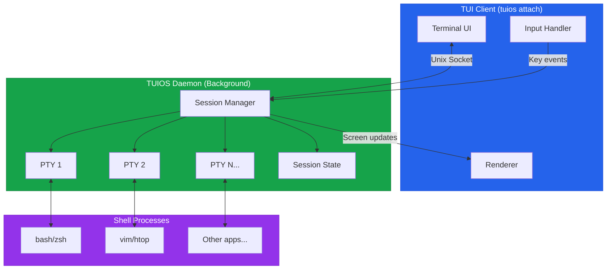
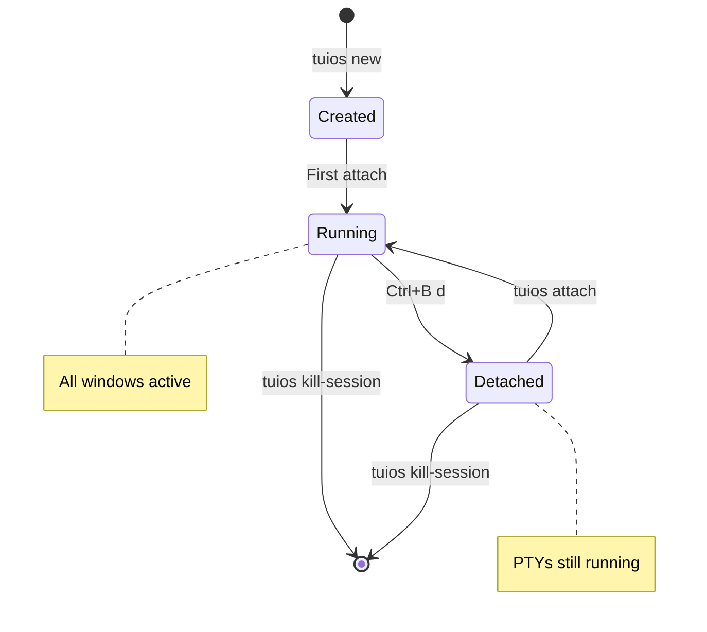

TUIOS supports persistent sessions through a daemon process, similar to tmux or screen. Sessions continue running in the background even when you disconnect, allowing you to reattach later with all windows and terminal content preserved.

<Callout type="warning">
**Platform Support:** Daemon mode currently requires Unix sockets and is only available on **Linux** and **macOS**. Windows support is not available yet.
</Callout>

## Quick Start

```bash
# Create a new session
tuios new mysession

# Work in TUIOS, then detach
# Press Ctrl+B d

# Later, list sessions
tuios ls

# Reattach to continue
tuios attach mysession
```

## Creating Sessions

Use `tuios new` to create a new persistent session:

```bash
# Auto-generated session name
tuios new

# Named session
tuios new work

# With options
tuios new dev --theme dracula --show-keys
```

### Session Naming

- Session names can contain letters, numbers, hyphens, and underscores
- If no name is provided, a unique name is auto-generated
- Session names must be unique

## Listing Sessions

View all sessions with `tuios ls`:

```bash
tuios ls
```

**Output:**
```
╭───────────────┬─────────┬──────────┬───────────────┬─────────────────╮
│ NAME          │ WINDOWS │ STATUS   │ CREATED       │ LAST ACTIVE     │
├───────────────┼─────────┼──────────┼───────────────┼─────────────────┤
│ work          │ 3       │ detached │ 2 hours ago   │ 5 mins ago      │
│ dev           │ 2       │ attached │ 1 day ago     │ just now        │
╰───────────────┴─────────┴──────────┴───────────────┴─────────────────╯
```

## Attaching to Sessions

Reattach to a session with `tuios attach`:

```bash
# Attach to specific session
tuios attach work

# Attach to most recent session (if only one)
tuios attach
```

<Callout type="info">
When you attach, the session resumes exactly where you left off. All windows, their positions, and terminal content are preserved.
</Callout>

## Detaching from Sessions

Detach from a session without closing it:

| Method | Key |
|--------|-----|
| Prefix command | <kbd>Ctrl</kbd>+<kbd>B</kbd> <kbd>d</kbd> |
| From window mode | <kbd>d</kbd> (detach) |

After detaching, the session continues running in the background.

## Managing Sessions

### Kill a Session

Remove a specific session:

```bash
tuios kill-session work
```

<Callout type="warning">
This permanently closes all windows in the session. Any unsaved work will be lost.
</Callout>

### Stop the Daemon

Stop the TUIOS daemon and all sessions:

```bash
tuios kill-server
```

## How It Works



1. **Daemon Process**: When you create your first session, TUIOS starts a background daemon that manages all sessions
2. **Socket Communication**: TUI clients communicate with the daemon over a Unix socket
3. **PTY Persistence**: Terminal PTYs are owned by the daemon, not the client, so they survive disconnection
4. **State Sync**: Window positions, workspace layout, and terminal content sync continuously

### Session Lifecycle



### Daemon Location

The daemon socket is located at:
- Linux: `$XDG_RUNTIME_DIR/tuios/daemon.sock` or `/tmp/tuios-$UID/daemon.sock`
- macOS: `/tmp/tuios-$UID/daemon.sock`

## Alt-Screen Applications

Applications that use the alternate screen buffer (vim, htop, btop, etc.) are handled specially:

- When you detach, TUIOS saves that the window was in alt-screen mode
- When you reattach, TUIOS sends a resize signal to trigger a redraw
- The application refreshes itself automatically

<Callout type="info">
You may see a brief moment of rendering while alt-screen applications refresh. This is normal and happens almost instantly.
</Callout>

## Best Practices

### Naming Conventions

Use descriptive session names:
```bash
tuios new project-frontend
tuios new project-backend
tuios new personal
```

### Workspace Organization

Combine sessions with workspaces:
- Use sessions for different projects or contexts
- Use workspaces within a session for related tasks

### Clean Up

Regularly remove unused sessions:
```bash
tuios ls              # Review sessions
tuios kill-session old-project
```

## Troubleshooting

### "Daemon not running"

If you see this error, the daemon may have crashed. Start fresh:

```bash
tuios kill-server     # Clean up any stale socket
tuios new mysession   # Start new daemon
```

### "Session not found"

The session may have been killed or the name is incorrect:

```bash
tuios ls              # Check available sessions
tuios attach <name>   # Use exact name
```

### Stale Sessions

If a session becomes unresponsive:

```bash
tuios kill-session stuck-session
tuios new fresh-session
```

## Comparison with tmux

| Feature | TUIOS | tmux |
|---------|-------|------|
| Persistent sessions | ✓ | ✓ |
| Detach/attach | ✓ | ✓ |
| Multiple windows | ✓ | ✓ |
| Mouse support | ✓ (full) | ✓ (limited) |
| True color | ✓ | ✓ |
| Modal editing | ✓ (vim-like) | via config |
| Window tiling | ✓ (BSP) | Panes |
| Workspaces | ✓ (9) | Sessions |

## Related

<Cards>
  <Card
    title="CLI Reference"
    href="/docs/cli-reference"
    description="Complete command reference"
  />
  <Card
    title="Keybindings"
    href="/docs/keybindings"
    description="Keyboard shortcuts"
  />
  <Card
    title="Configuration"
    href="/docs/configuration"
    description="Customize TUIOS"
  />
</Cards>
