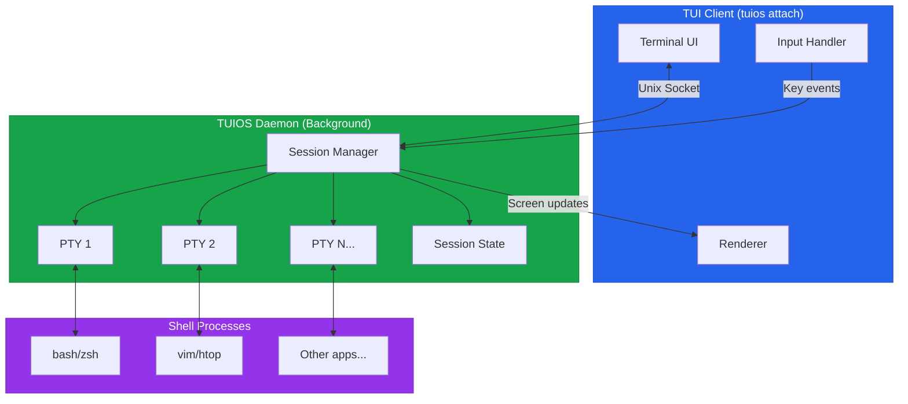
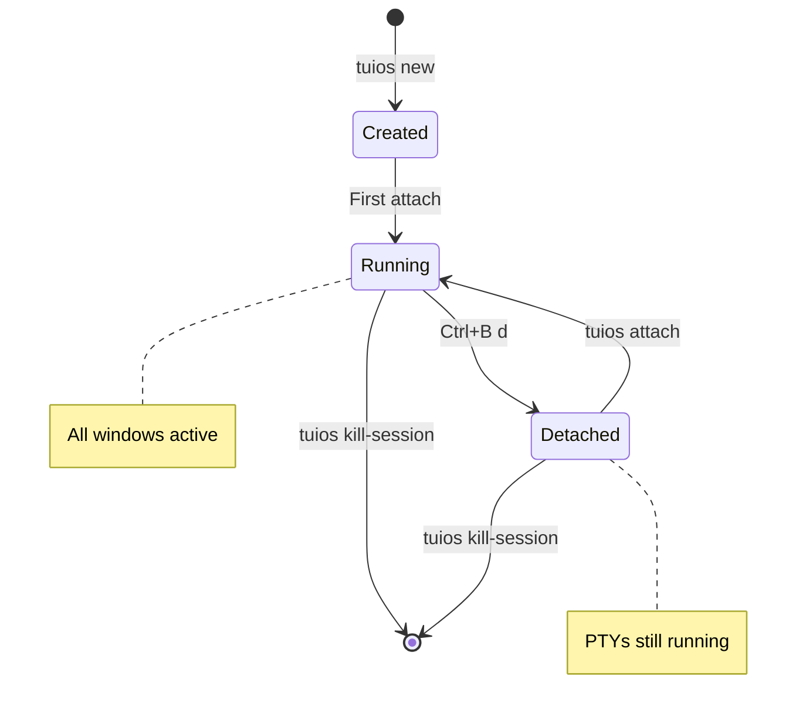

import { Callout } from 'fumadocs-ui/components/callout';
import { Card, Cards } from 'fumadocs-ui/components/card';

TUIOS supports persistent sessions through a daemon process, similar to tmux or screen. Sessions continue running in the background even when you disconnect, allowing you to reattach later with all windows and terminal content preserved.

<Callout type="info">
**Platform Support:** Daemon mode is available on **Linux**, **macOS**, and **Windows** (Windows 10 build 17063+ with Unix socket support).
</Callout>

## Quick Start

```bash
# Create a new session
tuios new mysession

# Work in TUIOS, then detach
# Press Ctrl+B d

# Later, list sessions
tuios ls

# Reattach to continue
tuios attach mysession
```

## Creating Sessions

Use `tuios new` to create a new persistent session:

```bash
# Auto-generated session name
tuios new

# Named session
tuios new work

# With options
tuios new dev --theme dracula --show-keys
```

### Headless Sessions

`--detach` (short `-d`) creates a session without attaching to it. The session gets an initial window and is immediately usable by `send-keys`, `run-command`, `capture-pane`, and the [control protocol](/docs/control-protocol). This is the entry point for scripting and for driving TUIOS from a program.

```bash
tuios new build --detach
tuios send-keys -s build --literal --raw "make all"
tuios send-keys -s build Enter
```

<Callout type="warn">
A detached session is created at a fixed 80x24. It resizes when a client attaches, but until then anything you capture is 80 columns wide regardless of your terminal.

The root appearance flags (`--theme`, `--show-keys`, `--border-style`, and the rest) are ignored by `--detach`. They are read when a client attaches, and a headless session has no client. Passing them is not an error, so they fail silently.
</Callout>

### Session Naming

- Session names can contain letters, numbers, hyphens, and underscores
- If no name is provided, a unique name is auto-generated
- Session names must be unique

## Listing Sessions

View all sessions with `tuios ls`:

```bash
tuios ls
```

**Output:**
<pre className="monospace">
╭───────────────┬─────────┬──────────┬───────────────┬─────────────────╮
│ NAME          │ WINDOWS │ STATUS   │ CREATED       │ LAST ACTIVE     │
├───────────────┼─────────┼──────────┼───────────────┼─────────────────┤
│ work          │ 3       │ detached │ 2 hours ago   │ 5 mins ago      │
│ dev           │ 2       │ attached │ 1 day ago     │ just now        │
╰───────────────┴─────────┴──────────┴───────────────┴─────────────────╯
</pre>

## Attaching to Sessions

Reattach to a session with `tuios attach`:

```bash
# Attach to specific session
tuios attach work

# Attach to the most recently active session
tuios attach

# Attach and create if session doesn't exist
tuios attach work -c
```

<Callout type="info">
Attaching to a session you detached from resumes it exactly where you left off: the same windows, positions, and terminal content, because the PTYs never stopped running.

This is different from what survives a daemon restart. See [Session Resurrection](#session-resurrection) for what comes back after the daemon exits, and what does not.
</Callout>

## Detaching from Sessions

Detach from a session without closing it:

| Method | Key |
|--------|-----|
| Prefix command | <kbd>Ctrl</kbd>+<kbd>B</kbd> <kbd>d</kbd> |
| From window mode | <kbd>d</kbd> (detach) |

After detaching, the session continues running in the background.

## Session Switcher (In-App)

In addition to the CLI commands above, TUIOS v0.7.0 includes an in-app **Session Switcher** that lets you browse and switch between sessions without leaving the TUI.

### Opening the Session Switcher

- Press <kbd>Ctrl</kbd>+<kbd>B</kbd> then <kbd>S</kbd> from any mode

### How It Works

The session switcher displays a list of all daemon sessions with their name, window count, and status. You can:

- **Arrow keys** or <kbd>j</kbd>/<kbd>k</kbd> to navigate the list
- **Type** to filter the list by name
- **Enter** to attach to the selected session (detaches from the current one). If your query matches no existing session, Enter creates a session with that name instead.
- <kbd>Ctrl</kbd>+<kbd>D</kbd> to kill the selected session, confirmed with <kbd>y</kbd> or cancelled with <kbd>n</kbd>
- **Esc** to close the switcher without changing sessions

This is especially useful when you have multiple projects running as separate sessions and want to hop between them quickly, without dropping to the shell to run `tuios attach`.

<Callout type="tip">
The session switcher works alongside the CLI commands. Use <kbd>Ctrl</kbd>+<kbd>B</kbd> <kbd>S</kbd> for quick in-app switching, and `tuios ls` / `tuios attach` for scripting and external access.
</Callout>

## Managing Sessions

### Kill a Session

Remove a specific session:

```bash
tuios kill-session work
```

<Callout type="warning">
This permanently closes all windows in the session. Any unsaved work will be lost.
</Callout>

### Stop the Daemon

Stop the TUIOS daemon and all sessions:

```bash
tuios kill-server
```

## How It Works


```mermaid
graph TB
    subgraph Client["TUI Client (tuios attach)"]
        UI[Terminal UI]
        Input[Input Handler]
        Render[Renderer]
    end

    subgraph Daemon["TUIOS Daemon (Background)"]
        SM[Session Manager]
        PTY1[PTY 1]
        PTY2[PTY 2]
        PTY3[PTY N...]
        State[Session State]
    end

    subgraph Shells["Shell Processes"]
        Shell1[bash/zsh]
        Shell2[vim/htop]
        Shell3[Other apps...]
    end

    UI <-->|Unix Socket| SM
    Input -->|Key events| SM
    SM -->|Screen updates| Render

    SM --> State
    SM --> PTY1
    SM --> PTY2
    SM --> PTY3

    PTY1 <--> Shell1
    PTY2 <--> Shell2
    PTY3 <--> Shell3

    style Client fill:#2563eb,stroke:#1d4ed8,color:#fff
    style Daemon fill:#16a34a,stroke:#15803d,color:#fff
    style Shells fill:#9333ea,stroke:#7e22ce,color:#fff
```

1. **Daemon Process**: When you create your first session, TUIOS starts a background daemon that manages all sessions
2. **Socket Communication**: TUI clients communicate with the daemon over a Unix socket
3. **PTY Persistence**: Terminal PTYs are owned by the daemon, not the client, so they survive disconnection
4. **State Sync**: Window positions, workspace layout, and terminal content sync continuously

## Session Resurrection

Detaching and reattaching preserves everything, because the daemon keeps running and the PTYs never stop. Resurrection is the weaker guarantee that applies when the daemon itself exits: a reboot, a crash, or `tuios kill-server`.

The daemon writes each session's structure to disk every 30 seconds, and again synchronously when it shuts down cleanly. On its next cold start it restores those sessions automatically, before it accepts any connections.

### What comes back

Window structure, and only window structure:

- Window geometry, titles, and custom names
- Workspace assignment, minimize state, and which window had focus
- The BSP tree for each workspace, the layout mode, tiling scheme, and master ratio
- The working directory each window was in
- Session options

### What does not come back

<Callout type="warn">
Resurrection restores the shape of your session, not its contents. It is crash recovery, not a snapshot.
</Callout>

- **Processes are gone.** Every window gets a fresh `$SHELL`. A build, a `vim`, or an SSH connection that was running is not restarted, and TUIOS does not try to re-run it.
- **Screen contents and scrollback are gone.** They live only in daemon memory and are never written to disk. Each restored window starts with an empty emulator.
- **Up to 30 seconds of structural change can be lost** if the daemon is killed rather than shut down. A window created 5 seconds before a `SIGKILL` will not be there.
- **Restored shells inherit the daemon's environment**, not the environment of the terminal you attach from. If your `$SHELL` or your exported variables changed since the daemon started, the restored windows do not see it.
- **Working directory capture is Linux only.** It reads `/proc/<pid>/cwd`. On macOS and Windows, restored windows open in the shell's default directory instead.

A restored window announces itself so you are not misled into thinking your work survived. It prints a dimmed `-- tuios: session restored, fresh shell in <cwd> --` banner, dropping the `in <cwd>` part when the working directory could not be captured, and sets `TUIOS_RESTORED=1` in the environment so your shell profile can react to it.

### Controlling resurrection

```bash
# Restore saved sessions on demand
tuios resurrect

# Start a daemon without restoring anything
tuios daemon --no-restore
```

State lives in `$XDG_STATE_HOME/tuios/sessions/<name>.json`, written with owner-only permissions.

Killing a session with `tuios kill-session` deletes its state file, so a killed session is deliberately not resurrectable. This is the difference between killing a session and losing a daemon.

## Multi-Client Support

Multiple clients can connect to the same session simultaneously. All clients see synchronized state in real-time.

### How It Works

When you attach multiple terminals to the same session:
- All clients share the same windows and workspaces
- Actions from one client are reflected on all others
- The effective terminal size is the minimum of all connected clients

### Notifications

TUIOS displays notifications for multi-client events:

| Event | Notification |
|-------|--------------|
| Client joins | "Client joined (N connected)" |
| Client leaves | "Client left (N connected)" |
| Window created | "Window created (N total)" |
| Window closed | "Window closed (N remaining)" |
| Workspace switch | "Switched to workspace N" |

### Example: Pair Programming

```bash
# Terminal 1: Create session
tuios new pairing

# Terminal 2: Attach to same session
tuios attach pairing

# Both terminals now show the same TUIOS instance
# Actions in either terminal are reflected in both
```

<Callout type="info">
Multi-client mode uses thread-safe channels to prevent race conditions when synchronizing state between clients.
</Callout>

### Session Lifecycle


```mermaid
stateDiagram-v2
    [*] --> Created: tuios new
    Created --> Running: First attach
    Running --> Detached: Ctrl+B d
    Detached --> Running: tuios attach
    Running --> [*]: tuios kill-session
    Detached --> [*]: tuios kill-session

    note right of Running: All windows active
    note right of Detached: PTYs still running
```

### Daemon Location

The daemon socket is located at:
- **Linux**: `$XDG_RUNTIME_DIR/tuios/tuios.sock` or `/tmp/tuios-$UID/tuios.sock`
- **macOS**: `/tmp/tuios-$UID/tuios.sock`
- **Windows**: `%LOCALAPPDATA%\tuios\tuios.sock`

## Remote Control

One of the most powerful features of daemon sessions is the ability to control them from external scripts and tools. TUIOS provides CLI commands to send keystrokes, execute commands, and query state.

### Send Keystrokes

Send input to a running session:

```bash
# Enter terminal mode
tuios send-keys i

# Send key combo
tuios send-keys "ctrl+b q"

# Send to specific session
tuios send-keys -s mysession Escape

# Send literal text to terminal (use --raw to prevent space splitting)
tuios send-keys --literal --raw "echo hello"
```

### Run Commands

Execute TUIOS commands remotely:

```bash
# Create a new window
tuios run-command NewWindow "my-terminal"

# Get JSON output with window ID
tuios run-command --json NewWindow "dev"

# Switch workspace
tuios run-command SwitchWorkspace 2

# Toggle tiling
tuios run-command ToggleTiling

# Target specific session
tuios run-command -s mysession NewWindow "dev"
```

### Query State

Inspect session state for scripting:

```bash
# List all windows
tuios list-windows --json

# Get focused window info
tuios get-window --json

# Get session state
tuios session-info --json

# Capture a pane's contents
tuios capture-pane -w mywindow --scrollback
```

<Callout type="info">
`run-command --json` flattens its result data to the top level of the JSON object, so a window ID is at `.window_id`, not `.data.window_id`. Window objects from `list-windows` use `window_id` as their identifier field; there is no `.id`.
</Callout>

### Beyond the CLI

The CLI commands above are convenient for shell scripts, but they open a connection per invocation and report failures as exit codes. For anything more involved, the daemon speaks a [JSON control protocol](/docs/control-protocol) on the same socket: structured errors, blocking waits with `wait-for` instead of poll loops, and a subscribable event stream.

```bash
# Discover the whole protocol without reading the docs
tuios list-verbs
```

### Example: Development Layout Script

```bash
#!/bin/bash
# Create a development environment

# Create windows and capture IDs
EDITOR=$(tuios run-command --json NewWindow "editor" | jq -r '.window_id')
TERM=$(tuios run-command --json NewWindow "terminal" | jq -r '.window_id')
LOGS=$(tuios run-command --json NewWindow "logs" | jq -r '.window_id')

# Enable tiling
tuios run-command ToggleTiling

# Start applications
tuios send-keys --literal --raw "nvim ." && tuios send-keys Enter
tuios run-command FocusWindow "$TERM"
tuios run-command FocusWindow "$LOGS"
tuios send-keys --literal --raw "tail -f app.log" && tuios send-keys Enter
```

### Example: Window Selector with fzf

```bash
#!/bin/bash
WINDOW=$(tuios list-windows --json | \
    jq -r '.windows[] | "\(.display_name)\t\(.window_id)"' | \
    fzf --with-nth=1 | cut -f2)

[ -n "$WINDOW" ] && tuios run-command FocusWindow "$WINDOW"
```

<Callout type="info">
For the complete list of remote control commands, see the [CLI Reference](/docs/cli-reference#remote-control-commands).
</Callout>

## Best Practices

### Naming Conventions

Use descriptive session names:
```bash
tuios new project-frontend
tuios new project-backend
tuios new personal
```

### Workspace Organization

Combine sessions with workspaces:
- Use sessions for different projects or contexts
- Use workspaces within a session for related tasks

### Clean Up

Regularly remove unused sessions:
```bash
tuios ls              # Review sessions
tuios kill-session old-project
```

## Troubleshooting

### "Daemon not running"

If you see this error, the daemon may have crashed. Clean up the stale socket and start again:

```bash
tuios kill-server     # Clean up any stale socket
tuios new mysession   # Start a new daemon
```

<Callout type="warn">
This does not give you a clean slate. `kill-server` saves every session on the way out, and the next daemon restores them all on start. If you want a daemon with no sessions, start it explicitly:

```bash
tuios kill-server
tuios daemon --no-restore
```
</Callout>

### "Session not found"

The session may have been killed or the name is incorrect:

```bash
tuios ls              # Check available sessions
tuios attach <name>   # Use exact name
```

### Stale Sessions

If a session becomes unresponsive:

```bash
tuios kill-session stuck-session
tuios new fresh-session
```

## Related

<Cards>
  <Card
    title="CLI Reference"
    href="/docs/cli-reference"
    description="Complete command reference"
  />
  <Card
    title="Keybindings"
    href="/docs/keybindings"
    description="Keyboard shortcuts"
  />
  <Card
    title="Configuration"
    href="/docs/configuration"
    description="Customize TUIOS"
  />
  <Card
    title="Control Protocol"
    href="/docs/control-protocol"
    description="Drive the daemon from scripts"
  />
</Cards>
