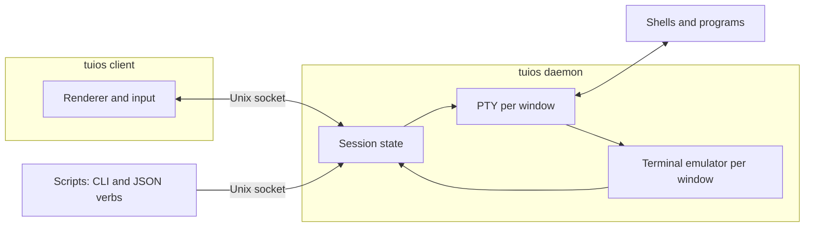

import { Callout } from 'fumadocs-ui/components/callout';
import { Card, Cards } from 'fumadocs-ui/components/card';

A session is a set of windows and workspaces. By default a background daemon holds your sessions, so they keep running when you close the terminal, and you can attach to them again later, from the same terminal or several at once.

## Quick start

```bash
tuios                   # attach to your most recent session, or create one
tuios new work          # create a session called "work" and attach to it
# ... work, then press Ctrl+B d to detach ...
tuios ls                # list sessions
tuios attach work       # attach to "work" again
tuios kill-session work # end "work" and every window in it
```

## Daemon sessions and standalone sessions

TUIOS runs a session in one of two ways.

**Daemon session (the default).** A separate `tuios` daemon process owns the shells and runs a terminal emulator for each one. The TUIOS you see is a client: it draws what the daemon sends and forwards your keys. Closing the client does not stop anything.

**Standalone session.** Everything lives in the one `tuios` process. No daemon starts, no socket is created and nothing is saved. When the process exits, the session is gone.

Ask for a standalone session in any of these ways:

```bash
tuios --standalone      # this run only
TUIOS_NO_DAEMON=1 tuios # every tuios started from this shell
```

```toml
[startup]
daemon = false          # every tuios, from the config file
```

The flag and the environment variable win over the config file. If the daemon fails to start, `tuios` says so and runs standalone for that run, so you always get a terminal.

The rest of this page is about daemon sessions.

<Callout type="info">
Daemon sessions work on Linux, macOS and Windows. Windows needs build 17063 or later, which added Unix socket support.
</Callout>

## Creating sessions

```bash
tuios                   # attach to the most recent session, creating one if none exist
tuios new               # create a session with a generated name (session-0, session-1, ...)
tuios new work          # create a session called "work" and attach to it
tuios attach work -c    # attach to "work", creating it if it does not exist
```

Inside TUIOS, press <kbd>N</kbd> in window management mode to create a session.

The daemon starts on its own the first time you need it.

A session name cannot contain `/` or `\`, start or end with whitespace, contain control characters, or be `.` or `..`. The name is also the name of the file the session is saved to.

### Headless sessions

`--detach` (short `-d`) creates a session without attaching to it. The session gets one window and is ready for `send-text`, `capture-pane`, `wait-for` and the [control protocol](/docs/control-protocol) straight away. This is the starting point for scripts.

```bash
tuios new build --detach
tuios send-text -s build 'make all
'
tuios wait-for window-output -s build --pattern 'make: \*\*\*|Build complete'
```

<Callout type="warn">
A headless session is 80 columns by 24 rows until a client attaches. Anything you capture before then is 80 columns wide.

Appearance flags such as `--theme` and `--show-keys` do nothing with `--detach`. They apply to a client, and a headless session has none. Passing them is not an error.
</Callout>

## Listing sessions

```bash
tuios ls
```

<TerminalCapture
  title="tuios ls"
  rows={7}
  lines={[
    { text: '╭──────┬─────────┬──────────┬─────────────┬─────────────╮' },
    { text: '│ NAME │ WINDOWS │ STATUS   │ CREATED     │ LAST ACTIVE │' },
    { text: '├──────┼─────────┼──────────┼─────────────┼─────────────┤' },
    { text: '│ work │ 3       │ detached │ 2 hours ago │ 5 mins ago  │' },
    { text: '│ dev  │ 2       │ attached │ 1 day ago   │ just now    │' },
    { text: '╰──────┴─────────┴──────────┴─────────────┴─────────────╯' },
    { text: '2 session(s)', tone: 'dim' },
  ]}
/>

`tuios ls --json` prints the same list for scripts. When no daemon is running, `tuios ls` lists the sessions saved on disk instead, marked `saved`, and exits with status 3.

## Attaching and detaching

| Action | How | What happens |
|--------|-----|--------------|
| Attach | `tuios attach [name]` | Draws the session in this terminal. With no name, attaches to the most recent session. |
| Detach | <kbd>Ctrl</kbd>+<kbd>B</kbd> <kbd>d</kbd> | Saves this client's view to the daemon and exits. The session and its shells keep running. |
| Quit | <kbd>Ctrl</kbd>+<kbd>B</kbd> <kbd>q</kbd>, or <kbd>q</kbd> in window mode | Opens the quit menu: detach (the default, so <kbd>q</kbd> <kbd>q</kbd> detaches), switch session, or kill this session. |

When you attach, you get the session exactly as you left it: the same windows, positions and screen contents, because the shells never stopped.

A client that dies without detaching, because its terminal closed or its SSH connection dropped, counts as a detach. The daemon notices the connection close and keeps the session running.

## Switching sessions

<kbd>Ctrl</kbd>+<kbd>B</kbd> <kbd>S</kbd> opens the session switcher.

| Key | Action |
|-----|--------|
| Type | Filter sessions by name |
| <kbd>↑</kbd> <kbd>↓</kbd>, <kbd>Ctrl</kbd>+<kbd>P</kbd> <kbd>Ctrl</kbd>+<kbd>N</kbd> | Move the selection |
| <kbd>Enter</kbd> | Switch to the selected session. If nothing matches, create a session with the name you typed. |
| <kbd>Ctrl</kbd>+<kbd>R</kbd> | Give the selected session a display name. Scripts keep addressing it by its real name. |
| <kbd>Ctrl</kbd>+<kbd>D</kbd> | Kill the selected session, after a <kbd>y</kbd>/<kbd>n</kbd> confirmation. You cannot kill the session you are on this way. |
| <kbd>Ctrl</kbd>+<kbd>U</kbd> | Clear the filter |
| <kbd>Esc</kbd> | Close without switching |

The session you leave keeps running. <kbd>Ctrl</kbd>+<kbd>B</kbd> <kbd>(</kbd> and <kbd>Ctrl</kbd>+<kbd>B</kbd> <kbd>)</kbd> step to the previous and next session without opening the switcher.

## Sharing a session

Several clients can attach to one session at the same time, for example two terminals on one machine, or a terminal and an SSH login.

- Every client sees the same windows, workspaces and output, and changes made in one show up in the others.
- The session is drawn at the size of the smallest attached client.
- Each client keeps its own input mode and copy mode position, so one person entering terminal mode does not change what another is doing.
- Each client shows a short notice when another client joins or leaves.

```bash
# Terminal 1
tuios new pairing

# Terminal 2
tuios attach pairing
```

<Callout type="warn">
Every attached client has full control: it sees all output, types into every shell and can close windows. There are no read-only clients. Local clients are limited to your own user by the socket's permissions. SSH clients are limited by `tuios ssh` authentication, and browser clients by whatever you put in front of `tuios-web`.
</Callout>

## Session resurrection

Detaching loses nothing, because the daemon keeps running. Resurrection is what happens when the daemon itself stops: `tuios kill-server`, a crash, or a reboot. It brings back the **shape** of each session, not what was running in it.

### When state is saved

Each session is written to disk within a couple of seconds of any change to its windows or layout, every 30 seconds regardless (which keeps each window's working directory current), and once more on a clean shutdown. The write is atomic, so a crash while saving cannot leave a half-written file.

When the daemon starts, it restores every saved session before it accepts connections.

### What comes back

- Every window, with its position, size, title and custom name
- Workspace assignment, minimize state and which window had focus
- The BSP tree for each workspace and the layout mode
- The working directory of each window
- Session options

### What does not come back

<Callout type="warn">
Resurrection is crash recovery, not a snapshot. Your layout comes back and each window starts in the right directory, but whatever was running in it is gone.
</Callout>

- **Processes.** Every window gets a fresh shell. A `vim`, a build or an SSH connection that was running is not restarted.
- **Screen contents and scrollback.** They live only in the daemon's memory and are never written to disk.
- **The last few seconds before a crash.** A window created just before a `SIGKILL` may be missing, and a `cd` made less than 30 seconds before it may not be recorded.
- **Your terminal's environment.** Restored shells inherit the daemon's environment and `$SHELL`, not those of the terminal you later attach from.
- **Working directories on Windows and the BSDs.** The daemon asks the kernel where each shell is, which works on Linux and macOS. Elsewhere, restored windows open in the shell's default directory.

A restored window prints a dimmed line so you do not mistake it for the old shell:

```
-- tuios: session restored, fresh shell in /home/you/project --
```

The `in <dir>` part is left out when the directory is unknown. Restored shells also get `TUIOS_RESTORED=1` in their environment, so your shell profile can react.

The session is marked too. It shows a `restored` tag in `tuios ls`, the sidebar and the session switcher, and `tuios attach` prints a notice before drawing it. The mark clears on the first attach.

### What survives each kind of interruption

| | Detach, client crash, SSH drop | `kill-server`, `SIGTERM` | Daemon crash (`SIGKILL`, OOM) | Reboot |
|---|---|---|---|---|
| Session exists afterwards | Yes | Yes, restored | Yes, restored | Yes, restored |
| Window layout | Yes | Yes | As of the last save | As of the last save |
| Working directories | Yes | Yes, on Linux and macOS | As of the last save, on Linux and macOS | As of the last save, on Linux and macOS |
| Shell processes and running programs | Yes | No | No | No |
| Screen contents and scrollback | Yes | No | No | No |
| Copy mode position, input mode | No, these are per client | No | No | No |

### Controlling it

```bash
tuios resurrect            # list saved sessions, whether each is live, and when it was saved
tuios resurrect work       # restore "work" from saved state and attach to it
tuios daemon --no-restore  # start a daemon that restores nothing on start
```

`tuios resurrect <name>` starts the daemon if needed. If the daemon already restored that session, it simply attaches. `restore` is an alias.

`tuios kill-session` deletes the session's saved state, and so does killing it from the quit menu. A session you killed on purpose never comes back.

A state file that is corrupt, or written by a newer TUIOS, is moved to an archive directory and skipped, so one bad file never stops the daemon from starting.

## Sessions on other machines

The daemon can reach TUIOS on other machines over ssh. Name a machine once:

```bash
tuios hosts add build you@buildbox   # any address ssh understands, including an ssh_config alias
tuios hosts test build               # check the link
```

Then:

```bash
tuios attach --host build api        # draw the session "api" on build, in this terminal
tuios new --host build ci -d         # create a session on build without attaching
tuios new-window deploy --host build # a window in this session whose shell runs on build
```

A window whose process runs elsewhere shows the machine in its title, as `build:deploy`. `tuios new NAME --global` creates a session meant to hold windows from several machines. The daemon runs ssh with `BatchMode` on, so ssh to the host once by hand first to accept its key.

See the [CLI Reference](/docs/cli-reference) for `tuios hosts`, including `tuios hosts tailnet` for machines on a Tailscale tailnet.

## Daemon location

| What | Where |
|------|-------|
| Socket, Linux and macOS | `$XDG_RUNTIME_DIR/tuios/tuios.sock`, or `/tmp/tuios-<uid>/tuios.sock` when `XDG_RUNTIME_DIR` is unset |
| Socket, Windows | `%LOCALAPPDATA%\tuios\tuios.sock` |
| PID file | The socket path with `.pid` appended |
| Saved sessions | `$XDG_STATE_HOME/tuios/sessions/<name>.json`, usually `~/.local/state/tuios/sessions/`, readable only by you |
| Archived bad state | `$XDG_STATE_HOME/tuios/sessions/archive/`, pruned after 14 days |

To run the daemon in the foreground with logging, for debugging:

```bash
tuios daemon --log-level=messages
```

`tuios kill-server` stops the daemon and every session. It waits until every session is saved and the socket is removed, so you can start a new daemon as soon as it returns.

## How it works


```mermaid
graph LR
    subgraph Client["tuios client"]
        UI[Renderer and input]
    end

    subgraph Daemon["tuios daemon"]
        SM[Session state]
        EMU[Terminal emulator per window]
        PTY[PTY per window]
    end

    SH[Shells and programs]
    SCRIPT[Scripts: CLI and JSON verbs]

    UI <-->|Unix socket| SM
    SCRIPT -->|Unix socket| SM
    SM --> PTY
    PTY <--> SH
    PTY --> EMU
    EMU --> SM
```

The daemon owns the PTYs and keeps an emulator fed for each one, so output is parsed whether or not a client is watching. When a client attaches, it asks the daemon for each window's screen and scrollback and paints them.

## Remote control

Scripts can drive a running session through CLI commands that talk to the daemon. They all take `-s <session>` (default: the most recently active session) and most take `-w <window>`, a window name or ID (default: the focused window).

### Run commands in a window

```bash
# Type a line and press Enter (the trailing newline submits it)
tuios send-text -w build 'go test ./...
'

# Send keys by name, as if typed at TUIOS
tuios send-keys 'ctrl+b,c'
```

`send-text` writes its argument to the shell exactly as given. `send-keys` parses key names and splits on spaces and commas, which suits chords and control keys. Use `send-text` for anything that contains spaces.

### Open windows

```bash
tuios new-window build                    # prints the new window's ID and name
tuios new-window htop /usr/bin/htop       # run a program instead of a shell
tuios new-window --json logs | jq -r .window_id
```

### Wait and read

```bash
tuios wait-for window-output -w build --pattern 'PASS|FAIL' --timeout 600000
tuios wait-for window-idle -w build --idle 2000
tuios capture-pane -w build --lines 40
tuios capture-pane -w build --scrollback > build.log
```

`wait-for` blocks until the condition matches and exits non-zero on timeout, so you do not need a poll loop.

### Inspect

```bash
tuios list-windows --json   # every window, with window_id, display_name, workspace and more
tuios get-window build      # one window
tuios session-info          # the session
```

### Run any command

`tuios run-command` runs any named command, the same set tape scripts use. `tuios run-command --list` prints them all.

```bash
tuios run-command ToggleTiling
tuios run-command SwitchWorkspace 2
tuios run-command --json NewWindow dev
```

With `--json`, the result fields sit at the top level, so the new window's ID is at `.window_id`.

### Example: a development layout

```bash
#!/bin/sh
tuios new dev --detach
tuios new-window -s dev editor
tuios new-window -s dev server
tuios new-window -s dev logs

tuios send-text -s dev -w editor 'nvim .
'
tuios send-text -s dev -w server 'npm run dev
'
tuios send-text -s dev -w logs 'tail -f app.log
'

tuios attach dev
```

### Example: pick a window with fzf

```bash
#!/bin/sh
WINDOW=$(tuios list-windows --json |
  jq -r '.windows[] | "\(.display_name)\t\(.window_id)"' |
  fzf --with-nth=1 | cut -f2)

[ -n "$WINDOW" ] && tuios focus-window "$WINDOW"
```

### Beyond the CLI

Each CLI call opens its own connection. For a long-running program, speak the [JSON control protocol](/docs/control-protocol) on the daemon socket directly: structured errors, blocking waits and a live event stream. Run `tuios list-verbs` to see every verb. The [CLI Reference](/docs/cli-reference#remote-control-commands) documents every command and flag.

## Troubleshooting

### "Daemon not running" or a stale socket

```bash
tuios kill-server   # stops the daemon, or removes a stale socket if none is running
tuios               # starts a fresh daemon
```

<Callout type="warn">
This does not give you a clean slate. `kill-server` saves every session on the way out, and the next daemon restores them. To start a daemon with no sessions, run `tuios daemon --no-restore`.
</Callout>

### "Session not found"

The name is wrong or the session was killed. `tuios ls` lists the live ones, and `tuios resurrect` lists the saved ones.

### A session stopped responding

```bash
tuios kill-session stuck
tuios new fresh
```

`tuios logs` shows the daemon log.

## Related

<Cards>
  <Card title="Control Protocol" href="/docs/control-protocol" description="Drive the daemon from scripts and programs" />
  <Card title="CLI Reference" href="/docs/cli-reference" description="Every command and flag" />
  <Card title="Keybindings" href="/docs/keybindings" description="Keyboard shortcuts" />
  <Card title="Hooks" href="/docs/hooks" description="Run commands on session and window events" />
</Cards>
