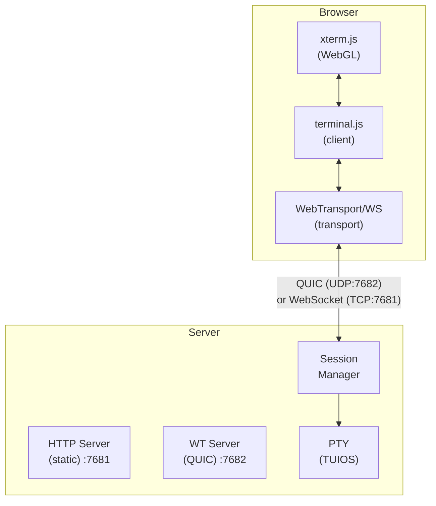

import { Callout } from 'fumadocs-ui/components/callout';
import { Step, Steps } from 'fumadocs-ui/components/steps';
import { Tab, Tabs } from 'fumadocs-ui/components/tabs';

Access TUIOS from any modern web browser with hardware-accelerated rendering and low-latency connections.

<Callout type="warn" title="Separate Binary">
The web terminal functionality is provided as a separate `tuios-web` binary for security isolation. This prevents the web server from being used as a potential backdoor in the main TUIOS binary.
</Callout>

## Installation

<Tabs items={['Homebrew', 'AUR', 'Go Install']}>
<Tab value="Homebrew">
```bash
brew install tuios-web
```
</Tab>
<Tab value="AUR">
```bash
yay -S tuios-web-bin
# or
paru -S tuios-web-bin
```
</Tab>
<Tab value="Go Install">
```bash
go install github.com/Gaurav-Gosain/tuios/cmd/tuios-web@latest
```
</Tab>
</Tabs>

## Quick Start

<Steps>
<Step>
### Start the web server

```bash
tuios-web
```

This starts:
- HTTP server on `http://localhost:7681` (static files, WebSocket)
- WebTransport server on `https://127.0.0.1:7682` (QUIC/UDP)
</Step>

<Step>
### Open in browser

```bash
open http://localhost:7681
```

The browser will automatically connect using the best available transport (WebTransport if supported, WebSocket otherwise).
</Step>
</Steps>

## Features

- **WebGL Rendering** - GPU-accelerated terminal at 60fps
- **Dual Protocols** - WebTransport (QUIC) with WebSocket fallback
- **Bundled Fonts** - JetBrains Mono Nerd Font included
- **Settings Panel** - Configure transport, renderer, font size
- **Mouse Support** - Full interaction with cell-based optimization
- **Auto-Reconnect** - Automatic reconnection with backoff
- **Read-Only Mode** - View-only sessions for demos

## Command Reference

```bash
tuios-web [flags]
```

### Flags

| Flag | Default | Description |
|------|---------|-------------|
| `--port` | `7681` | HTTP server port |
| `--host` | `localhost` | Server bind address |
| `--read-only` | `false` | Disable client input |
| `--max-connections` | `0` | Max concurrent sessions (0=unlimited) |

### TUIOS Flags

All TUIOS flags are forwarded to the spawned instance:

```bash
# With theme
tuios-web --theme dracula

# With show-keys overlay
tuios-web --show-keys

# Multiple flags
tuios-web --theme nord --ascii-only --debug
```

## Client Settings

Click the ⚙ button in the top-right corner to access settings:

### Transport

| Option | Description |
|--------|-------------|
| **Auto** | Prefer WebTransport, fallback to WebSocket |
| **WebTransport** | Force QUIC (lower latency) |
| **WebSocket** | Force WebSocket (wider compatibility) |

### Renderer

| Option | Description |
|--------|-------------|
| **Auto** | Prefer WebGL, fallback to Canvas/DOM |
| **WebGL** | GPU-accelerated (best performance) |
| **Canvas** | 2D canvas (good compatibility) |
| **DOM** | Standard DOM (most compatible) |

### Font Size

Adjustable from 10px to 24px. Settings persist in localStorage.

## Architecture



### Message Protocol

| Type | Code | Direction | Description |
|------|------|-----------|-------------|
| Input | `0` | C→S | Keyboard/mouse input |
| Output | `1` | S→C | Terminal output data |
| Resize | `2` | C→S | Terminal size change |
| Ping | `3` | C→S | Keep-alive ping |
| Pong | `4` | S→C | Keep-alive response |
| Title | `5` | S→C | Window title update |
| Options | `6` | S→C | Session configuration |
| Close | `7` | S→C | Session ended |

## Reverse Proxy Setup

For production deployments, put TUIOS behind a reverse proxy with proper TLS.

<Callout title="Important" type="warn">
WebTransport requires HTTP/3 (QUIC) support. Most reverse proxies only support WebSocket, so WebTransport connections will fall back to WebSocket when proxied.
</Callout>

### Cloudflare Tunnel

Cloudflare Tunnels provide secure access without opening ports.

<Steps>
<Step>
### Install cloudflared

```bash
# macOS
brew install cloudflare/cloudflare/cloudflared

# Linux
curl -L https://github.com/cloudflare/cloudflared/releases/latest/download/cloudflared-linux-amd64 -o cloudflared
chmod +x cloudflared
sudo mv cloudflared /usr/local/bin/
```
</Step>

<Step>
### Authenticate

```bash
cloudflared tunnel login
```
</Step>

<Step>
### Create tunnel

```bash
cloudflared tunnel create tuios
```
</Step>

<Step>
### Configure tunnel

Create `~/.cloudflared/config.yml`:

```yaml
tunnel: <your-tunnel-id>
credentials-file: /path/to/credentials.json

ingress:
  - hostname: tuios.yourdomain.com
    service: http://localhost:7681
  - service: http_status:404
```
</Step>

<Step>
### Start TUIOS and tunnel

```bash
# Terminal 1: Start TUIOS web server
tuios-web --host 127.0.0.1

# Terminal 2: Start tunnel
cloudflared tunnel run tuios
```
</Step>

<Step>
### Add DNS record

```bash
cloudflared tunnel route dns tuios tuios.yourdomain.com
```

Access at `https://tuios.yourdomain.com`
</Step>
</Steps>

### Nginx

<Tabs items={['WebSocket Only', 'With SSL']}>
<Tab value="WebSocket Only">
```nginx
server {
    listen 80;
    server_name tuios.example.com;

    location / {
        proxy_pass http://127.0.0.1:7681;
        proxy_http_version 1.1;
        proxy_set_header Upgrade $http_upgrade;
        proxy_set_header Connection "upgrade";
        proxy_set_header Host $host;
        proxy_set_header X-Real-IP $remote_addr;
        proxy_read_timeout 86400;
    }
}
```
</Tab>

<Tab value="With SSL">
```nginx
server {
    listen 443 ssl http2;
    server_name tuios.example.com;

    ssl_certificate /etc/letsencrypt/live/tuios.example.com/fullchain.pem;
    ssl_certificate_key /etc/letsencrypt/live/tuios.example.com/privkey.pem;

    location / {
        proxy_pass http://127.0.0.1:7681;
        proxy_http_version 1.1;
        proxy_set_header Upgrade $http_upgrade;
        proxy_set_header Connection "upgrade";
        proxy_set_header Host $host;
        proxy_set_header X-Real-IP $remote_addr;
        proxy_set_header X-Forwarded-For $proxy_add_x_forwarded_for;
        proxy_set_header X-Forwarded-Proto $scheme;
        proxy_read_timeout 86400;
        proxy_send_timeout 86400;
    }
}

server {
    listen 80;
    server_name tuios.example.com;
    return 301 https://$server_name$request_uri;
}
```
</Tab>
</Tabs>

### Caddy

Caddy automatically handles TLS certificates:

```text
tuios.example.com {
    reverse_proxy localhost:7681
}
```

### Traefik

```yaml
# docker-compose.yml
services:
  tuios:
    image: ghcr.io/gaurav-gosain/tuios:latest
    command: web --host 0.0.0.0
    labels:
      - "traefik.enable=true"
      - "traefik.http.routers.tuios.rule=Host(`tuios.example.com`)"
      - "traefik.http.routers.tuios.entrypoints=websecure"
      - "traefik.http.routers.tuios.tls.certresolver=letsencrypt"
      - "traefik.http.services.tuios.loadbalancer.server.port=7681"
```

## Security Considerations

### Development Mode

By default, TUIOS generates a self-signed certificate for WebTransport:
- Valid for 10 days (Chrome requirement for `serverCertificateHashes`)
- Certificate hash provided via `/cert-hash` endpoint
- No browser warning for WebTransport connections

### Production Recommendations

<Callout title="Security Tips" type="warn">
1. **Always use a reverse proxy** with proper TLS for production
2. **Bind to localhost**: `tuios-web --host 127.0.0.1`
3. **Limit connections**: `tuios-web --max-connections 10`
4. **Use read-only for demos**: `tuios-web --read-only`
5. **Add authentication** at the reverse proxy level
</Callout>

### Basic Auth with Nginx

```nginx
location / {
    auth_basic "TUIOS";
    auth_basic_user_file /etc/nginx/.htpasswd;
    
    proxy_pass http://127.0.0.1:7681;
    # ... rest of proxy config
}
```

Create password file:

```bash
htpasswd -c /etc/nginx/.htpasswd username
```

## Performance

### Server Optimizations

- **Buffer Pools** - Reusable buffers reduce GC pressure
- **Atomic Counters** - Lock-free connection counting
- **Direct Streaming** - No intermediate buffering
- **Structured Logging** - charmbracelet/log with configurable levels

### Client Optimizations

- **requestAnimationFrame Batching** - Writes batched per frame
- **Mouse Deduplication** - Only sends on cell position change
- **Pre-allocated Buffers** - Reusable send/receive buffers
- **Cached DOM Elements** - No repeated queries

### Typical Metrics

| Metric | Value |
|--------|-------|
| Latency (local) | &lt;5ms |
| Latency (LAN) | &lt;20ms |
| Mouse events filtered | 80-95% |
| Memory (per session) | ~10MB |

## Troubleshooting

### WebTransport Not Connecting

1. **Check browser support** - Chrome 97+, Edge 97+
2. **Verify UDP port** - Port 7682 must be accessible
3. **Check console** - Look for certificate hash errors
4. **Force WebSocket** - Use settings panel to switch

### Blank Terminal

1. **Check console** - Look for JavaScript errors
2. **Verify fonts** - Check if fonts loaded
3. **Try different renderer** - Switch in settings
4. **Check server logs** - Verify TUIOS process started

### High Latency

1. **Check network** - Run speed test
2. **Prefer WebTransport** - Lower latency than WebSocket
3. **Use WebGL** - Hardware acceleration
4. **Check server CPU** - May be overloaded

### Session Not Closing

When TUIOS quits (pressing `q`), the web session should close automatically. If not:

1. Check browser console for errors
2. Verify server logs show session cleanup
3. Refresh browser to start new session

### Debug Mode

```bash
tuios-web --debug
```

Server logs include:
- Connection attempts
- Session lifecycle
- Bytes sent/received
- Terminal resize events
- Error details

## Examples

### Public Demo Server

```bash
# Read-only with connection limit
tuios-web \
  --host 0.0.0.0 \
  --port 7681 \
  --read-only \
  --max-connections 50 \
  --theme dracula
```

### Development with Hot Reload

```bash
# With debug logging
tuios-web --debug --show-keys
```

### Docker Deployment

```bash
docker run -it --rm \
  -p 7681:7681 \
  -p 7682:7682/udp \
  ghcr.io/gaurav-gosain/tuios:latest \
  web --host 0.0.0.0
```

### Systemd Service

```ini
# /etc/systemd/system/tuios-web.service
[Unit]
Description=TUIOS Web Terminal
After=network.target

[Service]
Type=simple
User=tuios
ExecStart=/usr/local/bin/tuios-web --host 127.0.0.1 --port 7681
Restart=always
RestartSec=5

[Install]
WantedBy=multi-user.target
```

```bash
sudo systemctl enable tuios-web
sudo systemctl start tuios-web
```

## Related Documentation

<Cards>
  <Card
    title="CLI Reference"
    href="/docs/cli-reference"
    description="Complete command-line reference"
  />
  <Card
    title="Configuration"
    href="/docs/configuration"
    description="Customize keybindings and settings"
  />
  <Card
    title="Architecture"
    href="/docs/architecture"
    description="Technical architecture and design"
  />
</Cards>
