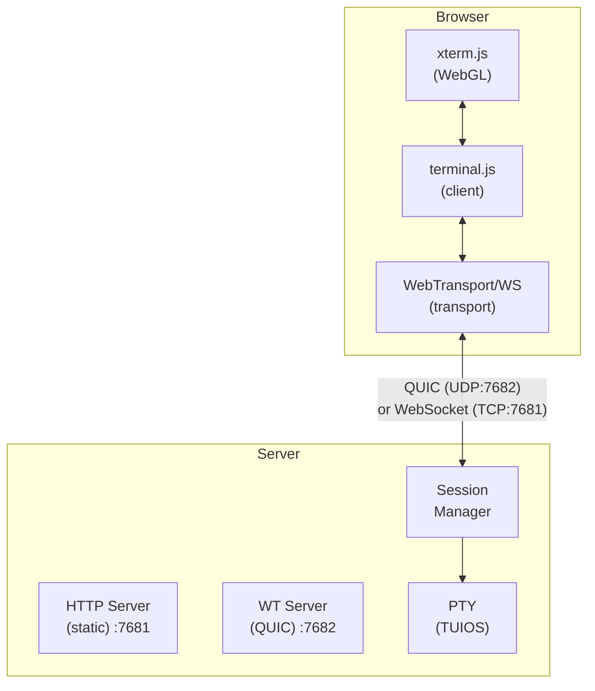

import { Callout } from 'fumadocs-ui/components/callout';
import { Step, Steps } from 'fumadocs-ui/components/steps';
import { Tab, Tabs } from 'fumadocs-ui/components/tabs';

Access TUIOS from any modern web browser with hardware-accelerated rendering and low-latency connections.

<Callout type="info" title="Powered by Sip">
The web terminal is powered by [**sip**](https://github.com/Gaurav-Gosain/sip), a standalone library for serving Bubble Tea apps through the browser. You can use sip to serve your own Bubble Tea applications on the web!
</Callout>

<Callout type="warn" title="Separate Binary">
The web terminal functionality is provided as a separate `tuios-web` binary for security isolation. This prevents the web server from being used as a potential backdoor in the main TUIOS binary.
</Callout>

## Installation

<Tabs items={['Homebrew', 'AUR', 'Go Install']}>
<Tab value="Homebrew">
```bash
brew tap Gaurav-Gosain/tap
brew install tuios-web
```
</Tab>
<Tab value="AUR">
```bash
yay -S tuios-web-bin
# or
paru -S tuios-web-bin
```
</Tab>
<Tab value="Go Install">
```bash
go install github.com/Gaurav-Gosain/tuios/cmd/tuios-web@latest
```
</Tab>
</Tabs>

## Quick Start

<Steps>
<Step>
### Start the web server

```bash
tuios-web
```

This starts:
- HTTP server on `http://localhost:7681` (static files, WebSocket)
- WebTransport server on `https://127.0.0.1:7682` (QUIC/UDP)
</Step>

<Step>
### Open in browser

```bash
open http://localhost:7681
```

The browser will automatically connect using the best available transport (WebTransport if supported, WebSocket otherwise).
</Step>
</Steps>

## Features

- **WebGL Rendering** - GPU-accelerated terminal
- **Dual Protocols** - WebTransport (QUIC) with WebSocket fallback
- **Bundled Fonts** - JetBrains Mono Nerd Font included
- **Settings Panel** - Configure transport, renderer, font size
- **Mouse Support** - Full interaction with cell-based optimization
- **Auto-Reconnect** - Automatic reconnection with backoff
- **Read-Only Mode** - View-only sessions for demos

## Command Reference

```bash
tuios-web [flags]
```

### Flags

| Flag | Default | Description |
|------|---------|-------------|
| `--port` | `7681` | HTTP server port |
| `--host` | `localhost` | Server bind address |
| `--read-only` | `false` | Disable client input |
| `--max-connections` | `0` | Max concurrent sessions (0=unlimited) |
| `--default-session` | `web` | Session name shared by all connections |
| `--ephemeral` | `false` | Disable daemon mode, so sessions do not persist |

`tuios-web` starts the daemon automatically. If the daemon cannot be started it falls back to ephemeral mode silently, so sessions that you expected to persist will not.

### Forwarded TUIOS Flags

Nine TUIOS flags are forwarded to the spawned instance: `--debug`, `--ascii-only`, `--theme`, `--border-style`, `--dockbar-position`, `--hide-window-buttons`, `--scrollback-lines`, `--show-keys`, and `--no-animations`.

<Callout type="warn">
This is not the full TUIOS flag set. `--shared-borders`, `--show-clock`, `--show-cpu`, `--show-ram`, `--hide-scrollbar`, `--window-title-position`, `--zoom-max-width`, `--confirm-quit`, and `--pprof` are **not** forwarded. Passing them to `tuios-web` is not an error, so they fail silently. Set them in your config file instead.
</Callout>

`tuios-web` also sets `TERM=xterm-kitty` and `TERM_PROGRAM=tuios-web` for every session it spawns.

```bash
# With theme
tuios-web --theme dracula

# With show-keys overlay
tuios-web --show-keys

# Disable animations for instant transitions
tuios-web --no-animations

# Multiple flags
tuios-web --theme nord --ascii-only --debug
```

## Client Settings

Click the ⚙ button in the top-right corner to access settings:

### Transport

| Option | Description |
|--------|-------------|
| **Auto** | Prefer WebTransport, fallback to WebSocket |
| **WebTransport** | Force QUIC (lower latency) |
| **WebSocket** | Force WebSocket (wider compatibility) |

### Renderer

| Option | Description |
|--------|-------------|
| **Auto** | Prefer WebGL, fallback to Canvas/DOM |
| **WebGL** | GPU-accelerated (best performance) |
| **Canvas** | 2D canvas (good compatibility) |
| **DOM** | Standard DOM (most compatible) |

### Font Size

Adjustable from 10px to 24px. Settings persist in localStorage.

## Architecture


```mermaid
flowchart TB
    subgraph Browser
        xterm["xterm.js<br/>(WebGL)"]
        client["terminal.js<br/>(client)"]
        transport["WebTransport/WS<br/>(transport)"]
        xterm <--> client <--> transport
    end

    transport <-->|"QUIC (UDP:7682)<br/>or WebSocket (TCP:7681)"| session

    subgraph Server
        http["HTTP Server<br/>(static) :7681"]
        wt["WT Server<br/>(QUIC) :7682"]
        session["Session<br/>Manager"]
        pty["PTY<br/>(TUIOS)"]
        session --> pty
    end
```

### Message Protocol

| Type | Code | Direction | Description |
|------|------|-----------|-------------|
| Input | `0` | C→S | Keyboard/mouse input |
| Output | `1` | S→C | Terminal output data |
| Resize | `2` | C→S | Terminal size change |
| Ping | `3` | C→S | Keep-alive ping |
| Pong | `4` | S→C | Keep-alive response |
| Title | `5` | S→C | Window title update |
| Options | `6` | S→C | Session configuration |
| Close | `7` | S→C | Session ended |

The code is the ASCII character `'0'` through `'7'` (bytes `0x30` to `0x37`), not the raw byte values 0 to 7. It is the first byte of each frame.

## Graphics in the Browser

Inline images work in the web client, but a narrower set of the Kitty graphics protocol is supported than in a native terminal.

**Works:** direct base64 transmission (`t=d`), the placement and deletion actions, RGB and RGBA and PNG formats, zlib compression, chunked transmission, source-region clipping, and repositioning on scroll. Sixel graphics also work.

**Does not work:** file transmission (`t=f`), temporary-file transmission (`t=t`), shared memory (`t=s`, including `/dev/shm`), the animation protocol (`a=f`, `a=a`, `a=c`), and Unicode placeholders (`U=1`).

The practical consequence is that a program which insists on passing a file path or a shared memory handle gets no image. `mpv --vo=kitty` is the common case: it prefers shared memory, which the browser client cannot read.

<Callout type="info">
This is handled honestly rather than silently. TUIOS probes its host terminal at startup to find out which transmission media actually work, and answers guest capability queries with the real answer. A program that asks whether it can send a file path is told no, and falls back to streaming bytes, instead of sending a path that produces a blank image.

Earlier versions answered every capability query with a yes, which is why `kitten icat` and similar tools could silently render nothing. See [Graphics Support](/docs#graphics-support-experimental) for the host-side behaviour.
</Callout>

There is one conservative edge: the host probe shares a 300 ms budget, so a host that supports file transmission but answers slowly is treated as if it does not. That costs a server-side read and re-encode per frame rather than breaking anything, and there is no environment variable to force it back on.

## Reverse Proxy Setup

For production deployments, put TUIOS behind a reverse proxy with proper TLS.

<Callout title="Important" type="warn">
WebTransport requires HTTP/3 (QUIC) support. Most reverse proxies only support WebSocket, so WebTransport connections will fall back to WebSocket when proxied.
</Callout>

### Cloudflare Tunnel

Cloudflare Tunnels provide secure access without opening ports.

<Steps>
<Step>
### Install cloudflared

```bash
# macOS
brew install cloudflare/cloudflare/cloudflared

# Linux
curl -L https://github.com/cloudflare/cloudflared/releases/latest/download/cloudflared-linux-amd64 -o cloudflared
chmod +x cloudflared
sudo mv cloudflared /usr/local/bin/
```
</Step>

<Step>
### Authenticate

```bash
cloudflared tunnel login
```
</Step>

<Step>
### Create tunnel

```bash
cloudflared tunnel create tuios
```
</Step>

<Step>
### Configure tunnel

Create `~/.cloudflared/config.yml`:

```yaml
tunnel: <your-tunnel-id>
credentials-file: /path/to/credentials.json

ingress:
  - hostname: tuios.yourdomain.com
    service: http://localhost:7681
  - service: http_status:404
```
</Step>

<Step>
### Start TUIOS and tunnel

```bash
# Terminal 1: Start TUIOS web server
tuios-web --host 127.0.0.1

# Terminal 2: Start tunnel
cloudflared tunnel run tuios
```
</Step>

<Step>
### Add DNS record

```bash
cloudflared tunnel route dns tuios tuios.yourdomain.com
```

Access at `https://tuios.yourdomain.com`
</Step>
</Steps>

### Nginx

<Tabs items={['WebSocket Only', 'With SSL']}>
<Tab value="WebSocket Only">
```nginx
server {
    listen 80;
    server_name tuios.example.com;

    location / {
        proxy_pass http://127.0.0.1:7681;
        proxy_http_version 1.1;
        proxy_set_header Upgrade $http_upgrade;
        proxy_set_header Connection "upgrade";
        proxy_set_header Host $host;
        proxy_set_header X-Real-IP $remote_addr;
        proxy_read_timeout 86400;
    }
}
```
</Tab>

<Tab value="With SSL">
```nginx
server {
    listen 443 ssl http2;
    server_name tuios.example.com;

    ssl_certificate /etc/letsencrypt/live/tuios.example.com/fullchain.pem;
    ssl_certificate_key /etc/letsencrypt/live/tuios.example.com/privkey.pem;

    location / {
        proxy_pass http://127.0.0.1:7681;
        proxy_http_version 1.1;
        proxy_set_header Upgrade $http_upgrade;
        proxy_set_header Connection "upgrade";
        proxy_set_header Host $host;
        proxy_set_header X-Real-IP $remote_addr;
        proxy_set_header X-Forwarded-For $proxy_add_x_forwarded_for;
        proxy_set_header X-Forwarded-Proto $scheme;
        proxy_read_timeout 86400;
        proxy_send_timeout 86400;
    }
}

server {
    listen 80;
    server_name tuios.example.com;
    return 301 https://$server_name$request_uri;
}
```
</Tab>
</Tabs>

### Caddy

Caddy automatically handles TLS certificates:

```text
tuios.example.com {
    reverse_proxy localhost:7681
}
```

### Traefik

```yaml
# docker-compose.yml
services:
  tuios:
    # Build this yourself; no published image ships tuios-web.
    image: tuios-web:local
    command: ["--host", "0.0.0.0"]
    labels:
      - "traefik.enable=true"
      - "traefik.http.routers.tuios.rule=Host(`tuios.example.com`)"
      - "traefik.http.routers.tuios.entrypoints=websecure"
      - "traefik.http.routers.tuios.tls.certresolver=letsencrypt"
      - "traefik.http.routers.tuios.middlewares=tuios-auth"
      - "traefik.http.middlewares.tuios-auth.basicauth.usersfile=/etc/traefik/htpasswd"
      - "traefik.http.services.tuios.loadbalancer.server.port=7681"
```

The `basicauth` middleware is doing the access control here. Without it this configuration publishes an unauthenticated shell on a public hostname.

## Security Considerations

### There is no authentication

<Callout title="tuios-web has no access control of any kind" type="error">
`tuios-web` serves a full interactive shell to anyone who can reach the port. It has no login, no token, no password flag, and no TLS option. Anyone who connects gets your shell with your privileges.

It also accepts WebSocket connections **from any origin**. The origin check is a function that returns true unconditionally, and the allowed-origin list is left empty, which the underlying library treats as a wildcard. This means any web page you visit while `tuios-web` is running can open a connection to `localhost:7681` and run commands as you. Binding to `127.0.0.1` does not protect against this, because the request originates from your own browser.

Treat a running `tuios-web` as an open shell on that port. Do not leave it running unattended, and do not expose it without putting authentication in front of it.
</Callout>

### Putting authentication in front of it

Because the server has no authentication of its own, a reverse proxy is the only place to add it. This is a requirement for any use beyond a local session you are actively watching, not a hardening tip.

<Callout title="If you expose this at all" type="warn">
1. **Terminate TLS and authenticate at a reverse proxy.** The server speaks plaintext HTTP and WebSocket and exposes no TLS flags.
2. **Bind to localhost**: `tuios-web --host 127.0.0.1`, and let the proxy be the only thing that reaches it.
3. **Limit connections**: `tuios-web --max-connections 10`
4. **Use read-only for demos**: `tuios-web --read-only`
5. **Do not rely on origin checks.** There are none to configure. The `AllowOrigins` setting exists in the underlying library but `tuios-web` exposes no flag for it.
</Callout>

### WebTransport certificates

The server generates a self-signed certificate for WebTransport:

- Valid for 10 days, which is Chrome's limit for `serverCertificateHashes`
- The hash is served from the `/cert-hash` endpoint
- No browser warning is shown for the WebTransport connection

<Callout type="warn">
The WebTransport listener binds to `127.0.0.1` regardless of what you pass to `--host`. With `--host 0.0.0.0`, remote clients cannot use WebTransport at all and always fall back to WebSocket. WebTransport is effectively a local-only optimisation today.
</Callout>

### Basic Auth with Nginx

```nginx
location / {
    auth_basic "TUIOS";
    auth_basic_user_file /etc/nginx/.htpasswd;
    
    proxy_pass http://127.0.0.1:7681;
    # ... rest of proxy config
}
```

Create password file:

```bash
htpasswd -c /etc/nginx/.htpasswd username
```

## Performance

### Server Optimizations

- **Buffer Pools** - Reusable buffers reduce GC pressure
- **Atomic Counters** - Lock-free connection counting
- **Direct Streaming** - No intermediate buffering
- **Structured Logging** - charmbracelet/log with configurable levels

### Client Optimizations

- **requestAnimationFrame Batching** - Writes batched per frame
- **Mouse Deduplication** - Only sends on cell position change
- **Pre-allocated Buffers** - Reusable send/receive buffers
- **Cached DOM Elements** - No repeated queries

### Measured Performance

There is no benchmark in the repository for the web path, so no latency, memory, or event-filtering figures are claimed here. The optimisations above are real code, but their effect has not been measured and published.

If you need numbers for your own deployment, measure them on your own hardware and network. Local latency is dominated by the transport in use, and WebTransport is only available when the browser reaches the server on `127.0.0.1`.

## Troubleshooting

### WebTransport Not Connecting

1. **Check browser support** - Chrome 97+, Edge 97+
2. **Verify UDP port** - Port 7682 must be accessible
3. **Check console** - Look for certificate hash errors
4. **Force WebSocket** - Use settings panel to switch

### Blank Terminal

1. **Check console** - Look for JavaScript errors
2. **Verify fonts** - Check if fonts loaded
3. **Try different renderer** - Switch in settings
4. **Check server logs** - Verify TUIOS process started

### High Latency

1. **Check network** - Run speed test
2. **Prefer WebTransport** - Lower latency than WebSocket
3. **Use WebGL** - Hardware acceleration
4. **Check server CPU** - May be overloaded

### Session Not Closing

When TUIOS quits (pressing `q`), the web session should close automatically. If not:

1. Check browser console for errors
2. Verify server logs show session cleanup
3. Refresh browser to start new session

### Debug Mode

```bash
tuios-web --debug
```

Server logs include:
- Connection attempts
- Session lifecycle
- Bytes sent/received
- Terminal resize events
- Error details

## Examples

### Public Demo Server

```bash
# Read-only with connection limit
tuios-web \
  --host 0.0.0.0 \
  --port 7681 \
  --read-only \
  --max-connections 50 \
  --theme dracula
```

### Development with Hot Reload

```bash
# With debug logging
tuios-web --debug --show-keys
```

### Docker Deployment

<Callout type="warn">
There is no published image that contains `tuios-web`. The `ghcr.io/gaurav-gosain/tuios` image builds only `cmd/tuios` and its entrypoint is the `tuios` binary, which has no `web` subcommand. To run the web terminal in a container you have to build an image yourself.
</Callout>

```dockerfile
FROM golang:1.25 AS build
WORKDIR /src
COPY . .
RUN go build -o /out/tuios-web ./cmd/tuios-web

FROM debian:bookworm-slim
COPY --from=build /out/tuios-web /usr/local/bin/tuios-web
EXPOSE 7681
ENTRYPOINT ["tuios-web", "--host", "0.0.0.0"]
```

Remember that this exposes an unauthenticated shell. See [Security Considerations](#security-considerations).

### Systemd Service

```ini
# /etc/systemd/system/tuios-web.service
[Unit]
Description=TUIOS Web Terminal
After=network.target

[Service]
Type=simple
User=tuios
ExecStart=/usr/local/bin/tuios-web --host 127.0.0.1 --port 7681
Restart=always
RestartSec=5

[Install]
WantedBy=multi-user.target
```

```bash
sudo systemctl enable tuios-web
sudo systemctl start tuios-web
```

## Related Documentation

<Cards>
  <Card
    title="CLI Reference"
    href="/docs/cli-reference"
    description="Complete command-line reference"
  />
  <Card
    title="Configuration"
    href="/docs/configuration"
    description="Customize keybindings and settings"
  />
  <Card
    title="Architecture"
    href="/docs/architecture"
    description="Technical architecture and design"
  />
</Cards>
