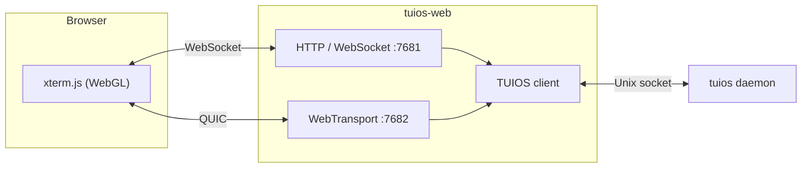

import { Callout } from 'fumadocs-ui/components/callout';
import { Card, Cards } from 'fumadocs-ui/components/card';
import { Step, Steps } from 'fumadocs-ui/components/steps';
import { Tab, Tabs } from 'fumadocs-ui/components/tabs';

`tuios-web` serves TUIOS to a web browser. The browser draws the terminal with WebGL and connects over WebTransport when it can, or WebSocket when it cannot.

It is a separate binary from `tuios`, so the main binary contains no web server. It is built on [sip](https://github.com/Gaurav-Gosain/sip), a library for serving any Bubble Tea program in a browser.

<Callout title="Every browser gets a shell" type="warn">
A browser that opens `tuios-web` gets a shell as the user who runs it. Set a password to control who connects. See [Who can connect](#who-can-connect).
</Callout>

<Callout title="Upgrading from v0.8.0" type="info">
In v0.8.1, a bind to an address other than `localhost` needs a password. See [Upgrade from v0.8.0](#upgrade-from-v080).
</Callout>

## Install

<Tabs items={['Homebrew', 'Arch (AUR)', 'Script', 'Go']}>
<Tab value="Homebrew">
```bash
brew tap Gaurav-Gosain/tap
brew install tuios-web
```
</Tab>
<Tab value="Arch (AUR)">
```bash
yay -S tuios-web-bin
```
</Tab>
<Tab value="Script">
```bash
curl -fsSL https://raw.githubusercontent.com/Gaurav-Gosain/tuios/main/install-web.sh | bash
```
</Tab>
<Tab value="Go">
```bash
go install github.com/Gaurav-Gosain/tuios/cmd/tuios-web@latest
```
</Tab>
</Tabs>

## Quick start

<Steps>
<Step>
### Start the server

```bash
tuios-web
```

It listens on `http://localhost:7681`, and for WebTransport on UDP port 7682 of the same host.

</Step>

<Step>
### Open it

Go to [http://localhost:7681](http://localhost:7681). The page picks the best transport on its own.

</Step>
</Steps>

By default every browser attaches to one daemon session called `web`, created the first time it is needed. Close the tab and the session keeps running, like any [daemon session](/docs/sessions). Open a second tab and both show the same session.

## Reaching it from another device

A bind to an address other than loopback needs TLS and a password. TLS encrypts the keystrokes. The password controls who connects. `tuios-web` does not start without both, and it prints the commands to use.

```bash
# HTTPS from a self-signed certificate that tuios-web makes and keeps,
# and a new password at each start. tuios-web prints the password.
tuios-web --host 0.0.0.0 --auto-tls --random-password

# HTTPS from a certificate you already have, and a password in a file
tuios-web --host 0.0.0.0 --cert cert.pem --key key.pem \
  --password-file ~/.config/tuios/web-password

# Plain HTTP and no password, only on a network you trust
tuios-web --host 0.0.0.0 --insecure --no-auth
```

An empty `--host` listens on every interface. `tuios-web` applies the same rules to it as to `0.0.0.0`.

With `--auto-tls`, each browser shows a certificate warning on its first visit, because the certificate is self-signed. `tuios-web cert info` explains what the warning looks like and how to make it go away. The other `cert` subcommands are `new` (replace the certificate), `path` (print its path) and `rm` (delete it and the key).

An SSH tunnel is another option, and needs no certificate:

```bash
ssh -L 7681:localhost:7681 you@server
```

Then open `http://localhost:7681` on your own machine.

On phones and tablets, `tuios-web` adds a key bar with the prefix key and buttons for common commands (new, close, next, zoom, the command palette and more). It detects touch devices from the browser's request. Use `--touch on` or `--touch off` when it guesses wrong.

## Flags

| Flag | Default | Description |
|------|---------|-------------|
| `--host` | `localhost` | Address to bind |
| `--port` | `7681` | HTTP port. WebTransport uses the next port up. |
| `--auto-tls` | off | Serve HTTPS from a self-signed certificate that `tuios-web` generates and keeps |
| `--cert`, `--key` | | Serve HTTPS from your own certificate and key, in PEM form |
| `--cert-days` | `365` | Days an `--auto-tls` certificate is valid. Under 14 also keeps WebTransport working in Chrome. |
| `--cert-dir` | sip's directory in your user config dir | Where `--auto-tls` keeps its certificate |
| `--cert-host` | | Extra DNS name or IP for the `--auto-tls` certificate. Repeatable. |
| `--insecure` | off | Allow plain HTTP on a non-loopback address |
| `--random-password` | off | Make a new password at start and print it |
| `--password-file` | | Read the password from the first line of this file. The file must be yours, with mode 600 or 400. |
| `--user` | `tuios` | User name that the browser must give with the password |
| `--no-auth` | off | Serve a non-loopback address with no password |
| `--allow-host` | | On a loopback `--host`, also accept this host name in the Host header. Give the name with no port. Repeatable. |
| `--read-only` | off | Ignore all input from browsers |
| `--max-connections` | `0` | Maximum concurrent connections. `0` means no limit. |
| `--default-session` | `web` | Session every browser attaches to |
| `--ephemeral` | off | Give each connection its own standalone session, with no daemon. Nothing persists. |
| `--touch` | `auto` | Touch mode: `auto`, `on` or `off` |
| `--debug` | off | Log connections, sessions and errors |

All the appearance flags of `tuios` also work here and apply to every browser session: `--theme`, `--border-style`, `--dockbar-position`, `--show-keys`, `--shared-borders`, `--ascii-only`, `--no-animations` and the rest. `tuios-web --help` lists them. They are layered over your config file the same way `tuios` layers them.

```bash
tuios-web --theme nord --show-keys
```

`tuios-web` starts the daemon if it is not running. If the daemon cannot start, it logs a warning and falls back to ephemeral sessions, which do not persist.

Windows opened from the browser get `TERM=xterm-256color` and `COLORTERM=truecolor`.

## Browser settings

The gear button in the corner opens the settings panel. Settings are saved in the browser's local storage.

| Setting | Options |
|---------|---------|
| Transport | Auto (prefers WebTransport), WebTransport, WebSocket |
| Renderer | Auto (prefers WebGL), WebGL, Canvas, DOM, vtgl (experimental) |
| Font size | 10 to 28 px, default 14 |
| Toggles | Copy on select, blinking cursor, the browser's right-click menu, and capturing <kbd>Ctrl</kbd>+<kbd>W</kbd> and similar keys (fullscreen only) |

The page ships with JetBrains Mono Nerd Font, so icons render without anything installed on the client.

## Graphics in the browser

Inline images work, with a smaller part of the Kitty graphics protocol than a native terminal supports.

**Works:** direct base64 transmission (`t=d`), placing and deleting images, RGB, RGBA and PNG data, zlib compression, chunked transmission, source-region clipping, and images moving with scrolling. Sixel images work too.

**Does not work:** file transmission (`t=f`), temporary files (`t=t`), shared memory (`t=s`), animation frame edits (`a=f`), and Unicode placeholders (`U=1`).

TUIOS tells programs what the browser can do. A program that asks whether it can send a file path is told no, and falls back to sending the bytes. A program that insists on shared memory gets no image: `mpv --vo=kitty` is the common case. See [Graphics](/docs/architecture#graphics) for how TUIOS handles graphics in a native terminal.

## Security

### Who can connect

Every browser that opens `tuios-web` gets a shell on this machine. The session switcher reaches every session. Set a password to control who connects. The browser asks for a user name and the password. The user name is `tuios`. Use `--user` to change it.

`tuios-web` reads the password from one of these:

- `--random-password`: `tuios-web` makes a new password at each start. It prints the password and a URL that holds it.
- `--password-file <path>`: `tuios-web` reads the first line of the file. The file must belong to you, with mode 600 or 400. `tuios-web` does not check the file mode on Windows.
- `TUIOS_WEB_PASSWORD`: `tuios-web` reads this environment variable. It does not pass the variable to panes. Your own processes can still read it from `/proc`, so use `--password-file` if you can.

No flag takes the password itself, because other users can see command line arguments in `ps`. Give only one password source. A password and `--no-auth` do not go together.

```bash
# Make a password file that only you can read
mkdir -p ~/.config/tuios
(umask 077; head -c 18 /dev/urandom | base64 > ~/.config/tuios/web-password)
tuios-web --host 0.0.0.0 --auto-tls --password-file ~/.config/tuios/web-password
```

What `tuios-web` needs depends on the address:

| `--host` | Password | What happens |
|---|---|---|
| `localhost` or another loopback address | Optional | With no password, other users on this machine can connect. `tuios-web` prints one line at start to say so. |
| Any other address, or an empty `--host` | Required | `tuios-web` does not start without a password or `--no-auth`. |

With a password, sessions use WebSocket. A WebTransport connection carries no password, so `tuios-web` refuses it and the browser falls back to WebSocket.

### The Host check

On a loopback address, `tuios-web` accepts a session only when the Host header names this machine, such as `localhost` or `127.0.0.1`. This stops a web page that points its own name at 127.0.0.1 (DNS rebinding). A refused session gets the message "tuios-web does not answer to this host name".

Browser connections from other web sites are also refused. A WebSocket or WebTransport connection must come from a page that `tuios-web` served.

To accept the host name of a reverse proxy, use `--allow-host`. See [Behind a reverse proxy](#behind-a-reverse-proxy).

### If other people can reach the port

1. **Set a password** with `--random-password` or `--password-file`.
2. **Use TLS** with `--auto-tls` or `--cert`, or put a proxy with TLS in front.
3. **Bind to localhost** with `--host 127.0.0.1` when a proxy or an SSH tunnel carries the traffic.
4. **Limit connections** with `--max-connections`.
5. **Use `--read-only`** for demos, so viewers cannot type.

### WebTransport and certificates

WebTransport always runs over TLS.

- **On localhost without TLS,** `tuios-web` generates a short-lived self-signed certificate for WebTransport alone. It is valid for 10 days, Chrome's limit for certificates pinned by hash, and the page fetches its hash from `/cert-hash`, so no warning appears.
- **With `--cert` or `--auto-tls`,** WebTransport uses the same certificate as HTTPS. For a self-signed `--auto-tls` certificate, Chrome only accepts WebTransport if the certificate is valid for under 14 days, so set `--cert-days 13` if you want it.
- **With `--insecure`** there is no certificate, so there is no WebTransport. Browsers use WebSocket.

## Behind a reverse proxy

Run `tuios-web` on `127.0.0.1` and let the proxy handle TLS. Most proxies carry only the WebSocket connection, so browsers use WebSocket.

The proxy must pass the original `Host` header through. `tuios-web` compares it with the page's origin and refuses the WebSocket connection if they differ.

The proxy sends its own host name, such as `tuios.example.com`. Add that name with `--allow-host`. Give the name with no port. `--allow-host` works only with a loopback `--host`.

`--allow-host` needs a password or `--no-auth`, because the proxy lets the network in. Pick one of these:

```bash
# tuios-web asks for the password. The proxy adds no login of its own.
tuios-web --host 127.0.0.1 --allow-host tuios.example.com \
  --password-file ~/.config/tuios/web-password

# The proxy asks for the login, as in the examples below.
tuios-web --host 127.0.0.1 --allow-host tuios.example.com --no-auth
```

`tuios-web` uses HTTP basic auth. Do not put a second basic auth login in the proxy in front of a `tuios-web` password. The browser sends only one login.

### Nginx with basic auth

```nginx
server {
    listen 443 ssl http2;
    server_name tuios.example.com;

    ssl_certificate     /etc/letsencrypt/live/tuios.example.com/fullchain.pem;
    ssl_certificate_key /etc/letsencrypt/live/tuios.example.com/privkey.pem;

    location / {
        auth_basic           "TUIOS";
        auth_basic_user_file /etc/nginx/.htpasswd;

        proxy_pass http://127.0.0.1:7681;
        proxy_http_version 1.1;
        proxy_set_header Upgrade $http_upgrade;
        proxy_set_header Connection "upgrade";
        proxy_set_header Host $host;
        proxy_set_header X-Real-IP $remote_addr;
        proxy_set_header X-Forwarded-For $proxy_add_x_forwarded_for;
        proxy_set_header X-Forwarded-Proto $scheme;
        proxy_read_timeout 86400;
        proxy_send_timeout 86400;
    }
}

server {
    listen 80;
    server_name tuios.example.com;
    return 301 https://$server_name$request_uri;
}
```

Create the password file with `htpasswd -c /etc/nginx/.htpasswd yourname`.

### Caddy with basic auth

Caddy gets a certificate for you:

```text
tuios.example.com {
    basic_auth {
        yourname <hash from "caddy hash-password">
    }
    reverse_proxy localhost:7681
}
```

### Cloudflare Tunnel

A tunnel reaches the server without opening a port. Put [Cloudflare Access](https://developers.cloudflare.com/cloudflare-one/access-controls/applications/http-apps/) in front of the hostname, or anyone who finds it gets a shell.

<Steps>
<Step>
### Create the tunnel

```bash
cloudflared tunnel login
cloudflared tunnel create tuios
cloudflared tunnel route dns tuios tuios.example.com
```
</Step>

<Step>
### Configure it

`~/.cloudflared/config.yml`:

```yaml
tunnel: <your-tunnel-id>
credentials-file: /path/to/credentials.json

ingress:
  - hostname: tuios.example.com
    service: http://localhost:7681
  - service: http_status:404
```
</Step>

<Step>
### Run both

```bash
tuios-web --host 127.0.0.1 --allow-host tuios.example.com \
  --password-file ~/.config/tuios/web-password
cloudflared tunnel run tuios
```

With Cloudflare Access in front, you can use `--no-auth` in place of the password.
</Step>
</Steps>

### Traefik

```yaml
# docker-compose.yml
services:
  tuios:
    # Build this image yourself (see Docker below). No published image contains tuios-web.
    image: tuios-web:local
    labels:
      - "traefik.enable=true"
      - "traefik.http.routers.tuios.rule=Host(`tuios.example.com`)"
      - "traefik.http.routers.tuios.entrypoints=websecure"
      - "traefik.http.routers.tuios.tls.certresolver=letsencrypt"
      - "traefik.http.routers.tuios.middlewares=tuios-auth"
      - "traefik.http.middlewares.tuios-auth.basicauth.usersfile=/etc/traefik/htpasswd"
      - "traefik.http.services.tuios.loadbalancer.server.port=7681"
```

The `basicauth` middleware is the only access control here, because the container runs `tuios-web` with `--no-auth`. Without the middleware, this publishes a shell to the internet.

## Running as a service

### Docker

The published `ghcr.io/gaurav-gosain/tuios` image contains only `tuios`. Build your own image for `tuios-web` from a checkout of the repository:

```dockerfile
FROM golang:1.26 AS build
WORKDIR /src
COPY . .
RUN go build -o /out/tuios-web ./cmd/tuios-web

FROM debian:bookworm-slim
COPY --from=build /out/tuios-web /usr/local/bin/tuios-web
EXPOSE 7681
# Plain HTTP and no password inside the container: a proxy in front of it
# must add TLS and a login. Or replace --no-auth with --password-file.
ENTRYPOINT ["tuios-web", "--host", "0.0.0.0", "--insecure", "--no-auth"]
```

### systemd

```ini
# /etc/systemd/system/tuios-web.service
[Unit]
Description=TUIOS web terminal
After=network.target

[Service]
Type=simple
User=tuios
# The file must belong to the user tuios, with mode 600 or 400.
ExecStart=/usr/local/bin/tuios-web --host 127.0.0.1 --port 7681 --password-file /home/tuios/.config/tuios/web-password
Restart=always
RestartSec=5

[Install]
WantedBy=multi-user.target
```

```bash
sudo systemctl enable --now tuios-web
```

## How it works


```mermaid
flowchart LR
    subgraph Browser
        xterm["xterm.js (WebGL)"]
    end

    subgraph Server["tuios-web"]
        http["HTTP / WebSocket :7681"]
        wt["WebTransport :7682"]
        tui["TUIOS client"]
    end

    daemon["tuios daemon"]

    xterm <-->|WebSocket| http
    xterm <-->|QUIC| wt
    http --> tui
    wt --> tui
    tui <-->|Unix socket| daemon
```

Each browser connection runs a TUIOS client inside `tuios-web`, which attaches to the daemon like any other client. The first byte of every message says what it is. It is an ASCII digit, not a raw byte value:

| Type | Byte | Direction | Content |
|------|------|-----------|---------|
| Input | `'0'` | browser to server | Keyboard and mouse input |
| Output | `'1'` | server to browser | Terminal output |
| Resize | `'2'` | browser to server | New size in cells and pixels |
| Ping | `'3'` | browser to server | Keep-alive |
| Pong | `'4'` | server to browser | Keep-alive reply |
| Title | `'5'` | server to browser | Window title |
| Options | `'6'` | server to browser | Session settings |
| Close | `'7'` | server to browser | The session ended |
| Kitty keyboard | `'8'` | browser to server | Keyboard protocol flags |

## Troubleshooting

### It refuses to start on `0.0.0.0`

A non-loopback address needs TLS and a password. Add `--auto-tls`, or `--cert` and `--key`, or `--insecure`. Add `--random-password`, `--password-file` or `--no-auth`. The error message lists the commands.

### The session is refused with "does not answer to this host name"

The Host header does not name this machine. This happens behind a reverse proxy. Start `tuios-web` with `--allow-host` and the proxy's host name.

### It refuses the password file

The file must belong to you, with mode 600 or 400. Run `chmod 600` on the file.

### WebTransport does not connect

The page falls back to WebSocket, so this only costs latency. Check that UDP port 7682 (or your `--port` plus one) is reachable, that you are not using `--insecure`, and that your browser supports WebTransport. The browser console shows certificate errors. You can force WebSocket in the settings panel.

### The WebSocket connection is refused behind a proxy

The proxy is probably rewriting the `Host` header. Pass it through unchanged, for example `proxy_set_header Host $host;` in nginx.

### Blank terminal

Check the browser console for errors, try another renderer in the settings panel, and run `tuios-web --debug` to see the server's log.

### The session ended

When the session stops, the browser shows a last message before the connection closes. The message says why:

- **The session stopped.** Another client or a command removed it. Connect again to use a different session.
- **TUIOS lost the connection to the daemon.** The daemon stopped or failed. Connect again after the daemon starts.
- **The link to a remote host closed.** TUIOS tried to connect again and stopped. Connect again when the link is back.

This needs a `tuios-web` newer than v0.8.0. Older builds, which use sip before v0.8.2, can close the tab before the message arrives.

### The browser asks for a login

`tuios-web` has a password. Give the user name `tuios`, or the name from `--user`, and the password. With `--random-password`, `tuios-web` prints both at start.

### The tab stays open after quitting

In a daemon session, <kbd>Ctrl</kbd>+<kbd>B</kbd> <kbd>q</kbd> opens the quit menu, and its default is to detach. Detaching or killing the session from that menu ends the browser connection. If the page does not close, reload it.

## Upgrade from v0.8.0

v0.8.1 adds passwords to `tuios-web`. Some commands that worked in v0.8.0 are refused now.

- A bind to an address other than `localhost` needs a password. `--auto-tls` or `--cert` alone is not enough. Add `--random-password` or `--password-file`. On a network you trust, add `--no-auth`.
- An empty `--host` listens on every interface, so the same rule applies to it.
- A reverse proxy on this machine sends its own host name. Add that name with `--allow-host`, and add a password or `--no-auth`.
- On `localhost` with no password, `tuios-web` still starts. It prints one line to say that other users on this machine can connect.
- The password file must belong to you, with mode 600 or 400.

## Related

<Cards>
  <Card title="Sessions" href="/docs/sessions" description="How the daemon keeps sessions alive" />
  <Card title="Configuration" href="/docs/configuration" description="The config file that browser sessions also read" />
  <Card title="CLI Reference" href="/docs/cli-reference" description="Every command and flag" />
</Cards>
